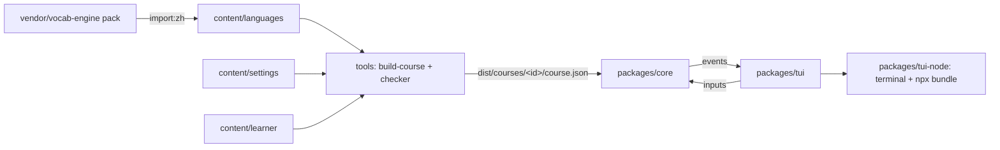

# Silver Tongue

Language-learning life game. Design: `docs/superpowers/specs/2026-09-25-silver-tongue-design.md`.

## Architecture



- `packages/core`: all game rules. `core.send(input) → events`. No DOM, no Node APIs, no rendering. Randomness and time are injected.
- `packages/tui`: text front end written against the `Terminal` interface. It never keeps game state; everything comes from core events and `core.state`.
- `packages/tui-node`: the Node `Terminal` backend and the `silver-tongue` CLI bundle.
- `tools`: pack import, content build (Fluent → rendered, tagged lines) and the content checker.
- Scenes are language-neutral skeletons that name concepts; each language supplies Fluent lines. Slot values are bound by copying a concept's term under the slot's name (`tools/src/fluent.ts` `bindSlots`).

## Commands

```sh
npm test                 # vitest, all packages
npm run typecheck        # tsc
npm run build:course     # content -> dist/courses/zh-china-en/course.json (fails on any checker error)
npm run play             # play from source in this terminal
npm run import:zh        # re-import the zh pack from vendor/vocab-engine
npm run audio            # make missing clips with edge-tts (pipx install edge-tts), delete unused ones
npm run bundle -w silver-tongue   # build packages/tui-node/dist for npm/npx
```

## Rules

- Always keep core free of I/O and rendering; front ends talk to it only through `send` and `state`.
- Always run `npm run build:course` after changing anything under `content/`; never ship a course with checker errors. A changed line needs its clip: run `npm run audio` and commit `content/audio/`.
- Never edit generated files: `content/languages/zh/words.json`, `content/languages/zh/pack.json` (except `stages`), `content/learner/en/glosses-zh.ftl`, `content/audio/`, `dist/`. Re-run the import or the build instead.
- Bonus (off-list) words go in `content/languages/<lang>/extra-words.json` with glosses in `content/learner/<l>/glosses-<lang>-extra.ftl`.
- Every UI string the TUI uses must be listed in `packages/tui/src/text.ts` `UI_KEYS`.
- Code ported from vocab-engine is used with its author's consent; note the origin in a comment.
