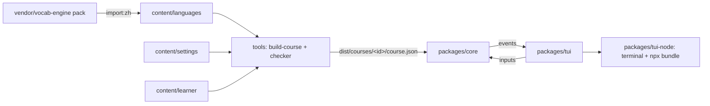

# Milestone A — Terminal Demo Implementation Plan

> **For agentic workers:** REQUIRED SUB-SKILL: Use superpowers:subagent-driven-development (recommended) or superpowers:executing-plans to implement this plan task-by-task. Steps use checkbox (`- [ ]`) syntax for tracking.

**Goal:** A playable terminal demo of Silver Tongue: a two-scene noodle-shop course in Mandarin, playable with `npx silver-tongue`, built on the full game core and content pipeline from the design spec.

**Architecture:** An npm-workspaces monorepo. `packages/core` holds every game rule as pure TypeScript behind `core.send(input) → events`. `tools/` imports the Chinese word pack from vocab-engine, renders Fluent scene lines for every slot combination, tags their words and runs the content checker, writing `dist/courses/zh-china-en/course.json`. `packages/tui` is the text front end, written against a small `Terminal` interface, and `packages/tui-node` is its Node backend plus the `npx` bundle.

**Tech Stack:** TypeScript 5, Node 22+, npm workspaces, Vitest 5, tsx, `@fluent/bundle` + `@fluent/syntax`, esbuild. No framework, and the shipped bundle has no runtime dependencies.

**Spec:** `docs/superpowers/specs/2026-09-25-silver-tongue-design.md`

**Where this sits:** this is milestone A of four. B (stage 1 text game: full content, audio, browser TUI, notebook), C (3D; it can start in parallel with A and connects to the core after A) and D (a second language) get their own plans. After this plan, treat the core's `Input` and `GameEvent` types as a contract: change them deliberately, because C builds against them.

**Deliberately left to later plans:**
- audio (B);
- typed replies: the zh pack has no typing, so `type` mode plays as tiles until a typing pack arrives;
- mentor and notebook (B);
- the browser TUI (B);
- the ported vocab-engine distractor helper `wordOpts` (B, once groups grow past a few values; today wrong options vary one slot within a small group);
- save export/import as a text string, and the play-test event log (B; `serialize`/`parseSave` already exist);
- the tagger for languages that put spaces between words (D).

The checker's coverage and audio rules exist and are tested, but are switched off for this two-scene pilot course in `content/courses/zh-china-en.json`.

**Conventions for every task**
- Work in the repo root (`~/Documents/projects/silver-tongue`). All paths are relative to it.
- Imports inside a package are extensionless (`./types`). Packages import each other by name (`@silver-tongue/core`).
- End every commit message with these two lines. They are left out of the commit commands below for brevity.
  ```
  Co-Authored-By: Claude Opus 5.5 <noreply@anthropic.com>
  Claude-Session: https://claude.ai/code/session_012MvvnD2gjsTpmjETXQvPVa
  ```

## File map

| Path | Responsibility |
|---|---|
| `packages/core/src/types.ts` | Built-course data, game state, inputs and events |
| `packages/core/src/combo.ts` | Slot combinations: keys, enumeration, `$slot` parameter resolution |
| `packages/core/src/learner.ts` | Word records, unseen/met/shaky/known with decay, reply mode, slot preference, rank |
| `packages/core/src/rng.ts` | Seeded PRNG and shuffle |
| `packages/core/src/life.ts` | New game, scene availability, wallet, trust, end of day |
| `packages/core/src/dialogue.ts` | Scene runner: lines, options, tiles, action compare, reactions, rephrase |
| `packages/core/src/core.ts` | `createCore`: input dispatch, rejection without state change, unlock and rank events |
| `packages/core/src/save.ts` | Versioned, strict save parsing |
| `packages/core/src/testing/fixture.ts` | Hand-built two-scene course used by tests in every package |
| `tools/src/pack.ts` | Our pack format types and the vocab-engine input types |
| `tools/src/import-vocab-pack.ts` | vocab-engine pack → our pack + generated gloss file |
| `tools/src/segment.ts` | Word tagging for unspaced scripts (fewest unknowns, then fewest words) |
| `tools/src/fluent.ts` | Fluent parsing, slot binding, rendering |
| `tools/src/check.ts` | Content checker |
| `tools/src/build-course.ts` | Content → `dist/courses/<id>/course.json` |
| `packages/tui/src/terminal.ts` | `Terminal` interface and styled lines |
| `packages/tui/src/width.ts` | Cell width (CJK = 2) and line fitting |
| `packages/tui/src/text.ts` | Learner-language text lookup and the `UI_KEYS` contract |
| `packages/tui/src/screen.ts` | Framed screen rendering |
| `packages/tui/src/app.ts` | TUI state machine: menu, scene, word help, tiles |
| `packages/tui-node/src/node-terminal.ts` | Node stdin/stdout `Terminal`, ANSI output |
| `packages/tui-node/src/main.ts` | CLI entry: course, saves, backups |
| `content/…` | Pack import output, bonus words, terms, lines, reactions, world, scenes, learner text, course |

### Task 1: Monorepo scaffold

**Files:**
- Create: `package.json`, `tsconfig.json`, `vitest.config.ts`, `.gitignore`
- Create: `packages/core/package.json`, `packages/tui/package.json`, `tools/package.json`

- [ ] **Step 1: Write the root files**

`package.json`:

```json
{
  "name": "silver-tongue-monorepo",
  "private": true,
  "type": "module",
  "engines": { "node": ">=22" },
  "workspaces": ["packages/*", "tools"],
  "scripts": {
    "test": "vitest run",
    "typecheck": "tsc",
    "import:zh": "tsx tools/src/import-vocab-pack.ts vendor/vocab-engine/packs/zh content/languages/zh content/learner/en/glosses-zh.ftl",
    "build:course": "tsx tools/src/build-course.ts",
    "play": "tsx packages/tui-node/src/main.ts"
  },
  "devDependencies": {
    "@types/node": "^22.10.0",
    "tsx": "^4.19.0",
    "typescript": "^5.7.0",
    "vitest": "^5.0.1"
  }
}
```

`tsconfig.json`:

```json
{
  "compilerOptions": {
    "target": "ES2022",
    "module": "ESNext",
    "moduleResolution": "Bundler",
    "lib": ["ES2022"],
    "types": ["node"],
    "strict": true,
    "noEmit": true,
    "skipLibCheck": true,
    "isolatedModules": true,
    "resolveJsonModule": true
  },
  "include": ["packages/*/src", "packages/*/test", "tools/src", "tools/test"]
}
```

`vitest.config.ts`:

```ts
import { defineConfig } from "vitest/config";

export default defineConfig({
  test: { include: ["packages/*/test/**/*.test.ts", "tools/test/**/*.test.ts"] },
});
```

`.gitignore`:

```gitignore
node_modules/
dist/
*.tgz
```

- [ ] **Step 2: Write the workspace package files**

`@silver-tongue/core` exposes its TypeScript source directly (tsx, Vitest and esbuild all read it), plus a `./testing` entry for the shared test fixture.

`packages/core/package.json`:

```json
{
  "name": "@silver-tongue/core",
  "private": true,
  "type": "module",
  "exports": { ".": "./src/index.ts", "./testing": "./src/testing/fixture.ts" }
}
```

`packages/tui/package.json`:

```json
{
  "name": "@silver-tongue/tui",
  "private": true,
  "type": "module",
  "exports": { ".": "./src/index.ts" },
  "dependencies": { "@fluent/bundle": "^0.18.0", "@silver-tongue/core": "*" }
}
```

`tools/package.json`:

```json
{
  "name": "@silver-tongue/tools",
  "private": true,
  "type": "module",
  "dependencies": {
    "@fluent/bundle": "^0.18.0",
    "@fluent/syntax": "^0.19.0",
    "@silver-tongue/core": "*",
    "@silver-tongue/tui": "*"
  }
}
```

- [ ] **Step 3: Install and check the toolchain**

Run: `npm install && npx vitest --version`

Expected: the install finishes, `node_modules/@silver-tongue/` holds `core`, `tui` and `tools` links, and Vitest prints `vitest/5.x`.

- [ ] **Step 4: Commit**

```bash
git add package.json package-lock.json tsconfig.json vitest.config.ts .gitignore packages/core/package.json packages/tui/package.json tools/package.json
git commit -m "chore: scaffold npm workspaces with TypeScript and Vitest"
```

### Task 2: Core types and slot combinations

**Files:**
- Create: `packages/core/src/types.ts`
- Create: `packages/core/src/combo.ts`
- Test: `packages/core/test/combo.test.ts`

- [ ] **Step 1: Write the failing test**

`packages/core/test/combo.test.ts`:

```ts
import { describe, expect, it } from "vitest";
import { allCombos, comboKey, parseComboKey, resolveParams } from "../src/combo";

describe("combo", () => {
  it("keys are order-independent and round-trip", () => {
    expect(comboKey({ item: "tea", count: "three" })).toBe("count=three|item=tea");
    expect(parseComboKey("count=three|item=tea")).toEqual({ count: "three", item: "tea" });
    expect(comboKey({})).toBe("");
    expect(parseComboKey("")).toEqual({});
  });

  it("lists every slot assignment", () => {
    const combos = allCombos({ item: "drinks", count: "nums" }, { drinks: ["tea", "water"], nums: ["three", "four"] });
    expect(combos.map(comboKey)).toEqual([
      "count=three|item=tea",
      "count=three|item=water",
      "count=four|item=tea",
      "count=four|item=water",
    ]);
    expect(allCombos({}, {})).toEqual([{}]);
  });

  it("rejects unknown groups", () => {
    expect(() => allCombos({ item: "food" }, {})).toThrow(/unknown group "food"/);
  });

  it("resolves $slot params", () => {
    expect(resolveParams({ action: "serve", item: "$item" }, { item: "tea" })).toEqual({ action: "serve", item: "tea" });
  });
});
```

- [ ] **Step 2: Run it to make sure it fails**

Run: `npx vitest run packages/core/test/combo.test.ts`

Expected: FAIL. The test can't import `../src/combo` because it doesn't exist yet.

- [ ] **Step 3: Write the implementation**

`packages/core/src/types.ts`:

```ts
export type WordId = string;

export interface Word {
  id: WordId;
  w: string;
  pron?: string;
  lv: string;
  gloss: string;
  bonus?: boolean;
}

/** A word's position in a line. Offsets are UTF-16 indices, `end` exclusive. */
export interface Token {
  start: number;
  end: number;
  word: WordId;
}

export interface RenderedLine {
  text: string;
  tokens: Token[];
  audio?: string;
}

export interface Variant {
  npc: RenderedLine;
  reply: RenderedLine;
  rephrase?: RenderedLine;
}

export interface Exchange {
  id: string;
  /** slot name -> group name */
  slots: Record<string, string>;
  /** action parameters; a value "$slot" refers to a slot */
  expect: Record<string, string>;
  /** "$slot" or a concept name */
  hinges: string[];
  pay: number;
  missCost: number;
  /** keyed by comboKey(combo); "" when the exchange has no slots */
  variants: Record<string, Variant>;
}

export interface Scene {
  id: string;
  place: string;
  npc: string;
  stage: number;
  after: string[];
  requires: { trust?: Record<string, number> };
  repeatable: boolean;
  trustGain: number;
  exchanges: Exchange[];
}

export interface Place {
  links: string[];
}

export interface Npc {
  place: string;
}

export interface World {
  start: string;
  currency: string;
  slotsPerDay: number;
  startWallet: number;
  foodPerDay: number;
  rentPerWeek: number;
  places: Record<string, Place>;
  npcs: Record<string, Npc>;
}

/** Built course output: everything the game loads. */
export interface Course {
  id: string;
  typing: boolean;
  words: Record<WordId, Word>;
  /** concept -> the word ids its base form is made of */
  concepts: Record<string, WordId[]>;
  /** group -> concepts */
  groups: Record<string, string[]>;
  world: World;
  scenes: Scene[];
  reactions: Record<string, RenderedLine>;
  /** learner-language Fluent source: UI text and narration */
  learnerFtl: string;
}

export type WordState = "unseen" | "met" | "shaky" | "known";
export type ReplyMode = "pick" | "tiles" | "type";

export interface WordRecord {
  right: number;
  wrong: number;
  streak: number;
  helps: number;
  /** missed or helped since the last correct answer */
  lapsed: boolean;
  firstSeen: number;
  lastSeen: number;
}

export interface SceneRun {
  scene: string;
  exchange: number;
  combo: Record<string, string>;
  mode: ReplyMode;
  /** pick mode: combo keys in display order */
  options: string[];
  /** tiles mode: tile texts in display order */
  tiles: string[];
  misses: number;
  earned: number;
  mixups: number;
}

export interface GameState {
  v: 1;
  course: string;
  day: number;
  slot: number;
  wallet: number;
  rentLate: boolean;
  place: string;
  trust: Record<string, number>;
  words: Record<WordId, WordRecord>;
  scenesDone: Record<string, number>;
  run: SceneRun | null;
}

export type Input =
  | { type: "goTo"; place: string }
  | { type: "startScene"; scene: string }
  | { type: "reply"; choice: number }
  | { type: "replyTiles"; tiles: number[] }
  | { type: "helpWord"; word: WordId }
  | { type: "sleep" };

export type GameEvent =
  | { type: "placeEntered"; place: string }
  | { type: "sceneStarted"; scene: string; npc: string }
  | { type: "lineSpoken"; npc: string; line: RenderedLine }
  | { type: "replyOptions"; mode: "pick"; options: RenderedLine[] }
  | { type: "replyOptions"; mode: "tiles"; tiles: string[] }
  | { type: "actionPerformed"; action: Record<string, string>; matched: boolean; diff: string[] }
  | { type: "npcReacted"; npc: string; reaction: string; line: RenderedLine }
  /** slow: no rephrase was written, so this replays the original line (show it slowly, with pronunciation) */
  | { type: "lineRephrased"; npc: string; line: RenderedLine; slow: boolean }
  | { type: "walletChanged"; wallet: number; delta: number; reason: string }
  | { type: "trustChanged"; npc: string; trust: number }
  | { type: "wordStateChanged"; word: WordId; from: WordState; to: WordState }
  | { type: "sceneEnded"; scene: string; earned: number }
  | { type: "unlocked"; scene: string }
  | { type: "rankChanged"; rank: number }
  | { type: "dayEnded"; day: number }
  | { type: "inputRejected"; reason: string };
```

`packages/core/src/combo.ts`:

```ts
export type Combo = Record<string, string>;

export function comboKey(combo: Combo): string {
  return Object.keys(combo)
    .sort()
    .map((k) => `${k}=${combo[k]}`)
    .join("|");
}

export function parseComboKey(key: string): Combo {
  const out: Combo = {};
  if (!key) return out;
  for (const part of key.split("|")) {
    const [k, v] = part.split("=");
    out[k] = v;
  }
  return out;
}

/** Every slot assignment for an exchange, e.g. {count: three, item: tea}. */
export function allCombos(slots: Record<string, string>, groups: Record<string, string[]>): Combo[] {
  let acc: Combo[] = [{}];
  for (const slot of Object.keys(slots).sort()) {
    const values = groups[slots[slot]];
    if (!values) throw new Error(`unknown group "${slots[slot]}" for slot "${slot}"`);
    acc = acc.flatMap((c) => values.map((v) => ({ ...c, [slot]: v })));
  }
  return acc;
}

/** Replaces "$slot" values with the combo's concept. */
export function resolveParams(params: Record<string, string>, combo: Combo): Record<string, string> {
  const out: Record<string, string> = {};
  for (const [k, v] of Object.entries(params)) out[k] = v.startsWith("$") ? combo[v.slice(1)] : v;
  return out;
}
```

- [ ] **Step 4: Run the tests and make sure they pass**

Run: `npx vitest run packages/core/test/combo.test.ts`

Expected: PASS (4 tests).

- [ ] **Step 5: Commit**

```bash
git add packages/core
git commit -m "feat(core): add game types and slot combinations"
```

### Task 3: Learner model: word states, decay, reply mode, rank

**Files:**
- Create: `packages/core/src/learner.ts`
- Test: `packages/core/test/learner.test.ts`

- [ ] **Step 1: Write the failing test**

`packages/core/test/learner.test.ts`:

```ts
import { describe, expect, it } from "vitest";
import {
  DAY_MS,
  decayIntervalMs,
  pickPreferred,
  rankFor,
  recordHelp,
  recordRight,
  recordSeen,
  recordWrong,
  replyModeFor,
  wordState,
} from "../src/learner";
import type { WordRecord } from "../src/types";

const T0 = 1_000_000;
const rightTimes = (n: number, now = T0) => {
  let r: WordRecord | undefined;
  for (let i = 0; i < n; i++) r = recordRight(r, now);
  return r!;
};

describe("word state", () => {
  it("moves unseen -> met -> known", () => {
    expect(wordState(undefined, T0)).toBe("unseen");
    expect(wordState(recordSeen(undefined, T0), T0)).toBe("met");
    expect(wordState(rightTimes(2), T0)).toBe("met");
    expect(wordState(rightTimes(3), T0)).toBe("known");
  });

  it("a miss or a help makes a word shaky until the next right answer", () => {
    expect(wordState(recordWrong(rightTimes(5), T0), T0)).toBe("shaky");
    expect(wordState(recordHelp(rightTimes(5), T0), T0)).toBe("shaky");
    expect(wordState(recordRight(recordWrong(undefined, T0), T0), T0)).toBe("met");
  });

  it("known words decay to shaky after an interval that grows with the streak", () => {
    expect(decayIntervalMs(3)).toBe(2 * DAY_MS);
    expect(decayIntervalMs(4)).toBe(4 * DAY_MS);
    expect(decayIntervalMs(20)).toBe(60 * DAY_MS);
    const r = rightTimes(3);
    expect(wordState(r, T0 + 2 * DAY_MS)).toBe("known");
    expect(wordState(r, T0 + 2 * DAY_MS + 1)).toBe("shaky");
    expect(wordState(rightTimes(5), T0 + 8 * DAY_MS + 1)).toBe("shaky");
  });

  it("seeing a decayed word keeps it shaky until it is answered right", () => {
    const later = T0 + 3 * DAY_MS;
    const seenAgain = recordSeen(rightTimes(3), later);
    expect(wordState(seenAgain, later)).toBe("shaky");
    expect(wordState(recordRight(seenAgain, later), later)).toBe("known");
  });
});

describe("reply mode", () => {
  it("follows the weakest hinge word", () => {
    expect(replyModeFor([], false)).toBe("pick");
    expect(replyModeFor(["known", "met"], false)).toBe("pick");
    expect(replyModeFor(["known", "shaky"], false)).toBe("tiles");
    expect(replyModeFor(["known"], false)).toBe("tiles");
    expect(replyModeFor(["known"], true)).toBe("type");
  });
});

describe("pickPreferred", () => {
  const records = { a: recordWrong(undefined, T0), b: recordSeen(undefined, T0) };
  const wordsOf = (c: string) => [c];
  it("prefers shaky, then met, then anything", () => {
    expect(pickPreferred(["c", "b", "a"], wordsOf, records, T0, () => 0.99)).toBe("a");
    expect(pickPreferred(["c", "b"], wordsOf, records, T0, () => 0.99)).toBe("b");
    expect(pickPreferred(["c", "d"], wordsOf, records, T0, () => 0.99)).toBe("d");
  });

  it("judges a multi-word candidate by its weakest word, and refuses an empty list", () => {
    expect(pickPreferred([["c"], ["b", "a"]], (c) => c, records, T0, () => 0)).toEqual(["b", "a"]);
    expect(() => pickPreferred([], wordsOf, records, T0, () => 0)).toThrow(/no candidates/);
  });
});

describe("rank", () => {
  it("is the share of course words known", () => {
    const ids = ["a", "b", "c", "d", "e"];
    expect(rankFor({}, ids, T0)).toBe(0);
    expect(rankFor({ a: rightTimes(3) }, ids, T0)).toBe(1);
    expect(rankFor(Object.fromEntries(ids.slice(0, 4).map((i) => [i, rightTimes(3)])), ids, T0)).toBe(3);
    expect(rankFor(Object.fromEntries(ids.map((i) => [i, rightTimes(3)])), ids, T0)).toBe(4);
  });
});
```

- [ ] **Step 2: Run it to make sure it fails**

Run: `npx vitest run packages/core/test/learner.test.ts`

Expected: FAIL. `../src/learner` doesn't exist yet.

- [ ] **Step 3: Write the implementation**

`packages/core/src/learner.ts`:

```ts
import type { ReplyMode, WordId, WordRecord, WordState } from "./types";

export const DAY_MS = 86_400_000;
export const KNOWN_STREAK = 3;
export const MAX_INTERVAL_DAYS = 60;
/** Share of course words known needed for each rank (Pidgin … Silver Tongue). */
export const RANK_THRESHOLDS = [0, 0.2, 0.4, 0.6, 0.85];

export function decayIntervalMs(streak: number): number {
  return Math.min(MAX_INTERVAL_DAYS, 2 ** (streak - 2)) * DAY_MS;
}

export function wordState(rec: WordRecord | undefined, now: number): WordState {
  if (!rec) return "unseen";
  if (rec.lapsed) return "shaky";
  if (rec.streak >= KNOWN_STREAK) return now - rec.lastSeen > decayIntervalMs(rec.streak) ? "shaky" : "known";
  return "met";
}

function base(rec: WordRecord | undefined, now: number): WordRecord {
  return rec
    ? { ...rec }
    : { right: 0, wrong: 0, streak: 0, helps: 0, lapsed: false, firstSeen: now, lastSeen: now };
}

/** Seeing a word that has decayed doesn't revive it: it stays shaky until it is answered right. */
export function recordSeen(rec: WordRecord | undefined, now: number): WordRecord {
  const r = base(rec, now);
  if (wordState(rec, now) === "shaky") r.lapsed = true;
  r.lastSeen = now;
  return r;
}

export function recordRight(rec: WordRecord | undefined, now: number): WordRecord {
  const r = recordSeen(rec, now);
  r.right += 1;
  r.streak += 1;
  r.lapsed = false;
  return r;
}

export function recordWrong(rec: WordRecord | undefined, now: number): WordRecord {
  const r = recordSeen(rec, now);
  r.wrong += 1;
  r.streak = 0;
  r.lapsed = true;
  return r;
}

export function recordHelp(rec: WordRecord | undefined, now: number): WordRecord {
  const r = recordSeen(rec, now);
  r.helps += 1;
  r.streak = 0;
  r.lapsed = true;
  return r;
}

const MODE_RANK: Record<WordState, number> = { unseen: 0, met: 0, shaky: 1, known: 2 };

/** The weakest hinge word decides: met -> pick, shaky -> tiles, known -> type (tiles without typing). */
export function replyModeFor(states: WordState[], typing: boolean): ReplyMode {
  if (states.length === 0) return "pick";
  const r = Math.min(...states.map((s) => MODE_RANK[s]));
  if (r === 0) return "pick";
  if (r === 1) return "tiles";
  return typing ? "type" : "tiles";
}

/** Shaky first, then met, then anything; ties broken by rng. */
export function pickPreferred<T>(
  candidates: T[],
  wordsOf: (c: T) => WordId[],
  records: Record<WordId, WordRecord>,
  now: number,
  rng: () => number,
): T {
  const prio = (c: T) =>
    Math.min(
      2,
      ...wordsOf(c).map((w) => {
        const s = wordState(records[w], now);
        return s === "shaky" ? 0 : s === "met" ? 1 : 2;
      }),
    );
  if (candidates.length === 0) throw new Error("pickPreferred: no candidates");
  const best = Math.min(...candidates.map(prio));
  const pool = candidates.filter((c) => prio(c) === best);
  return pool[Math.floor(rng() * pool.length)];
}

export function rankFor(records: Record<WordId, WordRecord>, wordIds: WordId[], now: number): number {
  if (wordIds.length === 0) return 0;
  const known = wordIds.filter((w) => wordState(records[w], now) === "known").length;
  const share = known / wordIds.length;
  let rank = 0;
  RANK_THRESHOLDS.forEach((t, i) => {
    if (share >= t) rank = i;
  });
  return rank;
}
```

- [ ] **Step 4: Run the tests and make sure they pass**

Run: `npx vitest run packages/core/test/learner.test.ts`

Expected: PASS (8 tests).

- [ ] **Step 5: Commit**

```bash
git add packages/core
git commit -m "feat(core): add learner model with decay and reply modes"
```

### Task 4: RNG, life rules and the shared test fixture

**Files:**
- Create: `packages/core/src/rng.ts`
- Create: `packages/core/src/life.ts`
- Create: `packages/core/src/testing/fixture.ts`
- Test: `packages/core/test/life.test.ts`

- [ ] **Step 1: Write the failing test**

`packages/core/test/life.test.ts`:

```ts
import { describe, expect, it } from "vitest";
import { availableSceneIds, changeWallet, endDay, newGame } from "../src/life";
import { fixtureCourse } from "../src/testing/fixture";

describe("life", () => {
  const course = fixtureCourse();

  it("unlocks scenes by order and trust", () => {
    const s = newGame(course);
    expect(availableSceneIds(course, s)).toEqual(["intro"]);
    s.scenesDone.intro = 1;
    expect(availableSceneIds(course, s)).toEqual([]);
    s.trust.cook = 1;
    expect(availableSceneIds(course, s)).toEqual(["shift"]);
  });

  it("never lets the wallet go negative", () => {
    const s = newGame(course);
    expect(changeWallet(s, -100, "food")).toEqual([{ type: "walletChanged", wallet: 0, delta: -20, reason: "food" }]);
    expect(changeWallet(s, -5, "food")).toEqual([]);
  });

  it("charges food daily and rent on day 7; short on rent, the landlord waits", () => {
    const s = newGame(course);
    s.wallet = 100;
    s.day = 7;
    const ev = endDay(course, s);
    expect(ev.map((e) => e.type)).toEqual(["dayEnded", "walletChanged", "walletChanged"]);
    expect(s.wallet).toBe(45);
    expect(s.day).toBe(8);
    expect(s.slot).toBe(0);

    s.wallet = 30;
    s.day = 14;
    endDay(course, s);
    expect(s.rentLate).toBe(true);
    expect(s.wallet).toBe(25);
    s.wallet = 60;
    endDay(course, s);
    expect(s.rentLate).toBe(false);
    expect(s.wallet).toBe(5);
  });
});
```

- [ ] **Step 2: Run it to make sure it fails**

Run: `npx vitest run packages/core/test/life.test.ts`

Expected: FAIL. `../src/life` and `../src/testing/fixture` don't exist yet.

- [ ] **Step 3: Write the implementation**

The fixture is a real, checker-valid two-scene course; it passes the Task 10 checker. *intro* greets the cook and names a drink, with at most 2 new words per exchange. *shift* orders 3 or 4 cups of tea or water. Tests in every package use it.

`packages/core/src/rng.ts`:

```ts
/** Small seeded PRNG so every run can be replayed. */
export function mulberry32(seed: number): () => number {
  let a = seed >>> 0;
  return () => {
    a = (a + 0x6d2b79f5) >>> 0;
    let t = a;
    t = Math.imul(t ^ (t >>> 15), t | 1);
    t ^= t + Math.imul(t ^ (t >>> 7), t | 61);
    return ((t ^ (t >>> 14)) >>> 0) / 4294967296;
  };
}

export function shuffle<T>(xs: readonly T[], rng: () => number): T[] {
  const a = [...xs];
  for (let i = a.length - 1; i > 0; i--) {
    const j = Math.floor(rng() * (i + 1));
    [a[i], a[j]] = [a[j], a[i]];
  }
  return a;
}
```

`packages/core/src/life.ts`:

```ts
import type { Course, GameEvent, GameState, Scene } from "./types";

export function isAvailable(scene: Scene, state: GameState): boolean {
  if (!scene.repeatable && (state.scenesDone[scene.id] ?? 0) > 0) return false;
  if (!scene.after.every((id) => (state.scenesDone[id] ?? 0) > 0)) return false;
  const trust = scene.requires.trust ?? {};
  return Object.entries(trust).every(([npc, min]) => (state.trust[npc] ?? 0) >= min);
}

export function availableSceneIds(course: Course, state: GameState): string[] {
  return course.scenes.filter((s) => isAvailable(s, state)).map((s) => s.id);
}

/** The wallet never goes below zero: there is no debt. */
export function changeWallet(state: GameState, delta: number, reason: string): GameEvent[] {
  const next = Math.max(0, state.wallet + delta);
  const actual = next - state.wallet;
  state.wallet = next;
  return actual === 0 ? [] : [{ type: "walletChanged", wallet: next, delta: actual, reason }];
}

export function addTrust(state: GameState, npc: string, amount: number): GameEvent[] {
  if (amount <= 0) return [];
  state.trust[npc] = (state.trust[npc] ?? 0) + amount;
  return [{ type: "trustChanged", npc, trust: state.trust[npc] }];
}

/** Food daily; rent every 7th day. Short on rent: the landlord waits and tries again next night. */
export function endDay(course: Course, state: GameState): GameEvent[] {
  const { foodPerDay, rentPerWeek } = course.world;
  const events: GameEvent[] = [{ type: "dayEnded", day: state.day }];
  events.push(...changeWallet(state, -foodPerDay, "food"));
  if (state.day % 7 === 0 || state.rentLate) {
    if (state.wallet >= rentPerWeek) {
      events.push(...changeWallet(state, -rentPerWeek, "rent"));
      state.rentLate = false;
    } else {
      state.rentLate = true;
    }
  }
  state.day += 1;
  state.slot = 0;
  return events;
}

export function newGame(course: Course): GameState {
  return {
    v: 1,
    course: course.id,
    day: 1,
    slot: 0,
    wallet: course.world.startWallet,
    rentLate: false,
    place: course.world.start,
    trust: {},
    words: {},
    scenesDone: {},
    run: null,
  };
}
```

`packages/core/src/testing/fixture.ts`:

```ts
import { allCombos, comboKey } from "../combo";
import type { Course, Exchange, RenderedLine, Variant } from "../types";

/** Builds a line from [text, wordId | null] parts; null parts are punctuation. */
export function line(...parts: [string, string | null][]): RenderedLine {
  let text = "";
  const tokens: RenderedLine["tokens"] = [];
  for (const [t, word] of parts) {
    if (word) tokens.push({ start: text.length, end: text.length + t.length, word });
    text += t;
  }
  return { text, tokens };
}

const W: Record<string, [string, string]> = {
  w_ni: ["你", "you"],
  w_hao: ["好", "good"],
  w_cha: ["茶", "tea"],
  w_shui: ["水", "water"],
  w_san: ["三", "three"],
  w_si: ["四", "four"],
  x_bei: ["杯", "cup (measure word)"],
  w_bu: ["不", "not"],
  w_shi: ["是", "to be"],
  w_zhe: ["这", "this"],
  w_ge: ["个", "(measure word)"],
};
const CONCEPT_WORD: Record<string, string> = { tea: "w_cha", water: "w_shui", three: "w_san", four: "w_si" };
const w = (concept: string): [string, string] => [W[CONCEPT_WORD[concept]][0], CONCEPT_WORD[concept]];
const GROUPS = { drinks: ["tea", "water"], nums: ["three", "four"] };

function variants(slots: Record<string, string>, make: (c: Record<string, string>) => Variant): Record<string, Variant> {
  return Object.fromEntries(allCombos(slots, GROUPS).map((c) => [comboKey(c), make(c)]));
}

const greet: Exchange = {
  id: "greet",
  slots: {},
  expect: { action: "greet" },
  hinges: [],
  pay: 0,
  missCost: 0,
  variants: { "": { npc: line(["你", "w_ni"], ["好", "w_hao"], ["！", null]), reply: line(["你", "w_ni"], ["好", "w_hao"], ["！", null]) } },
};

const menu: Exchange = {
  id: "menu",
  slots: { item: "drinks" },
  expect: { action: "repeat", item: "$item" },
  hinges: ["$item"],
  pay: 0,
  missCost: 1,
  variants: variants({ item: "drinks" }, (c) => ({ npc: line(w(c.item), ["。", null]), reply: line(w(c.item), ["？", null]) })),
};

const order: Exchange = {
  id: "order",
  slots: { item: "drinks", count: "nums" },
  expect: { action: "serve", item: "$item", count: "$count" },
  hinges: ["$item", "$count"],
  pay: 3,
  missCost: 2,
  variants: variants({ item: "drinks", count: "nums" }, (c) => ({
    npc: line(w(c.count), ["杯", "x_bei"], w(c.item), ["。", null]),
    reply: line(["好", "w_hao"], ["，", null], w(c.count), ["杯", "x_bei"], w(c.item), ["。", null]),
    rephrase: line(w(c.item), ["。", null], w(c.count), ["杯", "x_bei"], ["。", null]),
  })),
};

/** A two-scene course that passes the content checker: meet the cook, then serve drinks (repeatable). */
export function fixtureCourse(): Course {
  return {
    id: "test-course",
    typing: false,
    words: Object.fromEntries(
      Object.entries(W).map(([id, [text, gloss]]) => [
        id,
        { id, w: text, lv: "1", gloss, ...(id.startsWith("x_") ? { bonus: true } : {}) },
      ]),
    ),
    concepts: { tea: ["w_cha"], water: ["w_shui"], three: ["w_san"], four: ["w_si"] },
    groups: GROUPS,
    world: {
      start: "street",
      currency: "¥",
      slotsPerDay: 4,
      startWallet: 20,
      foodPerDay: 5,
      rentPerWeek: 50,
      places: { street: { links: ["noodle_shop"] }, noodle_shop: { links: ["street"] } },
      npcs: { cook: { place: "noodle_shop" } },
    },
    scenes: [
      { id: "intro", place: "noodle_shop", npc: "cook", stage: 1, after: [], requires: {}, repeatable: false, trustGain: 1, exchanges: [greet, menu] },
      { id: "shift", place: "noodle_shop", npc: "cook", stage: 1, after: ["intro"], requires: { trust: { cook: 1 } }, repeatable: true, trustGain: 1, exchanges: [order] },
    ],
    reactions: {
      "wrong-generic": line(["不", "w_bu"], ["是", "w_shi"], ["这", "w_zhe"], ["个", "w_ge"], ["。", null]),
    },
    learnerFtl: "",
  };
}
```

- [ ] **Step 4: Run the tests and make sure they pass**

Run: `npx vitest run packages/core/test/life.test.ts`

Expected: PASS (3 tests).

- [ ] **Step 5: Commit**

```bash
git add packages/core
git commit -m "feat(core): add life rules (wallet, trust, days) and test fixture"
```

### Task 5: Dialogue runner and the core entry point

**Files:**
- Create: `packages/core/src/dialogue.ts`
- Create: `packages/core/src/core.ts`
- Test: `packages/core/test/core.test.ts`

- [ ] **Step 1: Write the failing test**

`packages/core/test/core.test.ts`:

```ts
import { describe, expect, it } from "vitest";
import { comboKey } from "../src/combo";
import { describeRun } from "../src/dialogue";
import { createCore, newGame, type Core } from "../src/core";
import { recordRight } from "../src/learner";
import { mulberry32 } from "../src/rng";
import { fixtureCourse } from "../src/testing/fixture";
import type { GameEvent, WordRecord } from "../src/types";

const T0 = 1_000_000;
const course = fixtureCourse();

const setup = (seed = 1): Core => createCore(course, newGame(course), { now: () => T0, rng: mulberry32(seed) });
const types = (ev: GameEvent[]) => ev.map((e) => e.type);
const find = <K extends GameEvent["type"]>(ev: GameEvent[], type: K) =>
  ev.find((e) => e.type === type) as Extract<GameEvent, { type: K }>;

/** Index of the right option in the current pick. */
const rightChoice = (core: Core) => core.state.run!.options.indexOf(comboKey(core.state.run!.combo));
const answerRight = (core: Core) => core.send({ type: "reply", choice: rightChoice(core) });

function playIntro(core: Core) {
  core.send({ type: "goTo", place: "noodle_shop" });
  core.send({ type: "startScene", scene: "intro" });
  answerRight(core);
  return answerRight(core);
}

describe("core", () => {
  it("moves between linked places only", () => {
    const core = setup();
    expect(core.send({ type: "goTo", place: "nowhere" })).toEqual([{ type: "inputRejected", reason: "not-linked" }]);
    expect(core.send({ type: "goTo", place: "noodle_shop" })).toEqual([{ type: "placeEntered", place: "noodle_shop" }]);
    expect(core.state.place).toBe("noodle_shop");
  });

  it("a rejected input leaves the state untouched", () => {
    const core = setup();
    const before = core.state;
    core.send({ type: "startScene", scene: "intro" });
    expect(core.state).toBe(before);
  });

  it("plays the intro: line, options, next exchange, then trust and an unlock", () => {
    const core = setup();
    core.send({ type: "goTo", place: "noodle_shop" });
    const start = core.send({ type: "startScene", scene: "intro" });
    expect(types(start)).toEqual(["sceneStarted", "lineSpoken", "wordStateChanged", "wordStateChanged", "replyOptions"]);
    expect(find(start, "replyOptions")).toMatchObject({ mode: "pick" });
    expect(core.state.slot).toBe(1);

    const next = answerRight(core);
    expect(types(next)).toEqual(["actionPerformed", "lineSpoken", "wordStateChanged", "replyOptions"]);

    const end = answerRight(core);
    expect(types(end)).toEqual(["actionPerformed", "sceneEnded", "trustChanged", "unlocked"]);
    expect(find(end, "trustChanged")).toEqual({ type: "trustChanged", npc: "cook", trust: 2 });
    expect(find(end, "unlocked")).toEqual({ type: "unlocked", scene: "shift" });
    expect(core.state.run).toBeNull();
  });

  it("a wrong reply costs money, triggers a reaction, and rephrases after two misses", () => {
    const core = setup();
    playIntro(core);
    core.send({ type: "startScene", scene: "shift" });
    const right = rightChoice(core);
    const wrong = right === 0 ? 1 : 0;

    const miss1 = core.send({ type: "reply", choice: wrong });
    expect(find(miss1, "actionPerformed").matched).toBe(false);
    expect(find(miss1, "walletChanged")).toMatchObject({ delta: -2, reason: "mixup" });
    expect(find(miss1, "npcReacted")).toMatchObject({ npc: "cook", reaction: "wrong-generic" });
    expect(types(miss1)).not.toContain("lineRephrased");

    const miss2 = core.send({ type: "reply", choice: wrong });
    expect(find(miss2, "lineRephrased")).toMatchObject({ npc: "cook", slow: false });

    const ok = core.send({ type: "reply", choice: right });
    expect(find(ok, "sceneEnded")).toEqual({ type: "sceneEnded", scene: "shift", earned: 3 });
    expect(find(ok, "trustChanged")).toMatchObject({ trust: 3 });
    expect(core.state.wallet).toBe(20 - 4 + 3);
  });

  it("switches to tiles when the hinge words are known but typing is off", () => {
    const core = setup();
    playIntro(core);
    const words: Record<string, WordRecord> = {};
    for (const w of ["w_cha", "w_shui", "w_san", "w_si"]) {
      words[w] = recordRight(recordRight(recordRight(undefined, T0), T0), T0);
    }
    const tiles = createCore(course, { ...core.state, words }, { now: () => T0, rng: mulberry32(2) });
    const ev = tiles.send({ type: "startScene", scene: "shift" });
    expect(find(ev, "replyOptions").mode).toBe("tiles");

    const run = tiles.state.run!;
    const reply = course.scenes[1].exchanges[0].variants[comboKey(run.combo)].reply;
    const order = reply.tokens.map((t) => run.tiles.indexOf(reply.text.slice(t.start, t.end)));
    const done = tiles.send({ type: "replyTiles", tiles: order });
    expect(find(done, "actionPerformed").matched).toBe(true);

    const bad = createCore(course, { ...core.state, words }, { now: () => T0, rng: mulberry32(2) });
    bad.send({ type: "startScene", scene: "shift" });
    expect(find(bad.send({ type: "replyTiles", tiles: [0] }), "actionPerformed").matched).toBe(false);
  });

  it("only slots that change the action count as a mix-up", () => {
    const c = fixtureCourse();
    c.scenes[1].exchanges[0].expect = { action: "serve", item: "$item" };
    c.scenes[1].exchanges[0].hinges = ["$item"];
    const core = createCore(c, newGame(c), { now: () => T0, rng: mulberry32(1) });
    playIntro(core);
    core.send({ type: "startScene", scene: "shift" });
    const run = core.state.run!;
    const sameItem = run.options.findIndex((k) => k !== comboKey(run.combo) && k.endsWith(`item=${run.combo.item}`));
    expect(sameItem).toBeGreaterThanOrEqual(0);
    expect(find(core.send({ type: "reply", choice: sameItem }), "actionPerformed").matched).toBe(true);
  });

  it("rejects a resumed scene that no longer fits the course instead of throwing", () => {
    const core = setup();
    playIntro(core);
    core.send({ type: "startScene", scene: "shift" });
    const stale = createCore(course, { ...core.state, run: { ...core.state.run!, exchange: 5 } }, { now: () => T0, rng: mulberry32(1) });
    expect(stale.send({ type: "reply", choice: 0 })).toEqual([{ type: "inputRejected", reason: "stale-run" }]);
  });

  it("describes the scene in progress for a front end resuming a save, without changing it", () => {
    const core = setup();
    expect(describeRun(course, core.state)).toEqual([]);
    core.send({ type: "goTo", place: "noodle_shop" });
    core.send({ type: "startScene", scene: "intro" });
    const next = answerRight(core);
    const before = core.state;
    expect(describeRun(course, core.state)).toEqual([
      { type: "sceneStarted", scene: "intro", npc: "cook" },
      find(next, "lineSpoken"),
      find(next, "replyOptions"),
    ]);
    expect(core.state).toBe(before);
  });

  it("a help lookup makes a word shaky", () => {
    const core = setup();
    playIntro(core);
    expect(core.send({ type: "helpWord", word: "w_ni" })).toEqual([
      { type: "wordStateChanged", word: "w_ni", from: "met", to: "shaky" },
    ]);
  });

  it("uses day slots and refuses scenes when they run out", () => {
    const core = setup();
    playIntro(core);
    for (let i = 0; i < 3; i++) {
      core.send({ type: "startScene", scene: "shift" });
      answerRight(core);
    }
    expect(core.state.slot).toBe(4);
    expect(core.send({ type: "startScene", scene: "shift" })).toEqual([{ type: "inputRejected", reason: "no-slots" }]);
    expect(types(core.send({ type: "sleep" }))).toContain("dayEnded");
    expect(core.state.slot).toBe(0);
  });
});
```

- [ ] **Step 2: Run it to make sure it fails**

Run: `npx vitest run packages/core/test/core.test.ts`

Expected: FAIL. `../src/core` doesn't exist yet.

- [ ] **Step 3: Write the implementation**

Behaviour to keep in mind:
- Words in a spoken line count as *seen* before the reply mode is chosen. A brand-new hinge word is therefore *met* and gets **pick**.
- Wrong pick options differ from the right reply in exactly one slot. Duplicate reply texts are dropped.
- A wrong reply:
  - charges the hinge words of the *expected* combo;
  - costs `missCost` (the wallet never goes below 0);
  - uses the reaction `wrong-<slot>` if the language has one, otherwise `wrong-generic`;
  - rephrases from the second miss on.
- A scene with no mix-ups earns one extra trust.
- `createCore` works on a `structuredClone` of the state and throws the clone away when the input is rejected.

`packages/core/src/dialogue.ts`:

```ts
import { comboKey, parseComboKey, resolveParams, type Combo } from "./combo";
import { addTrust, changeWallet, isAvailable } from "./life";
import {
  pickPreferred,
  recordRight,
  recordSeen,
  recordWrong,
  replyModeFor,
  wordState,
} from "./learner";
import { shuffle } from "./rng";
import type { Course, Exchange, GameEvent, GameState, RenderedLine, Scene, SceneRun, WordId, WordRecord } from "./types";

export interface Ctx {
  course: Course;
  state: GameState;
  now: number;
  rng: () => number;
  ev: GameEvent[];
}

export function reject(ctx: Ctx, reason: string): void {
  ctx.ev.push({ type: "inputRejected", reason });
}

export function setWord(
  ctx: Ctx,
  word: WordId,
  update: (rec: WordRecord | undefined, now: number) => WordRecord,
): void {
  const from = wordState(ctx.state.words[word], ctx.now);
  ctx.state.words[word] = update(ctx.state.words[word], ctx.now);
  const to = wordState(ctx.state.words[word], ctx.now);
  if (from !== to) ctx.ev.push({ type: "wordStateChanged", word, from, to });
}

/** The words of a line in reading order, as tiles. Punctuation is not a tile. */
export function tilePieces(line: RenderedLine): string[] {
  return line.tokens.map((t) => line.text.slice(t.start, t.end));
}

function sceneById(ctx: Ctx, id: string): Scene | undefined {
  return ctx.course.scenes.find((s) => s.id === id);
}

function hingeWords(ctx: Ctx, ex: Exchange, combo: Combo): WordId[] {
  const concepts = ex.hinges.map((h) => (h.startsWith("$") ? combo[h.slice(1)] : h));
  return [...new Set(concepts.flatMap((c) => ctx.course.concepts[c] ?? []))];
}

function chooseCombo(ctx: Ctx, ex: Exchange): Combo {
  const combo: Combo = {};
  for (const slot of Object.keys(ex.slots).sort()) {
    const values = ctx.course.groups[ex.slots[slot]];
    combo[slot] = pickPreferred(values, (c) => ctx.course.concepts[c] ?? [], ctx.state.words, ctx.now, ctx.rng);
  }
  return combo;
}

function speak(ctx: Ctx, npc: string, line: RenderedLine): void {
  ctx.ev.push({ type: "lineSpoken", npc, line });
  for (const t of line.tokens) setWord(ctx, t.word, recordSeen);
}

/** Right reply plus up to 3 replies that differ from it in exactly one slot, with distinct text. */
function pickOptions(ctx: Ctx, ex: Exchange, combo: Combo): string[] {
  const rightKey = comboKey(combo);
  const texts = new Set([ex.variants[rightKey].reply.text]);
  const wrong: string[] = [];
  for (const key of shuffle(Object.keys(ex.variants), ctx.rng)) {
    if (wrong.length === 3) break;
    const c = parseComboKey(key);
    const differing = Object.keys(combo).filter((s) => c[s] !== combo[s]).length;
    const text = ex.variants[key].reply.text;
    if (differing === 1 && !texts.has(text)) {
      texts.add(text);
      wrong.push(key);
    }
  }
  return shuffle([rightKey, ...wrong], ctx.rng);
}

/** The right reply's words plus up to 2 words from other replies. */
function buildTiles(ctx: Ctx, ex: Exchange, combo: Combo): string[] {
  const rightKey = comboKey(combo);
  const pieces = tilePieces(ex.variants[rightKey].reply);
  const extra = new Set<string>();
  for (const key of shuffle(Object.keys(ex.variants), ctx.rng)) {
    if (key === rightKey) continue;
    for (const p of tilePieces(ex.variants[key].reply)) if (!pieces.includes(p)) extra.add(p);
    if (extra.size >= 2) break;
  }
  return shuffle([...pieces, ...[...extra].slice(0, 2)], ctx.rng);
}

function optionsEvent(ex: Exchange, run: SceneRun): GameEvent {
  return run.mode === "pick"
    ? { type: "replyOptions", mode: "pick", options: run.options.map((k) => ex.variants[k].reply) }
    : { type: "replyOptions", mode: "tiles", tiles: run.tiles };
}

function emitOptions(ctx: Ctx, ex: Exchange): void {
  ctx.ev.push(optionsEvent(ex, ctx.state.run!));
}

/**
 * The events that draw the scene in progress, for a front end that starts from a save made
 * mid-scene. Changes nothing. Empty when there is no scene, or it no longer fits the course.
 */
export function describeRun(course: Course, state: GameState): GameEvent[] {
  const run = state.run;
  const scene = run && course.scenes.find((s) => s.id === run.scene);
  const ex = scene?.exchanges[run!.exchange];
  const v = ex?.variants[comboKey(run!.combo)];
  if (!run || !scene || !ex || !v) return [];
  return [
    { type: "sceneStarted", scene: scene.id, npc: scene.npc },
    { type: "lineSpoken", npc: scene.npc, line: v.npc },
    optionsEvent(ex, run),
  ];
}

function beginExchange(ctx: Ctx, scene: Scene, index: number): void {
  const run = ctx.state.run!;
  const ex = scene.exchanges[index];
  const combo = chooseCombo(ctx, ex);
  speak(ctx, scene.npc, ex.variants[comboKey(combo)].npc);
  const states = hingeWords(ctx, ex, combo).map((w) => wordState(ctx.state.words[w], ctx.now));
  const mode = replyModeFor(states, ctx.course.typing);
  run.exchange = index;
  run.combo = combo;
  run.misses = 0;
  // Typed replies arrive with the first typing-enabled pack; until then "type" plays as tiles.
  run.mode = mode === "type" ? "tiles" : mode;
  run.options = run.mode === "pick" ? pickOptions(ctx, ex, combo) : [];
  run.tiles = run.mode === "tiles" ? buildTiles(ctx, ex, combo) : [];
  emitOptions(ctx, ex);
}

function finishScene(ctx: Ctx, scene: Scene): void {
  const run = ctx.state.run!;
  ctx.state.run = null;
  ctx.state.scenesDone[scene.id] = (ctx.state.scenesDone[scene.id] ?? 0) + 1;
  ctx.ev.push({ type: "sceneEnded", scene: scene.id, earned: run.earned });
  ctx.ev.push(...changeWallet(ctx.state, run.earned, "wages"));
  ctx.ev.push(...addTrust(ctx.state, scene.npc, scene.trustGain + (run.mixups === 0 ? 1 : 0)));
}

function resolve(ctx: Ctx, scene: Scene, ex: Exchange, chosen: Combo, diff: string[]): void {
  const run = ctx.state.run!;
  const matched = diff.length === 0;
  ctx.ev.push({ type: "actionPerformed", action: resolveParams(ex.expect, chosen), matched, diff });
  const hinges = hingeWords(ctx, ex, run.combo);
  if (matched) {
    for (const w of hinges) setWord(ctx, w, recordRight);
    run.earned += ex.pay;
    if (run.exchange + 1 < scene.exchanges.length) beginExchange(ctx, scene, run.exchange + 1);
    else finishScene(ctx, scene);
    return;
  }
  for (const w of hinges) setWord(ctx, w, recordWrong);
  run.misses += 1;
  run.mixups += 1;
  ctx.ev.push(...changeWallet(ctx.state, -ex.missCost, "mixup"));
  const reaction = diff.map((d) => `wrong-${d}`).find((r) => ctx.course.reactions[r]) ?? "wrong-generic";
  ctx.ev.push({ type: "npcReacted", npc: scene.npc, reaction, line: ctx.course.reactions[reaction] });
  if (run.misses >= 2) {
    const v = ex.variants[comboKey(run.combo)];
    const line = v.rephrase ?? v.npc;
    ctx.ev.push({ type: "lineRephrased", npc: scene.npc, line, slow: !v.rephrase });
    for (const t of line.tokens) setWord(ctx, t.word, recordSeen);
  }
  emitOptions(ctx, ex);
}

export function startScene(ctx: Ctx, id: string): void {
  const scene = sceneById(ctx, id);
  if (!scene) return reject(ctx, "unknown-scene");
  if (ctx.state.run) return reject(ctx, "in-scene");
  if (scene.place !== ctx.state.place) return reject(ctx, "wrong-place");
  if (!isAvailable(scene, ctx.state)) return reject(ctx, "locked");
  if (ctx.state.slot >= ctx.course.world.slotsPerDay) return reject(ctx, "no-slots");
  ctx.state.slot += 1;
  ctx.state.run = {
    scene: id, exchange: 0, combo: {}, mode: "pick", options: [], tiles: [], misses: 0, earned: 0, mixups: 0,
  };
  ctx.ev.push({ type: "sceneStarted", scene: id, npc: scene.npc });
  beginExchange(ctx, scene, 0);
}

/** The running scene and exchange, or undefined if there is none or the save no longer fits the course. */
function current(ctx: Ctx): { scene: Scene; ex: Exchange } | undefined {
  const run = ctx.state.run;
  if (!run) return undefined;
  const scene = sceneById(ctx, run.scene);
  const ex = scene?.exchanges[run.exchange];
  if (!scene || !ex || !ex.variants[comboKey(run.combo)]) return undefined;
  return { scene, ex };
}

/** Slots that change the action. A slot the action doesn't use is never a mix-up. */
function actionDiff(ex: Exchange, chosen: Combo, expected: Combo): string[] {
  const got = resolveParams(ex.expect, chosen);
  const want = resolveParams(ex.expect, expected);
  return Object.keys(want).filter((k) => got[k] !== want[k]);
}

export function reply(ctx: Ctx, choice: number): void {
  const run = ctx.state.run;
  if (run && !current(ctx)) return reject(ctx, "stale-run");
  const cur = current(ctx);
  if (!cur || !run || run.mode !== "pick") return reject(ctx, "no-pick");
  const key = run.options[choice];
  if (key === undefined) return reject(ctx, "bad-choice");
  const chosen = parseComboKey(key);
  resolve(ctx, cur.scene, cur.ex, chosen, actionDiff(cur.ex, chosen, run.combo));
}

export function replyTiles(ctx: Ctx, tiles: number[]): void {
  const run = ctx.state.run;
  if (run && !current(ctx)) return reject(ctx, "stale-run");
  const cur = current(ctx);
  if (!cur || !run || run.mode !== "tiles") return reject(ctx, "no-tiles");
  if (tiles.some((i) => run.tiles[i] === undefined)) return reject(ctx, "bad-tile");
  const answer = tiles.map((i) => run.tiles[i]).join("");
  const target = tilePieces(cur.ex.variants[comboKey(run.combo)].reply).join("");
  resolve(ctx, cur.scene, cur.ex, run.combo, answer === target ? [] : ["tiles"]);
}
```

`packages/core/src/core.ts`:

```ts
import { reject, reply, replyTiles, setWord, startScene, type Ctx } from "./dialogue";
import { recordHelp, rankFor } from "./learner";
import { availableSceneIds, endDay } from "./life";
import type { Course, GameEvent, GameState, Input } from "./types";

export { newGame } from "./life";

export interface CoreDeps {
  now: () => number;
  rng: () => number;
}

export interface Core {
  readonly state: GameState;
  send(input: Input): GameEvent[];
}

function handle(ctx: Ctx, input: Input): void {
  const { course, state } = ctx;
  switch (input.type) {
    case "goTo":
      if (state.run) return reject(ctx, "in-scene");
      if (!course.world.places[state.place]?.links.includes(input.place)) return reject(ctx, "not-linked");
      state.place = input.place;
      ctx.ev.push({ type: "placeEntered", place: input.place });
      return;
    case "startScene":
      return startScene(ctx, input.scene);
    case "reply":
      return reply(ctx, input.choice);
    case "replyTiles":
      return replyTiles(ctx, input.tiles);
    case "helpWord":
      if (!course.words[input.word]) return reject(ctx, "unknown-word");
      return setWord(ctx, input.word, recordHelp);
    case "sleep":
      if (state.run) return reject(ctx, "in-scene");
      ctx.ev.push(...endDay(course, state));
      return;
  }
}

/** One entry point: send an input, get events. A rejected input leaves the state untouched. */
export function createCore(course: Course, initial: GameState, deps: CoreDeps): Core {
  const wordIds = Object.keys(course.words);
  let state = initial;
  return {
    get state() {
      return state;
    },
    send(input) {
      const now = deps.now();
      const ctx: Ctx = { course, state: structuredClone(state), now, rng: deps.rng, ev: [] };
      handle(ctx, input);
      if (ctx.ev.some((e) => e.type === "inputRejected")) return ctx.ev;
      const before = new Set(availableSceneIds(course, state));
      for (const id of availableSceneIds(course, ctx.state)) {
        if (!before.has(id)) ctx.ev.push({ type: "unlocked", scene: id });
      }
      const rank = rankFor(ctx.state.words, wordIds, now);
      if (rank !== rankFor(state.words, wordIds, now)) ctx.ev.push({ type: "rankChanged", rank });
      state = ctx.state;
      return ctx.ev;
    },
  };
}
```

- [ ] **Step 4: Run the tests and make sure they pass**

Run: `npx vitest run packages/core/test/core.test.ts`

Expected: PASS (10 tests).

- [ ] **Step 5: Commit**

```bash
git add packages/core
git commit -m "feat(core): add dialogue runner and core.send entry point"
```

### Task 6: Saves and the core package entry

**Files:**
- Create: `packages/core/src/save.ts`
- Create: `packages/core/src/index.ts`
- Test: `packages/core/test/save.test.ts`

- [ ] **Step 1: Write the failing test**

`packages/core/test/save.test.ts`:

```ts
import { describe, expect, it } from "vitest";
import { createCore, newGame } from "../src/core";
import { parseSave, serialize } from "../src/save";
import { fixtureCourse } from "../src/testing/fixture";
import type { GameState } from "../src/types";

describe("save", () => {
  const course = fixtureCourse();
  const bad = (state: unknown) => parseSave(JSON.stringify(state), course);
  const inScene = () => {
    const core = createCore(course, newGame(course), { now: () => 0, rng: () => 0 });
    core.send({ type: "goTo", place: "noodle_shop" });
    core.send({ type: "startScene", scene: "intro" });
    return core;
  };

  it("round-trips a game", () => {
    const s = newGame(course);
    expect(parseSave(serialize(s), course)).toEqual({ ok: true, state: s });
  });

  it("round-trips a game in the middle of a scene", () => {
    const core = inScene();
    expect(core.state.run).not.toBeNull();
    expect(parseSave(serialize(core.state), course)).toEqual({ ok: true, state: core.state });
  });

  it("rejects broken or foreign saves with a reason", () => {
    expect(parseSave("{", course)).toEqual({ ok: false, reason: "not-json" });
    expect(parseSave("[]", course)).toEqual({ ok: false, reason: "not-object" });
    const s = newGame(course);
    expect(bad({ ...s, v: 2 })).toEqual({ ok: false, reason: "newer-version" });
    expect(bad({ ...s, v: "1" })).toEqual({ ok: false, reason: "version" });
    expect(bad({ ...s, course: "other" })).toEqual({ ok: false, reason: "other-course" });
    expect(bad({ ...s, place: "moon" })).toEqual({ ok: false, reason: "bad-place" });
    expect(bad({ ...s, words: [] })).toEqual({ ok: false, reason: "bad-words" });
  });

  it("rejects bad values inside the save", () => {
    const s = newGame(course);
    const rec = { right: 1, wrong: 0, streak: 1, helps: 0, lapsed: false, firstSeen: 0, lastSeen: 0 };
    expect(bad({ ...s, day: -1 })).toEqual({ ok: false, reason: "bad-day" });
    expect(bad({ ...s, slot: course.world.slotsPerDay + 1 })).toEqual({ ok: false, reason: "bad-slot" });
    expect(bad({ ...s, wallet: 1.5 })).toEqual({ ok: false, reason: "bad-wallet" });
    expect(bad({ ...s, rentLate: 0 })).toEqual({ ok: false, reason: "bad-rentLate" });
    expect(bad({ ...s, trust: { a: "hi" } })).toEqual({ ok: false, reason: "bad-trust" });
    expect(bad({ ...s, scenesDone: { a: null } })).toEqual({ ok: false, reason: "bad-scenesDone" });
    expect(bad({ ...s, words: { x: 5 } })).toEqual({ ok: false, reason: "bad-words" });
    expect(bad({ ...s, words: { x: { ...rec, lapsed: "no" } } })).toEqual({ ok: false, reason: "bad-words" });
    expect(bad({ ...s, run: { scene: "x" } })).toEqual({ ok: false, reason: "bad-run" });
  });

  it("drops a scene in progress that the course no longer has", () => {
    const core = inScene();
    const stale: GameState = { ...core.state, run: { ...core.state.run!, scene: "gone" } };
    const res = parseSave(serialize(stale), course);
    expect(res).toEqual({ ok: true, state: { ...stale, run: null } });
  });

  it("drops a tiles run whose reply the saved tiles can no longer build", () => {
    const core = inScene();
    const run = { ...core.state.run!, mode: "tiles" as const, options: [], tiles: ["x"] };
    const stale: GameState = { ...core.state, run };
    expect(parseSave(serialize(stale), course)).toEqual({ ok: true, state: { ...stale, run: null } });
  });
});
```

- [ ] **Step 2: Run it to make sure it fails**

Run: `npx vitest run packages/core/test/save.test.ts`

Expected: FAIL. `../src/save` doesn't exist yet.

- [ ] **Step 3: Write the implementation**

`packages/core/src/save.ts`:

```ts
import { comboKey } from "./combo";
import { tilePieces } from "./dialogue";
import type { Course, GameState, SceneRun } from "./types";

export const SAVE_VERSION = 1;

export type ParseResult = { ok: true; state: GameState } | { ok: false; reason: string };

export function serialize(state: GameState): string {
  return JSON.stringify(state);
}

const isObj = (x: unknown): x is Record<string, unknown> => !!x && typeof x === "object" && !Array.isArray(x);
const isCount = (x: unknown): x is number => Number.isInteger(x) && (x as number) >= 0;
const isStrings = (x: unknown): x is string[] => Array.isArray(x) && x.every((s) => typeof s === "string");
const allValues = (o: Record<string, unknown>, ok: (v: unknown) => boolean) => Object.values(o).every(ok);

function isWordRecord(x: unknown): boolean {
  if (!isObj(x) || typeof x.lapsed !== "boolean") return false;
  return ["right", "wrong", "streak", "helps", "firstSeen", "lastSeen"].every((k) => isCount(x[k]));
}

function isRunShape(x: unknown): x is SceneRun {
  if (!isObj(x) || typeof x.scene !== "string" || !isObj(x.combo) || !allValues(x.combo, (v) => typeof v === "string"))
    return false;
  if (!["pick", "tiles", "type"].includes(x.mode as string) || !isStrings(x.options) || !isStrings(x.tiles)) return false;
  return ["exchange", "misses", "earned", "mixups"].every((k) => isCount(x[k]));
}

/** Every piece of the reply is among the tiles, repeats counted. */
function tilesCover(tiles: string[], pieces: string[]): boolean {
  const left = [...tiles];
  return pieces.every((p) => {
    const i = left.indexOf(p);
    return i >= 0 && left.splice(i, 1).length === 1;
  });
}

/** A run fits the course if its scene, exchange and slot combination still exist and its reply can still be given. */
function runFits(run: SceneRun, course: Course): boolean {
  const ex = course.scenes.find((s) => s.id === run.scene)?.exchanges[run.exchange];
  const v = ex?.variants[comboKey(run.combo)];
  if (!ex || !v) return false;
  if (run.mode === "pick") return run.options.every((k) => !!ex.variants[k]);
  return tilesCover(run.tiles, tilePieces(v.reply));
}

/**
 * Strict: anything malformed is rejected with a reason, never half-loaded.
 * One exception: a scene in progress that the course no longer has (after a content update)
 * is dropped, so the player lands outside the scene instead of being stuck in it.
 */
export function parseSave(raw: string, course: Course): ParseResult {
  let data: unknown;
  try {
    data = JSON.parse(raw);
  } catch {
    return { ok: false, reason: "not-json" };
  }
  if (!isObj(data)) return { ok: false, reason: "not-object" };
  if (typeof data.v === "number" && data.v > SAVE_VERSION) return { ok: false, reason: "newer-version" };
  if (data.v !== SAVE_VERSION) return { ok: false, reason: "version" };
  if (data.course !== course.id) return { ok: false, reason: "other-course" };
  if (!isCount(data.day)) return { ok: false, reason: "bad-day" };
  if (!isCount(data.slot) || data.slot > course.world.slotsPerDay) return { ok: false, reason: "bad-slot" };
  if (!isCount(data.wallet)) return { ok: false, reason: "bad-wallet" };
  if (typeof data.rentLate !== "boolean") return { ok: false, reason: "bad-rentLate" };
  if (typeof data.place !== "string" || !course.world.places[data.place]) return { ok: false, reason: "bad-place" };
  if (!isObj(data.trust) || !allValues(data.trust, isCount)) return { ok: false, reason: "bad-trust" };
  if (!isObj(data.scenesDone) || !allValues(data.scenesDone, isCount)) return { ok: false, reason: "bad-scenesDone" };
  if (!isObj(data.words) || !allValues(data.words, isWordRecord)) return { ok: false, reason: "bad-words" };
  if (data.run !== null && !isRunShape(data.run)) return { ok: false, reason: "bad-run" };
  const state = data as unknown as GameState;
  if (state.run && !runFits(state.run, course)) state.run = null;
  return { ok: true, state };
}
```

`packages/core/src/index.ts`:

```ts
export * from "./types";
export * from "./combo";
export * from "./learner";
export * from "./life";
export * from "./rng";
export * from "./save";
export { createCore, type Core, type CoreDeps } from "./core";
export { describeRun, tilePieces } from "./dialogue";
```

- [ ] **Step 4: Run the tests and make sure they pass**

Run: `npx vitest run packages/core/test/save.test.ts`

Expected: PASS (6 tests).

- [ ] **Step 5: Run the whole core suite and the typecheck**

Run: `npx vitest run packages/core && npx tsc`

Expected: 31 tests pass in 5 files; `tsc` prints nothing.

- [ ] **Step 6: Commit**

```bash
git add packages/core
git commit -m "feat(core): add strict versioned saves and package entry"
```

### Task 7: vocab-engine pack import

**Files:**
- Create: `tools/src/pack.ts`
- Create: `tools/src/import-vocab-pack.ts`
- Test: `tools/test/import.test.ts`

- [ ] **Step 1: Write the failing test**

`tools/test/import.test.ts`:

```ts
import { describe, expect, it } from "vitest";
import { convertPack, ftlValue, packProblems } from "../src/import-vocab-pack";

const pack = { key: "zh", name: "Mandarin", tts: "zh-CN", ttsRate: 0.85, levels: [{ id: "1", label: "HSK 1" }, { id: "2", label: "HSK 2" }], typing: null, spaced: false };
const words = [
  { id: "w0133", w: "茶", en: "tea; tea plant", lv: "1", pron: "chá" },
  { id: "w0900", w: "括号", en: "brackets {like these}", lv: "2" },
];

describe("import-vocab-pack", () => {
  it("escapes Fluent braces and empty values", () => {
    expect(ftlValue("a {b} c")).toBe('a {"{"}b{"}"} c');
    expect(ftlValue("  ")).toBe('{""}');
    expect(ftlValue("two\nlines")).toBe("two lines");
  });

  it("converts pack metadata, words and glosses", () => {
    const r = convertPack(pack, words);
    expect(r.meta).toEqual({
      key: "zh",
      name: "Mandarin",
      locale: "zh",
      tts: "zh-CN",
      ttsRate: 0.85,
      levels: ["1", "2"],
      stages: { "1": ["1"], "2": ["2"] },
      typing: null,
      spaced: false,
    });
    expect(r.words).toEqual([
      { id: "w0133", w: "茶", lv: "1", pron: "chá" },
      { id: "w0900", w: "括号", lv: "2" },
    ]);
    expect(r.glossesFtl).toContain("w0133 = tea; tea plant\n");
    expect(r.glossesFtl).toContain('w0900 = brackets {"{"}like these{"}"}\n');
  });

  it("keeps hand-set stages on re-import", () => {
    const first = convertPack(pack, words);
    const again = convertPack(pack, words, { ...first.meta, stages: { "1": ["1", "2"] } });
    expect(again.meta.stages).toEqual({ "1": ["1", "2"] });
  });

  it("keeps alternatives, part of speech, typing rules and an explicit locale", () => {
    const typing = { caseSensitive: false, accents: "lenient" };
    const es = { key: "es", name: "Spanish", tts: "es-ES", langTag: "es-419", levels: [{ id: "A1", label: "A1" }], typing, spaced: true };
    const r = convertPack(es, [{ id: "w1", w: "hola", en: "hello", lv: "A1", alt: ["buenas"], pos: "intj" }]);
    expect(r.meta).toMatchObject({ locale: "es-419", tts: "es-ES", typing, spaced: true });
    expect(r.meta).not.toHaveProperty("ttsRate");
    expect(r.words).toEqual([{ id: "w1", w: "hola", lv: "A1", alt: ["buenas"], pos: "intj" }]);
  });

  it("reports every bad word and stale stage instead of writing a broken pack", () => {
    const bad = [
      { id: "w1", w: "茶", en: "tea", lv: "1" },
      { id: "w1", w: "水", en: "water", lv: "1" },
      { id: "1x", w: "一", en: "one", lv: "1" },
      { id: "w2", w: "", en: "empty", lv: "1" },
      { id: "w3", w: "山", lv: "9" },
    ] as never[];
    expect(packProblems(pack, bad, { ...convertPack(pack, words).meta, stages: { "1": ["1", "5"] } })).toEqual([
      "word 1 (w1): duplicate id",
      "word 2 (1x): id must match /^[a-zA-Z][a-zA-Z0-9_-]*$/",
      "word 3 (w2): missing w",
      "word 4 (w3): missing en",
      'word 4 (w3): level "9" is not in the pack\'s levels',
      'stage 1: level "5" is not in the pack\'s levels',
    ]);
    expect(() => convertPack(pack, bad)).toThrow(/can't be imported/);
  });
});
```

- [ ] **Step 2: Run it to make sure it fails**

Run: `npx vitest run tools/test/import.test.ts`

Expected: FAIL. `../src/import-vocab-pack` doesn't exist yet.

- [ ] **Step 3: Write the implementation**

`tools/src/pack.ts`:

```ts
/** Our language-pack format (content/languages/<key>/). */
export interface PackMeta {
  key: string;
  name: string;
  /** Intl locale used for Fluent plural rules, e.g. "zh", "es" */
  locale: string;
  /** speech-synthesis locale for audio, e.g. "zh-CN" */
  tts: string;
  ttsRate?: number;
  levels: string[];
  /** stage number -> the pack levels it covers */
  stages: Record<string, string[]>;
  /** typed-reply rules as vocab-engine writes them; null when the script can't be typed */
  typing: Record<string, unknown> | null;
  /** true when the script separates words with spaces */
  spaced: boolean;
}

export interface PackWord {
  id: string;
  w: string;
  lv: string;
  alt?: string[];
  pron?: string;
  pos?: string;
  bonus?: boolean;
}

/** The subset of a vocab-engine pack we read. */
export interface VocabPackJson {
  key: string;
  name: string;
  tts: string;
  ttsRate?: number;
  langTag?: string;
  levels: { id: string; label: string }[];
  typing?: Record<string, unknown> | null;
  spaced?: boolean;
}

export interface VocabWordJson {
  id: string;
  w: string;
  en: string;
  lv: string;
  alt?: string[];
  pron?: string;
  pos?: string;
}
```

`tools/src/import-vocab-pack.ts`:

```ts
import { existsSync, mkdirSync, readFileSync, writeFileSync } from "node:fs";
import { dirname, join } from "node:path";
import { fileURLToPath } from "node:url";
import type { PackMeta, PackWord, VocabPackJson, VocabWordJson } from "./pack";

/** Fluent-escapes a single-line value: braces must be written as string literals. */
export function ftlValue(s: string): string {
  const flat = s.replace(/\s+/g, " ").trim();
  if (!flat) return '{""}';
  return flat.replace(/[{}]/g, (c) => `{"${c}"}`);
}

export interface ImportResult {
  meta: PackMeta;
  words: PackWord[];
  glossesFtl: string;
}

/** Word ids become Fluent message ids, so they must be valid ones. */
const FTL_ID = /^[a-zA-Z][a-zA-Z0-9_-]*$/;

/** Every problem in the input, so one run reports them all. */
export function packProblems(pack: VocabPackJson, words: VocabWordJson[], existing?: PackMeta): string[] {
  const levels = new Set(pack.levels.map((l) => String(l.id)));
  const problems: string[] = [];
  const seen = new Set<string>();
  for (const [i, v] of words.entries()) {
    const at = `word ${i} (${v.id ?? "no id"})`;
    if (typeof v.id !== "string" || !FTL_ID.test(v.id)) problems.push(`${at}: id must match ${FTL_ID}`);
    else if (seen.has(v.id)) problems.push(`${at}: duplicate id`);
    else seen.add(v.id);
    if (typeof v.w !== "string" || !v.w) problems.push(`${at}: missing w`);
    if (typeof v.en !== "string") problems.push(`${at}: missing en`);
    if (!levels.has(String(v.lv))) problems.push(`${at}: level "${v.lv}" is not in the pack's levels`);
  }
  for (const [stage, lvs] of Object.entries(existing?.stages ?? {})) {
    for (const lv of lvs) if (!levels.has(lv)) problems.push(`stage ${stage}: level "${lv}" is not in the pack's levels`);
  }
  return problems;
}

/**
 * Converts a vocab-engine pack. `existing` is our current pack.json, whose
 * hand-set fields (stages) survive a re-import. Throws on bad input, listing every problem.
 */
export function convertPack(pack: VocabPackJson, words: VocabWordJson[], existing?: PackMeta): ImportResult {
  const problems = packProblems(pack, words, existing);
  if (problems.length) throw new Error(`vocab-engine pack "${pack.key}" can't be imported:\n  ${problems.join("\n  ")}`);
  const levels = pack.levels.map((l) => String(l.id));
  const meta: PackMeta = {
    key: pack.key,
    name: pack.name,
    locale: pack.langTag ?? pack.tts.split("-")[0],
    tts: pack.tts,
    ...(pack.ttsRate !== undefined && { ttsRate: pack.ttsRate }),
    levels,
    stages: existing?.stages ?? Object.fromEntries(levels.map((lv, i) => [String(i + 1), [lv]])),
    typing: pack.typing ?? null,
    spaced: pack.spaced !== false,
  };
  const out: PackWord[] = words.map((v) => {
    const w: PackWord = { id: v.id, w: v.w, lv: String(v.lv) };
    if (v.alt?.length) w.alt = v.alt;
    if (v.pron) w.pron = v.pron;
    if (v.pos) w.pos = v.pos;
    return w;
  });
  const glossesFtl =
    `# Generated by tools/src/import-vocab-pack.ts from vocab-engine pack "${pack.key}". Do not edit.\n` +
    words.map((v) => `${v.id} = ${ftlValue(v.en)}`).join("\n") +
    "\n";
  return { meta, words: out, glossesFtl };
}

function main(): void {
  const [src, outDir, glossesPath] = process.argv.slice(2);
  if (!src || !outDir || !glossesPath) {
    console.error("usage: import-vocab-pack <vocab-pack-dir> <out-language-dir> <out-glosses.ftl>");
    process.exit(2);
  }
  const pack = JSON.parse(readFileSync(join(src, "pack.json"), "utf8")) as VocabPackJson;
  const words = JSON.parse(readFileSync(join(src, "words.json"), "utf8")) as VocabWordJson[];
  const metaPath = join(outDir, "pack.json");
  const existing = existsSync(metaPath) ? (JSON.parse(readFileSync(metaPath, "utf8")) as PackMeta) : undefined;
  const res = convertPack(pack, words, existing);
  mkdirSync(outDir, { recursive: true });
  mkdirSync(dirname(glossesPath), { recursive: true });
  writeFileSync(metaPath, JSON.stringify(res.meta, null, 2) + "\n");
  writeFileSync(join(outDir, "words.json"), JSON.stringify(res.words, null, 1) + "\n");
  writeFileSync(glossesPath, res.glossesFtl);
  console.log(`imported ${res.words.length} words into ${outDir}`);
}

if (process.argv[1] === fileURLToPath(import.meta.url)) main();
```

- [ ] **Step 4: Run the tests and make sure they pass**

Run: `npx vitest run tools/test/import.test.ts`

Expected: PASS (5 tests).

- [ ] **Step 5: Commit**

```bash
git add tools
git commit -m "feat(tools): convert vocab-engine packs into our pack format"
```

### Task 8: Word tagging for unspaced scripts

**Files:**
- Create: `tools/src/segment.ts`
- Test: `tools/test/segment.test.ts`

- [ ] **Step 1: Write the failing test**

`tools/test/segment.test.ts`:

```ts
import { describe, expect, it } from "vitest";
import { buildLexicon, segment } from "../src/segment";

const lex = buildLexicon([
  { id: "w_bei", w: "杯", lv: "1" },
  { id: "w_beizi", w: "杯子", lv: "1" },
  { id: "w_cha", w: "茶", lv: "1" },
  { id: "w_san", w: "三", lv: "1" },
  { id: "w_hao", w: "好", lv: "1" },
  { id: "w_ta", w: "他", lv: "1", alt: ["她"] },
]);

describe("segment", () => {
  it("tags words and skips punctuation", () => {
    expect(segment("好，三杯茶。", lex)).toEqual({
      tokens: [
        { start: 0, end: 1, word: "w_hao" },
        { start: 2, end: 3, word: "w_san" },
        { start: 3, end: 4, word: "w_bei" },
        { start: 4, end: 5, word: "w_cha" },
      ],
      unknown: [],
    });
    expect(segment("杯子", lex).tokens).toEqual([{ start: 0, end: 2, word: "w_beizi" }]);
  });

  it("tags alternative forms with the word's id and skips digits", () => {
    expect(segment("她3杯", lex)).toEqual({
      tokens: [
        { start: 0, end: 1, word: "w_ta" },
        { start: 2, end: 3, word: "w_bei" },
      ],
      unknown: [],
    });
  });

  it("prefers the split with fewer words over the greedy one", () => {
    const l = buildLexicon([
      { id: "yanjiu", w: "研究", lv: "1" },
      { id: "yanjiusheng", w: "研究生", lv: "1" },
      { id: "shengming", w: "生命", lv: "1" },
    ]);
    expect(segment("研究生命", l).tokens.map((t) => t.word)).toEqual(["yanjiu", "shengming"]);
  });

  it("reports characters outside the word list with their offsets, as whole code points", () => {
    expect(segment("三碗茶", lex).unknown).toEqual([{ start: 1, end: 2, char: "碗" }]);
    expect(segment("𠀀茶", lex)).toEqual({
      tokens: [{ start: 2, end: 3, word: "w_cha" }],
      unknown: [{ start: 0, end: 2, char: "𠀀" }],
    });
    expect(segment("tea茶", lex).unknown.map((u) => u.char)).toEqual(["t", "e", "a"]);
  });

  it("refuses two words with the same form", () => {
    expect(() => buildLexicon([{ id: "a", w: "行", lv: "1" }, { id: "b", w: "走", lv: "1", alt: ["行"] }])).toThrow(
      /"行" \(a, b\)/,
    );
  });
});
```

- [ ] **Step 2: Run it to make sure it fails**

Run: `npx vitest run tools/test/segment.test.ts`

Expected: FAIL. `../src/segment` doesn't exist yet.

- [ ] **Step 3: Write the implementation**

`tools/src/segment.ts`:

```ts
import type { Token } from "@silver-tongue/core";
import type { PackWord } from "./pack";

export interface Lexicon {
  byForm: Map<string, string>;
  maxLen: number;
}

/** Throws if two words share a form: the tagger couldn't tell them apart. */
export function buildLexicon(words: PackWord[]): Lexicon {
  const byForm = new Map<string, string>();
  const clashes: string[] = [];
  let maxLen = 1;
  for (const w of words) {
    for (const form of new Set([w.w, ...(w.alt ?? [])])) {
      const other = byForm.get(form);
      if (other !== undefined && other !== w.id) clashes.push(`"${form}" (${other}, ${w.id})`);
      else byForm.set(form, w.id);
      maxLen = Math.max(maxLen, form.length);
    }
  }
  if (clashes.length) throw new Error(`words share a form, so lines can't be tagged: ${clashes.join(", ")}`);
  return { byForm, maxLen };
}

/** Punctuation, symbols, spaces and digits are not words. */
const SKIP = /^[\p{P}\p{S}\p{Z}\s\p{Nd}]$/u;

export interface Unknown {
  start: number;
  end: number;
  char: string;
}

interface Best {
  unknown: number;
  words: number;
  from: number;
  word?: string;
}

const better = (a: Best, b: Best | undefined) =>
  !b || a.unknown < b.unknown || (a.unknown === b.unknown && a.words < b.words);

/**
 * Word tagging for unspaced scripts (Chinese, Japanese). Picks the split with the fewest
 * characters outside the word list, then the fewest words, so 研究生命 is 研究 + 生命 when
 * both are words, not 研究生 + 命. On a tie the split whose last word is longer wins.
 * Offsets are UTF-16 indices; unknown characters are whole code points.
 */
export function segment(text: string, lex: Lexicon): { tokens: Token[]; unknown: Unknown[] } {
  const n = text.length;
  const best: (Best | undefined)[] = new Array(n + 1);
  best[0] = { unknown: 0, words: 0, from: -1 };
  const offer = (j: number, b: Best) => {
    if (better(b, best[j])) best[j] = b;
  };
  for (let i = 0; i < n; i++) {
    const cur = best[i];
    if (!cur) continue;
    const char = String.fromCodePoint(text.codePointAt(i)!);
    const next = i + char.length;
    if (SKIP.test(char)) {
      offer(next, { unknown: cur.unknown, words: cur.words, from: i });
      continue;
    }
    for (let len = 1; len <= Math.min(lex.maxLen, n - i); len++) {
      const id = lex.byForm.get(text.slice(i, i + len));
      if (id) offer(i + len, { unknown: cur.unknown, words: cur.words + 1, from: i, word: id });
    }
    offer(next, { unknown: cur.unknown + 1, words: cur.words, from: i });
  }
  const tokens: Token[] = [];
  const unknown: Unknown[] = [];
  for (let j = n; j > 0; ) {
    const b = best[j]!;
    const piece = text.slice(b.from, j);
    if (b.word) tokens.push({ start: b.from, end: j, word: b.word });
    else if (!SKIP.test(piece)) unknown.push({ start: b.from, end: j, char: piece });
    j = b.from;
  }
  return { tokens: tokens.reverse(), unknown: unknown.reverse() };
}
```

- [ ] **Step 4: Run the tests and make sure they pass**

Run: `npx vitest run tools/test/segment.test.ts`

Expected: PASS (5 tests).

- [ ] **Step 5: Commit**

```bash
git add tools
git commit -m "feat(tools): add longest-match word tagging"
```

### Task 9: Fluent: slot binding and rendering

**Files:**
- Create: `tools/src/fluent.ts`
- Test: `tools/test/fluent.test.ts`

- [ ] **Step 1: Write the failing test**

`tools/test/fluent.test.ts`:

```ts
import { describe, expect, it } from "vitest";
import { bindSlots, messageIds, parseFtl, Renderer, termNames, type FtlSource } from "../src/fluent";

const zhTerms = `-tea = { $form ->
    [measure] 杯
   *[base] 茶
}
-three = 三
`;
const zhLines = `order = { -count }{ -item(form: "measure") }{ -item }。\n`;

const esTerms = `-tea = { $form ->
    [plural] tés
   *[base] té
}
    .gender = masc
-one = un
-three = tres
`;
const esLines = `order = { $count ->
    [one] Un { -item }, por favor.
   *[other] { -count } { -item(form: "plural") }, por favor.
}
`;

const zh = (slots: string): FtlSource[] => [["t", zhTerms], ["slots", slots], ["l", zhLines]];
const es = (slots: string): FtlSource[] => [["t", esTerms], ["slots", slots], ["l", esLines]];

describe("fluent", () => {
  it("lists terms and messages, and rejects syntax errors", () => {
    expect(termNames(zhTerms, "t")).toEqual(["tea", "three"]);
    expect(messageIds(zhLines, "l")).toEqual(["order"]);
    expect(() => parseFtl("order = {", "bad.ftl")).toThrow(/bad.ftl: Fluent syntax error/);
  });

  it("binds slots to concept terms (zh measure words)", () => {
    const r = new Renderer("zh", zh(bindSlots(zhTerms, { item: "tea", count: "three" }, zhLines, "l")));
    expect(r.render("order", { count: 3 })).toBe("三杯茶。");
  });

  it("lets each language choose its own grammar (es plurals)", () => {
    const three = new Renderer("es", es(bindSlots(esTerms, { item: "tea", count: "three" }, esLines, "l")));
    expect(three.render("order", { count: 3 })).toBe("tres tés, por favor.");
    const one = new Renderer("es", es(bindSlots(esTerms, { item: "tea", count: "one" }, esLines, "l")));
    expect(one.render("order", { count: 1 })).toBe("Un té, por favor.");
  });

  it("fails loudly on unknown concepts and missing messages", () => {
    expect(() => bindSlots(zhTerms, { item: "coffee" }, zhLines, "l")).toThrow(/no term -coffee/);
    expect(() => new Renderer("zh", [["t", zhTerms]]).render("nope")).toThrow(/missing message "nope"/);
  });

  it("rejects broken entries and duplicate names instead of dropping them", () => {
    expect(() => new Renderer("zh", [["l", "ok = fine\nbroken = { -tea\nnext = x\n"]])).toThrow(/l: Fluent syntax error/);
    expect(() => new Renderer("zh", [["l", "a = 1\na = 2\n"]])).toThrow(/l: .*a/);
    expect(() => new Renderer("zh", [["t", zhTerms], ["t2", "-tea = 水\n"]])).toThrow(/t2: .*tea/);
  });

  it("refuses a slot named like a term, and forms a term doesn't have", () => {
    expect(() => bindSlots(zhTerms, { tea: "three" }, zhLines, "l")).toThrow(/slot "tea" has the same name as the term -tea/);
    const typo = `order = { -item(form: "measur") }\n`;
    expect(() => bindSlots(zhTerms, { item: "tea" }, typo, "l")).toThrow(/l: -item \(-tea\) has no form "measur"/);
    const noForms = `order = { -three(form: "measure") }\n`;
    expect(() => bindSlots(zhTerms, {}, noForms, "l")).toThrow(/l: -three has no form "measure"/);
    const inTerms = `${zhTerms}-cup = { -tea(form: "measur") }\n`;
    expect(() => bindSlots(inTerms, {}, zhLines, "l")).toThrow(/terms.ftl: -tea has no form "measur"/);
    expect(() => bindSlots(zhTerms, {}, `order = { -tea(form: 1) }\n`, "l")).toThrow(/l: -tea has no form 1/);
  });

  it("checks forms on term attributes against the attribute's own forms", () => {
    const terms = `-tea = 茶\n    .word = { $form ->\n        [measure] 杯\n       *[base] 茶\n    }\n`;
    const ok = `order = { -item.word(form: "measure") ->\n   *[other] 杯\n}\n`;
    expect(() => bindSlots(terms, { item: "tea" }, ok, "l")).not.toThrow();
    const bad = `order = { -item.word(form: "plural") ->\n   *[x] x\n}\n`;
    expect(() => bindSlots(terms, { item: "tea" }, bad, "l")).toThrow(/l: -item.word \(-tea\) has no form "plural"/);
  });
});
```

- [ ] **Step 2: Run it to make sure it fails**

Run: `npx vitest run tools/test/fluent.test.ts`

Expected: FAIL. `../src/fluent` doesn't exist yet.

- [ ] **Step 3: Write the implementation**

Fluent allows term attributes only inside selectors. Word forms a line displays (measure word, plural) are therefore chosen with a `$form` parameter on the term. Attributes such as `.gender` are only used for choosing. The test covers Chinese measure words and Spanish plurals, which shows the scheme is language-neutral.

`tools/src/fluent.ts`:

```ts
import { FluentBundle, FluentResource, type FluentVariable } from "@fluent/bundle";
import {
  FluentParser,
  FluentSerializer,
  Identifier,
  Message,
  Resource,
  SelectExpression,
  StringLiteral,
  Term,
  TermReference,
  VariableReference,
  Visitor,
  type Placeable,
} from "@fluent/syntax";

const parser = new FluentParser({ withSpans: false });

/** Parses Fluent source, failing on any syntax error. */
export function parseFtl(src: string, name: string): Resource {
  const res = parser.parse(src);
  const junk = res.body.find((e) => e.type === "Junk");
  if (junk) throw new Error(`${name}: Fluent syntax error near: ${JSON.stringify((junk as { content: string }).content.slice(0, 60))}`);
  return res;
}

export function termNames(src: string, name: string): string[] {
  return parseFtl(src, name).body.filter((e): e is Term => e instanceof Term).map((t) => t.id.name);
}

export function messageIds(src: string, name: string): string[] {
  return parseFtl(src, name).body.filter((e): e is Message => e instanceof Message).map((m) => m.id.name);
}

/**
 * The forms a term (or one of its attributes) chooses between with `$form`; empty when it has none.
 * Only named keys count: a number key like `[1]` is a plural category, not a form.
 */
function formsOf(term: Term, attribute?: string): string[] {
  const pattern = attribute ? term.attributes.find((a) => a.id.name === attribute)?.value : term.value;
  const select = pattern?.elements
    .map((e) => (e as Placeable).expression)
    .find((x): x is SelectExpression => x instanceof SelectExpression && x.selector instanceof VariableReference && x.selector.id.name === "form");
  return select ? select.variants.flatMap((v) => (v.key instanceof Identifier ? [v.key.name] : [])) : [];
}

interface FormRef {
  term: string;
  attribute?: string;
  /** a number means the line wrote `form: 1`, which never picks a named form */
  form: string | number;
}

/** Every `-term(form: ...)` in the source. */
function formRefs(src: string, name: string): FormRef[] {
  const refs: FormRef[] = [];
  class Collect extends Visitor {
    visitTermReference(node: TermReference) {
      const form = node.arguments?.named.find((a) => a.name.name === "form")?.value;
      if (form) {
        const value = form instanceof StringLiteral ? form.value : Number(form.value);
        refs.push({ term: node.id.name, ...(node.attribute && { attribute: node.attribute.name }), form: value });
      }
      this.genericVisit(node);
    }
  }
  new Collect().visit(parseFtl(src, name));
  return refs;
}

/**
 * Slot binding: for each slot, defines a term named after the slot as a copy
 * of the chosen concept's term, so lines can say { -item } or { -item(form: "measure") }.
 * Throws if a slot name is already a term, or if the lines or terms ask a term for a form it doesn't have
 * (Fluent would quietly fall back to the default form).
 */
export function bindSlots(termsSrc: string, combo: Record<string, string>, linesSrc: string, linesName: string): string {
  const terms = new Map(
    parseFtl(termsSrc, "terms.ftl")
      .body.filter((e): e is Term => e instanceof Term)
      .map((t) => [t.id.name, t]),
  );
  const aliases = Object.entries(combo).map(([slot, concept]) => {
    if (terms.has(slot)) throw new Error(`slot "${slot}" has the same name as the term -${slot}`);
    const term = terms.get(concept);
    if (!term) throw new Error(`terms.ftl has no term -${concept}`);
    const copy = term.clone();
    copy.id = new Identifier(slot);
    copy.comment = null;
    return copy;
  });
  const sources: [string, string][] = [
    ["terms.ftl", termsSrc],
    [linesName, linesSrc],
  ];
  for (const [name, src] of sources) {
    for (const { term, attribute, form } of formRefs(src, name)) {
      const target = terms.get(combo[term] ?? term);
      if (target && !(typeof form === "string" && formsOf(target, attribute).includes(form))) {
        const ref = `-${term}${attribute ? `.${attribute}` : ""}`;
        const shown = term in combo ? `${ref} (-${combo[term]})` : ref;
        throw new Error(`${name}: ${shown} has no form ${JSON.stringify(form)}`);
      }
    }
  }
  return new FluentSerializer().serialize(new Resource(aliases));
}

/** A Fluent source and the name its errors are reported under. */
export type FtlSource = [name: string, src: string];

export class Renderer {
  private bundle: FluentBundle;

  /** Throws on a syntax error, or if two sources define the same message or term. */
  constructor(locale: string, sources: FtlSource[]) {
    this.bundle = new FluentBundle(locale, { useIsolating: false });
    for (const [name, src] of sources) {
      parseFtl(src, name);
      const errors = this.bundle.addResource(new FluentResource(src));
      if (errors.length) throw new Error(`${name}: ${errors[0].message}`);
    }
  }

  has(id: string): boolean {
    return !!this.bundle.getMessage(id)?.value;
  }

  render(id: string, args: Record<string, FluentVariable> = {}): string {
    const msg = this.bundle.getMessage(id);
    if (!msg?.value) throw new Error(`missing message "${id}"`);
    const errors: Error[] = [];
    const out = this.bundle.formatPattern(msg.value, args, errors);
    if (errors.length) throw new Error(`message "${id}": ${errors[0].message}`);
    return out;
  }
}
```

- [ ] **Step 4: Run the tests and make sure they pass**

Run: `npx vitest run tools/test/fluent.test.ts`

Expected: PASS (7 tests).

- [ ] **Step 5: Commit**

```bash
git add tools
git commit -m "feat(tools): bind scene slots to Fluent concept terms"
```

### Task 10: Content checker

**Files:**
- Create: `tools/src/check.ts`
- Test: `tools/test/check.test.ts`

- [ ] **Step 1: Write the failing test**

`tools/test/check.test.ts`:

```ts
import { describe, expect, it } from "vitest";
import { fixtureCourse, line } from "@silver-tongue/core/testing";
import { checkCourse, orderScenes, type CheckInput } from "../src/check";

const LEARNER = [
  "place-street", "place-street-desc", "place-noodle_shop", "place-noodle_shop-desc",
  "npc-cook", "scene-intro", "scene-shift", "hud",
];

function input(patch: Partial<CheckInput> = {}): CheckInput {
  return {
    course: fixtureCourse(),
    stages: { "1": ["1"] },
    checks: { coverage: false, audio: false },
    learnerIds: new Set(LEARNER),
    requiredUi: ["hud"],
    ...patch,
  };
}

describe("checkCourse", () => {
  it("passes the fixture course", () => {
    expect(checkCourse(input())).toEqual([]);
  });

  it("orders scenes by `after` and reports cycles", () => {
    const c = fixtureCourse();
    expect(orderScenes([c.scenes[1], c.scenes[0]]).ordered.map((s) => s.id)).toEqual(["intro", "shift"]);
    const loop = { ...c.scenes[0], after: ["shift"] };
    expect(orderScenes([loop, c.scenes[1]]).errors[0]).toMatch(/cycle/);
  });

  it("allows at most 2 new words per exchange", () => {
    const c = fixtureCourse();
    c.scenes[0].exchanges[0].variants[""].npc = line(["你", "w_ni"], ["好", "w_hao"], ["茶", "w_cha"]);
    expect(checkCourse(input({ course: c }))).toContain("intro/greet: 3 new words (你 好 茶); at most 2");
  });

  it("rejects non-bonus words above the scene's stage", () => {
    const c = fixtureCourse();
    c.words.w_cha.lv = "2";
    expect(checkCourse(input({ course: c }))).toContain('intro/menu[item=tea]: "茶" is level 2, above stage 1');
  });

  it("checks references, reactions and learner text", () => {
    const c = fixtureCourse();
    c.scenes[0].npc = "ghost";
    delete c.reactions["wrong-generic"];
    const errors = checkCourse(input({ course: c, learnerIds: new Set() }));
    expect(errors).toContain('intro: unknown npc "ghost"');
    expect(errors).toContain('reactions: "wrong-generic" is required');
    expect(errors).toContain('learner text: missing "hud"');
  });

  it("enforces coverage and audio when the course turns them on", () => {
    const errors = checkCourse(input({ checks: { coverage: true, audio: true } }));
    expect(errors).toContain('coverage: "你" (stage 1) is in 1 scenes; needs 3');
    expect(errors).toContain("intro/greet: npc line has no audio");
  });

  it("doesn't count words from scenes that can be played in another order", () => {
    const c = fixtureCourse();
    // shift no longer comes after intro, so intro's words are new in shift.
    c.scenes[1].after = [];
    c.scenes[1].requires = {};
    expect(checkCourse(input({ course: c })).some((e) => /^shift\/order\[.*new words/.test(e))).toBe(true);
  });

  it("checks reactions against the earliest stage", () => {
    const c = fixtureCourse();
    c.scenes[1].stage = 2;
    c.words.w_cha.lv = "2";
    c.reactions["wrong-generic"] = line(["茶", "w_cha"]);
    const errors = checkCourse(input({ course: c, stages: { "1": ["1"], "2": ["2"] } }));
    expect(errors).toContain('reaction wrong-generic: "茶" is level 2, above stage 1');
  });

  it("keeps checking scenes stuck in a cycle", () => {
    const c = fixtureCourse();
    c.scenes[0].after = ["shift"];
    c.scenes[0].exchanges[0].variants[""].npc = line(["你", "w_ni"], ["好", "w_hao"], ["茶", "w_cha"]);
    const errors = checkCourse(input({ course: c }));
    expect(errors.some((e) => /cycle/.test(e))).toBe(true);
    expect(errors).toContain("intro/greet: 3 new words (你 好 茶); at most 2");
  });

  it("rejects duplicate ids and trust no earlier scene can give", () => {
    const c = fixtureCourse();
    c.scenes.push({ ...c.scenes[1] });
    c.scenes[0].exchanges.push(c.scenes[0].exchanges[0]);
    const errors = checkCourse(input({ course: c }));
    expect(errors).toContain('scenes: id "shift" is used twice');
    expect(errors).toContain('intro: exchange id "greet" is used twice');

    const d = fixtureCourse();
    d.scenes[1].requires = { trust: { cook: 3 } };
    d.scenes[1].repeatable = false;
    expect(checkCourse(input({ course: d }))).toContain('shift: needs trust 3 with "cook", but earlier scenes give at most 2');
  });

  it("keeps every tile and help word on keys 1-9", () => {
    const c = fixtureCourse();
    const long = line(...Array.from({ length: 10 }, () => ["好", "w_hao"] as [string, string]));
    c.scenes[0].exchanges[0].variants[""] = { npc: long, reply: line(...long.tokens.slice(0, 8).map(() => ["好", "w_hao"] as [string, string])) };
    const errors = checkCourse(input({ course: c }));
    expect(errors).toContain("intro/greet: the reply has 8 words; at most 7");
    expect(errors).toContain("intro/greet: the npc line has 10 words; at most 9");
  });

  it("keeps each place's menu on keys 1-7, before sleep and quit", () => {
    const c = fixtureCourse();
    c.world.places.noodle_shop.links = ["street", "a", "b", "c", "d", "e"];
    for (const l of ["a", "b", "c", "d", "e"]) c.world.places[l] = { links: [] };
    expect(checkCourse(input({ course: c }))).toContain('world: place "noodle_shop" has 8 scenes and exits; at most 7');
  });
});
```

- [ ] **Step 2: Run it to make sure it fails**

Run: `npx vitest run tools/test/check.test.ts`

Expected: FAIL. `../src/check` doesn't exist yet.

- [ ] **Step 3: Write the implementation**

The checker, in the order it runs:
1. World and scene references.
2. Scene order: `after` order, with file order as the tie-break.
3. At most 2 new words per exchange variant. Words from all variants of earlier exchanges count as seen.
4. Words above the scene's stage are only allowed if they are bonus words. New words are defined by first appearance, so "introduced" is automatic.
5. Coverage and audio, when the course enables them.
6. Learner-language text for every place, NPC, scene and UI key.

`tools/src/check.ts`:

```ts
import type { Course, RenderedLine, Scene, WordId } from "@silver-tongue/core";

export interface CheckInput {
  course: Course;
  /** stage number -> pack levels it covers */
  stages: Record<string, string[]>;
  checks: { coverage: boolean; audio: boolean };
  /** message ids available in the learner-language files */
  learnerIds: Set<string>;
  /** message ids the front ends need */
  requiredUi: string[];
}

export const MAX_NEW_PER_EXCHANGE = 2;
export const MIN_SCENES_PER_WORD = 3;
/** Every choice is one key, 1-9: a reply's tiles are its words plus up to 2 extra. */
export const MAX_REPLY_WORDS = 7;
/** Word help offers each word of the NPC's line on keys 1-9. */
export const MAX_LINE_WORDS = 9;
/** A place's menu: its scenes and exits on keys 1-7, then sleep and quit. */
export const MAX_PLACE_ITEMS = 7;

/** Scenes in `after` order; ties keep file order. */
export function orderScenes(scenes: Scene[]): { ordered: Scene[]; errors: string[] } {
  const done = new Set<string>();
  const ordered: Scene[] = [];
  const pending = [...scenes];
  while (pending.length) {
    const i = pending.findIndex((s) => s.after.every((a) => done.has(a)));
    if (i < 0) {
      // Keep checking the stuck scenes too, so one cycle doesn't hide their other errors.
      return { ordered: [...ordered, ...pending], errors: [`scene order has a cycle or a missing scene: ${pending.map((s) => s.id).join(", ")}`] };
    }
    const [s] = pending.splice(i, 1);
    ordered.push(s);
    done.add(s.id);
  }
  return { ordered, errors: [] };
}

const lineWords = (l: RenderedLine | undefined): WordId[] => (l ? l.tokens.map((t) => t.word) : []);

/** Every scene each scene comes after, directly or not. */
function ancestors(scenes: Scene[]): Map<string, Set<string>> {
  const byId = new Map(scenes.map((s) => [s.id, s]));
  const memo = new Map<string, Set<string>>();
  const visit = (id: string, path: Set<string>): Set<string> => {
    const known = memo.get(id);
    if (known) return known;
    const out = new Set<string>();
    if (path.has(id)) return out; // a cycle, reported by orderScenes
    path.add(id);
    for (const a of byId.get(id)?.after ?? []) {
      out.add(a);
      for (const x of visit(a, path)) out.add(x);
    }
    path.delete(id);
    memo.set(id, out);
    return out;
  };
  for (const s of scenes) visit(s.id, new Set());
  return memo;
}

/** Duplicates in a list, each named once. */
const dupes = (xs: string[]) => [...new Set(xs.filter((x, i) => xs.indexOf(x) !== i))];

export function checkCourse(input: CheckInput): string[] {
  const { course, stages, checks, learnerIds } = input;
  const errors: string[] = [];
  const { world } = course;

  if (!world.places[world.start]) errors.push(`world: start place "${world.start}" does not exist`);
  for (const [id, p] of Object.entries(world.places)) {
    for (const l of p.links) if (!world.places[l]) errors.push(`world: place "${id}" links to unknown place "${l}"`);
  }
  for (const [id, p] of Object.entries(world.places)) {
    const items = p.links.length + course.scenes.filter((s) => s.place === id).length;
    if (items > MAX_PLACE_ITEMS) errors.push(`world: place "${id}" has ${items} scenes and exits; at most ${MAX_PLACE_ITEMS}`);
  }
  for (const [id, n] of Object.entries(world.npcs)) {
    if (!world.places[n.place]) errors.push(`world: npc "${id}" is at unknown place "${n.place}"`);
  }

  const sceneIds = new Set(course.scenes.map((s) => s.id));
  for (const d of dupes(course.scenes.map((s) => s.id))) errors.push(`scenes: id "${d}" is used twice`);
  const before = ancestors(course.scenes);
  for (const s of course.scenes) {
    for (const d of dupes(s.exchanges.map((e) => e.id))) errors.push(`${s.id}: exchange id "${d}" is used twice`);
    if (!world.places[s.place]) errors.push(`${s.id}: unknown place "${s.place}"`);
    if (!world.npcs[s.npc]) errors.push(`${s.id}: unknown npc "${s.npc}"`);
    for (const a of s.after) if (!sceneIds.has(a)) errors.push(`${s.id}: after unknown scene "${a}"`);
    for (const [npc, need] of Object.entries(s.requires.trust ?? {})) {
      if (!world.npcs[npc]) {
        errors.push(`${s.id}: requires trust with unknown npc "${npc}"`);
        continue;
      }
      // Trust comes from finishing scenes with that npc (trustGain, +1 without mix-ups).
      // Only scenes that can be played before this one count.
      const sources = course.scenes.filter((x) => x.npc === npc && x.id !== s.id && !before.get(x.id)?.has(s.id));
      const most = sources.some((x) => x.repeatable) ? Infinity : sources.reduce((n, x) => n + x.trustGain + 1, 0);
      if (most < need) errors.push(`${s.id}: needs trust ${need} with "${npc}", but earlier scenes give at most ${most}`);
    }
    for (const ex of s.exchanges) {
      for (const h of ex.hinges) {
        const ok = h.startsWith("$") ? h.slice(1) in ex.slots : h in course.concepts;
        if (!ok) errors.push(`${s.id}/${ex.id}: unknown hinge "${h}"`);
      }
    }
  }

  const allowed = (stage: number): Set<string> => {
    const lv = new Set<string>();
    for (let i = 1; i <= stage; i++) for (const l of stages[String(i)] ?? []) lv.add(l);
    return lv;
  };
  const checkLevels = (where: string, words: WordId[], stage: number) => {
    const ok = allowed(stage);
    for (const w of new Set(words)) {
      const word = course.words[w];
      if (!word) errors.push(`${where}: unknown word id "${w}"`);
      else if (!word.bonus && !ok.has(word.lv)) errors.push(`${where}: "${word.w}" is level ${word.lv}, above stage ${stage}`);
    }
  };

  const { ordered, errors: orderErrors } = orderScenes(course.scenes);
  errors.push(...orderErrors);
  // Words met before an exchange: those of the scenes it comes after (directly or not), then
  // its own earlier exchanges. Scenes that don't depend on each other can be played in either
  // order, so they don't count for each other.
  // A slot word counts as met once any variant has used it: slot values rotate, favouring
  // words the player is still learning, so every value is met within a few plays.
  // New words are counted per variant (NPC line, reply, rephrase). Words that only appear in
  // other variants' replies (the wrong options in pick and tiles mode) don't count: the player
  // isn't asked to understand them, and the learner model doesn't mark them met.
  const metAfter = new Map<string, Set<WordId>>();
  const scenesUsing = new Map<WordId, Set<string>>();
  for (const s of ordered) {
    const seen = new Set<WordId>();
    for (const a of before.get(s.id) ?? []) for (const w of metAfter.get(a) ?? []) seen.add(w);
    for (const ex of s.exchanges) {
      const exWords = new Set<WordId>();
      for (const [key, v] of Object.entries(ex.variants)) {
        const where = `${s.id}/${ex.id}${key ? `[${key}]` : ""}`;
        const words = [...lineWords(v.npc), ...lineWords(v.reply), ...lineWords(v.rephrase)];
        const fresh = [...new Set(words)].filter((w) => !seen.has(w));
        if (fresh.length > MAX_NEW_PER_EXCHANGE) {
          const shown = fresh.map((w) => course.words[w]?.w ?? w).join(" ");
          errors.push(`${where}: ${fresh.length} new words (${shown}); at most ${MAX_NEW_PER_EXCHANGE}`);
        }
        checkLevels(where, words, s.stage);
        if (v.reply.tokens.length > MAX_REPLY_WORDS) {
          errors.push(`${where}: the reply has ${v.reply.tokens.length} words; at most ${MAX_REPLY_WORDS}`);
        }
        for (const [name, l] of [["npc", v.npc], ["rephrase", v.rephrase]] as const) {
          if (l && l.tokens.length > MAX_LINE_WORDS) {
            errors.push(`${where}: the ${name} line has ${l.tokens.length} words; at most ${MAX_LINE_WORDS}`);
          }
        }
        if (checks.audio) {
          for (const [name, l] of Object.entries(v)) if (l && !l.audio) errors.push(`${where}: ${name} line has no audio`);
        }
        for (const w of words) {
          exWords.add(w);
          if (!scenesUsing.has(w)) scenesUsing.set(w, new Set());
          scenesUsing.get(w)!.add(s.id);
        }
      }
      for (const w of exWords) seen.add(w);
    }
    metAfter.set(s.id, seen);
  }

  // Reactions can play in any scene, so they must fit the earliest stage.
  const minStage = Math.min(...course.scenes.map((s) => s.stage), Infinity);
  for (const [id, l] of Object.entries(course.reactions)) {
    checkLevels(`reaction ${id}`, lineWords(l), Number.isFinite(minStage) ? minStage : 1);
    if (checks.audio && !l.audio) errors.push(`reaction ${id}: no audio`);
  }
  if (!course.reactions["wrong-generic"]) errors.push(`reactions: "wrong-generic" is required`);

  if (checks.coverage) {
    const stagesUsed = new Set(course.scenes.map((s) => String(s.stage)));
    for (const stage of stagesUsed) {
      const levels = new Set(stages[stage] ?? []);
      for (const word of Object.values(course.words)) {
        if (word.bonus || !levels.has(word.lv)) continue;
        const n = scenesUsing.get(word.id)?.size ?? 0;
        if (n < MIN_SCENES_PER_WORD) errors.push(`coverage: "${word.w}" (stage ${stage}) is in ${n} scenes; needs ${MIN_SCENES_PER_WORD}`);
      }
    }
  }

  const need = [
    ...input.requiredUi,
    ...Object.keys(world.places).map((p) => `place-${p}`),
    ...Object.keys(world.places).map((p) => `place-${p}-desc`),
    ...Object.keys(world.npcs).map((n) => `npc-${n}`),
    ...course.scenes.map((s) => `scene-${s.id}`),
  ];
  for (const id of need) if (!learnerIds.has(id)) errors.push(`learner text: missing "${id}"`);

  return errors;
}
```

- [ ] **Step 4: Run the tests and make sure they pass**

Run: `npx vitest run tools/test/check.test.ts`

Expected: PASS (12 tests).

- [ ] **Step 5: Commit**

```bash
git add tools
git commit -m "feat(tools): add content checker"
```

### Task 11: Terminal interface and cell width

**Files:**
- Create: `packages/tui/src/terminal.ts`
- Create: `packages/tui/src/width.ts`
- Test: `packages/tui/test/width.test.ts`

- [ ] **Step 1: Write the failing test**

`packages/tui/test/width.test.ts`:

```ts
import { describe, expect, it } from "vitest";
import { plain } from "../src/terminal";
import { fitLine, lineWidth, strWidth } from "../src/width";

describe("width", () => {
  it("counts CJK and full-width punctuation as two cells", () => {
    expect(strWidth("abc")).toBe(3);
    expect(strWidth("三杯茶。")).toBe(8);
    expect(strWidth("好，")).toBe(4);
    expect(strWidth("¥47")).toBe(3);
    expect(strWidth("é")).toBe(1);
  });

  it("fits a line to an exact width without splitting a wide character", () => {
    const fitted = fitLine([{ text: "ab" }, { text: "三杯茶" }], 5);
    expect(lineWidth(fitted)).toBe(5);
    expect(plain(fitted)).toBe("ab三 ");
    expect(plain(fitLine([{ text: "hi" }], 4))).toBe("hi  ");
  });

  it("counts emoji as wide and invisible characters as nothing", () => {
    expect(strWidth("👍")).toBe(2);
    expect(strWidth("a\u200db")).toBe(2);
    expect(strWidth("e\u0301")).toBe(1);
  });

  it("turns control characters into spaces so text can't break the layout", () => {
    expect(plain(fitLine([{ text: "a\tb\x1b[2J" }], 8))).toBe("a b [2J ");
  });
});
```

- [ ] **Step 2: Run it to make sure it fails**

Run: `npx vitest run packages/tui/test/width.test.ts`

Expected: FAIL. `../src/width` doesn't exist yet.

- [ ] **Step 3: Write the implementation**

`packages/tui/src/terminal.ts`:

```ts
export type Color = "cyan" | "yellow" | "green" | "red" | "magenta";

export interface Span {
  text: string;
  color?: Color;
  bold?: boolean;
  dim?: boolean;
  underline?: boolean;
}

export type StyledLine = Span[];

/** Key names: "0"-"9", letters, "return", "escape", "backspace", "up", "down", "left", "right", "ctrl-c". */
export interface Key {
  name: string;
}

/** What the TUI needs from a terminal. Backends: Node stdin/stdout, xterm.js. */
export interface Terminal {
  write(lines: StyledLine[]): void;
  onKey(handler: (key: Key) => void): void;
  /** Called after the terminal changes size (window resize, phone rotation). */
  onResize(handler: () => void): void;
  size(): { cols: number; rows: number };
  close(): void;
}

export const plain = (line: StyledLine): string => line.map((s) => s.text).join("");
```

`packages/tui/src/width.ts`:

```ts
import type { StyledLine } from "./terminal";

const isControl = (cp: number) => cp < 32 || (cp >= 0x7f && cp < 0xa0);

/**
 * Terminal cells a code point takes: 2 for East Asian wide characters and emoji,
 * 0 for combining marks and invisible format characters (zero-width joiner and space).
 * Emoji widths differ between terminals, so UI text should not rely on them.
 */
export function charWidth(cp: number): number {
  if (isControl(cp)) return 0;
  if (/[\p{Mn}\p{Cf}]/u.test(String.fromCodePoint(cp))) return 0;
  if (
    (cp >= 0x1100 && cp <= 0x115f) ||
    (cp >= 0x2e80 && cp <= 0xa4cf) ||
    (cp >= 0xac00 && cp <= 0xd7a3) ||
    (cp >= 0xf900 && cp <= 0xfaff) ||
    (cp >= 0xfe30 && cp <= 0xfe4f) ||
    (cp >= 0xff00 && cp <= 0xff60) ||
    (cp >= 0xffe0 && cp <= 0xffe6) ||
    cp === 0x1f004 ||
    (cp >= 0x1f300 && cp <= 0x1faff) ||
    (cp >= 0x20000 && cp <= 0x3fffd)
  ) {
    return 2;
  }
  return 1;
}

export function strWidth(s: string): number {
  let w = 0;
  for (const ch of s) w += charWidth(ch.codePointAt(0)!);
  return w;
}

export function lineWidth(line: StyledLine): number {
  return line.reduce((n, s) => n + strWidth(s.text), 0);
}

/**
 * Cuts or pads a line to exactly `cols` cells. A wide character that would straddle the edge
 * becomes a space. Control characters (tabs, newlines, escapes) become spaces too, so text
 * can never break the layout or send terminal commands.
 */
export function fitLine(line: StyledLine, cols: number): StyledLine {
  const out: StyledLine = [];
  let used = 0;
  for (const span of line) {
    let text = "";
    for (const raw of span.text) {
      const ch = isControl(raw.codePointAt(0)!) ? " " : raw;
      const w = charWidth(ch.codePointAt(0)!);
      if (used + w > cols) break;
      text += ch;
      used += w;
    }
    if (text) out.push({ ...span, text });
    if (used >= cols) break;
  }
  if (used < cols) out.push({ text: " ".repeat(cols - used) });
  return out;
}
```

- [ ] **Step 4: Run the tests and make sure they pass**

Run: `npx vitest run packages/tui/test/width.test.ts`

Expected: PASS (4 tests).

- [ ] **Step 5: Commit**

```bash
git add packages/tui
git commit -m "feat(tui): add Terminal interface and CJK-aware width"
```

### Task 12: Learner-language UI text

**Files:**
- Create: `packages/tui/src/text.ts`
- Create: `content/learner/en/ui.ftl`
- Test: `packages/tui/test/text.test.ts`

- [ ] **Step 1: Write the failing test**

`packages/tui/test/text.test.ts`:

```ts
import { readFileSync } from "node:fs";
import { describe, expect, it } from "vitest";
import { makeText, uiTextProblems } from "../src/text";

describe("text", () => {
  const t = makeText("hello = Hello, { $name }!\n");

  it("formats messages and shows the id for a missing one", () => {
    expect(t("hello", { name: "Mei" })).toBe("Hello, Mei!");
    expect(t("nope")).toBe("nope");
  });

  it("never throws on a missing variable", () => {
    expect(t("hello")).toBe("Hello, {$name}!");
  });

  it("the English UI file defines every UI message with the variables the TUI passes", () => {
    const en = readFileSync(new URL("../../../content/learner/en/ui.ftl", import.meta.url), "utf8");
    expect(uiTextProblems(en, "en")).toEqual([]);
  });

  it("reports missing messages and unknown variables", () => {
    const broken = "hud = Day { $dya }\n";
    const problems = uiTextProblems(broken, "en");
    expect(problems).toContain('learner text "hud": Unknown variable: $dya');
    expect(problems).toContain('learner text: missing "menu-title"');
  });
});
```

- [ ] **Step 2: Run it to make sure it fails**

Run: `npx vitest run packages/tui/test/text.test.ts`

Expected: FAIL. `../src/text` doesn't exist yet.

- [ ] **Step 3: Write the implementation**

`makeText` always passes an errors array to Fluent. Without one, Fluent throws on a missing variable and would crash the game.

`packages/tui/src/text.ts`:

```ts
import { FluentBundle, FluentResource, type FluentVariable } from "@fluent/bundle";

export type Text = (id: string, args?: Record<string, FluentVariable>) => string;

/** Learner-language text. A missing message shows its id, so gaps are visible, never fatal. */
export function makeText(ftl: string, locale = "en"): Text {
  const bundle = new FluentBundle(locale, { useIsolating: false });
  bundle.addResource(new FluentResource(ftl));
  return (id, args) => {
    const msg = bundle.getMessage(id);
    // Passing an errors array makes Fluent render problems inline ({$day}) instead of throwing.
    return msg?.value ? bundle.formatPattern(msg.value, args ?? {}, []) : id;
  };
}

/** Why the core refused an input (inputRejected.reason); each has a `reject-<code>` message. */
export const REJECT_CODES = [
  "unknown-scene",
  "in-scene",
  "wrong-place",
  "locked",
  "no-slots",
  "stale-run",
  "no-pick",
  "bad-choice",
  "no-tiles",
  "bad-tile",
  "not-linked",
  "unknown-word",
];

/**
 * Message ids the TUI uses, with the variables it passes to each.
 * The course build fails a learner language that lacks any of them or uses other variables.
 */
export const UI_KEYS: Record<string, string[]> = {
  hud: ["day", "slot", "slots", "currency", "wallet", "rank"],
  "rank-0": [],
  "rank-1": [],
  "rank-2": [],
  "rank-3": [],
  "rank-4": [],
  "menu-title": [],
  "menu-talk": ["npc", "scene"],
  "menu-go": ["place"],
  "menu-sleep": [],
  "menu-quit": [],
  "keys-explore": [],
  "keys-pick": [],
  "keys-tiles": [],
  "keys-help": [],
  "help-title": [],
  "tiles-answer": [],
  mismatch: [],
  rephrased: [],
  "wallet-change": ["sign", "currency", "amount", "reason"],
  "reason-wages": [],
  "reason-mixup": [],
  "reason-food": [],
  "reason-rent": [],
  "trust-up": ["npc", "trust"],
  "scene-done": ["currency", "earned"],
  unlocked: ["scene"],
  "rank-up": ["rank"],
  "day-ended": ["day"],
  "notice-bad-save": [],
  ...Object.fromEntries(REJECT_CODES.map((c) => [`reject-${c}`, []])),
};

/** Every UI message that is missing or can't be formatted with the variables the TUI passes. */
export function uiTextProblems(ftl: string, locale: string): string[] {
  const bundle = new FluentBundle(locale, { useIsolating: false });
  bundle.addResource(new FluentResource(ftl));
  const problems: string[] = [];
  for (const [id, vars] of Object.entries(UI_KEYS)) {
    const msg = bundle.getMessage(id);
    if (!msg?.value) {
      problems.push(`learner text: missing "${id}"`);
      continue;
    }
    const errors: Error[] = [];
    bundle.formatPattern(msg.value, Object.fromEntries(vars.map((v) => [v, 1])), errors);
    for (const e of errors) problems.push(`learner text "${id}": ${e.message}`);
  }
  return problems;
}
```

`content/learner/en/ui.ftl`:

```ftl
# Text-game UI. Every id here is required by packages/tui (UI_KEYS).

hud = Day { $day } · slot { $slot }/{ $slots } · { $currency }{ $wallet } · { $rank }

rank-0 = Pidgin
rank-1 = Getting By
rank-2 = Conversational
rank-3 = Fluent
rank-4 = Silver Tongue

menu-title = What now?
menu-talk = Talk to { $npc }: { $scene }
menu-go = Go to { $place }
menu-sleep = Sleep (end the day)
menu-quit = Save and quit

keys-explore = [1-9] choose · [q] quit
keys-pick = [1-4] reply · [w] word help
keys-tiles = [1-9] add tile · [⌫] undo · [enter] say it · [w] word help
keys-help = [1-9] look up · [esc] back

help-title = Which word?
tiles-answer = You say:

mismatch = That's not what they asked for.
rephrased = (slower)
wallet-change = { $sign }{ $currency }{ $amount } ({ $reason })
reason-wages = wages
reason-mixup = mix-up
reason-food = food
reason-rent = rent
trust-up = { $npc } trusts you a little more ({ $trust }).
scene-done = Done. You earned { $currency }{ $earned }.
unlocked = New: { $scene }
rank-up = You're now: { $rank }
day-ended = Day { $day } is over. You sleep.
reject-unknown-scene = There's nobody here for that.
reject-in-scene = Finish the conversation first.
reject-wrong-place = They're not here.
reject-locked = They're not ready to talk about that yet.
reject-no-slots = You're out of time today. Sleep first.
reject-stale-run = That conversation can't continue. Start it again.
reject-no-pick = Choose a reply with the number keys.
reject-bad-choice = There's no reply with that number.
reject-no-tiles = Build your reply from the tiles.
reject-bad-tile = There's no tile with that number.
reject-not-linked = You can't get there from here.
reject-unknown-word = That word isn't in the dictionary.
notice-bad-save = Your save couldn't be read. It was kept as a backup and a new game started.
```

- [ ] **Step 4: Run the tests and make sure they pass**

Run: `npx vitest run packages/tui/test/text.test.ts`

Expected: PASS (4 tests).

- [ ] **Step 5: Commit**

```bash
git add packages/tui content/learner/en/ui.ftl
git commit -m "feat(tui): add UI text lookup and English UI strings"
```

### Task 13: Screen rendering and the TUI app

**Files:**
- Create: `packages/tui/src/screen.ts`, `packages/tui/src/app.ts`, `packages/tui/src/index.ts`
- Create: `packages/tui/test/fake-terminal.ts`
- Test: `packages/tui/test/app.test.ts`

- [ ] **Step 1: Write the fake terminal and the failing test**

The fake terminal records every frame and lets tests press keys. `fixtureWithText` gives the core fixture the real English UI file plus a little narration.

`packages/tui/test/fake-terminal.ts`:

```ts
import { readFileSync } from "node:fs";
import { fixtureCourse } from "@silver-tongue/core/testing";
import type { Course } from "@silver-tongue/core";
import { plain, type Key, type StyledLine, type Terminal } from "../src/terminal";

export class FakeTerminal implements Terminal {
  frames: StyledLine[][] = [];
  closed = false;
  private handler: (k: Key) => void = () => {};
  private resized: () => void = () => {};

  constructor(
    public cols = 64,
    public rows = 20,
  ) {}

  write(lines: StyledLine[]): void {
    this.frames.push(lines);
  }
  onKey(handler: (k: Key) => void): void {
    this.handler = handler;
  }
  onResize(handler: () => void): void {
    this.resized = handler;
  }
  /** Changes the size and tells the app, like a window resize. */
  resize(cols: number, rows: number): void {
    this.cols = cols;
    this.rows = rows;
    this.resized();
  }
  size() {
    return { cols: this.cols, rows: this.rows };
  }
  close(): void {
    this.closed = true;
  }
  press(...names: string[]): void {
    for (const name of names) this.handler({ name });
  }
  /** The last frame as plain text lines. */
  screen(): string[] {
    return (this.frames.at(-1) ?? []).map(plain);
  }
}

const NARRATION = `
place-street = The street
place-street-desc = Bikes and steam.
place-noodle_shop = Noodle shop
place-noodle_shop-desc = Steam everywhere. The cook waves you over.
npc-cook = Cook
scene-intro = Say hello
scene-shift = Serve drinks
`;

/** The fixture course with the real English UI text. */
export function fixtureWithText(): Course {
  const ui = readFileSync(new URL("../../../content/learner/en/ui.ftl", import.meta.url), "utf8");
  return { ...fixtureCourse(), learnerFtl: ui + NARRATION };
}
```

`packages/tui/test/app.test.ts`:

```ts
import { describe, expect, it } from "vitest";
import { comboKey, createCore, mulberry32, newGame, type GameState } from "@silver-tongue/core";
import { startApp } from "../src/app";
import { lineWidth } from "../src/width";
import { FakeTerminal, fixtureWithText } from "./fake-terminal";

const T0 = 1_000_000;

function setup(patch: (s: GameState) => void = () => {}) {
  const course = fixtureWithText();
  const state = newGame(course);
  patch(state);
  const core = createCore(course, state, { now: () => T0, rng: mulberry32(1) });
  const term = new FakeTerminal();
  const saves: GameState[] = [];
  let quit = false;
  startApp({ course, core, term, now: () => T0, save: (s) => saves.push(s), quit: () => (quit = true) });
  return { course, core, term, saves, quitted: () => quit };
}

const rightKey = (core: ReturnType<typeof setup>["core"]) =>
  String(core.state.run!.options.indexOf(comboKey(core.state.run!.combo)) + 1);

describe("tui app", () => {
  it("frames every line to the terminal width, CJK included", () => {
    const { term } = setup();
    term.press("1");
    term.press("1");
    for (const line of term.frames.at(-1)!) expect(lineWidth(line)).toBe(64);
    expect(term.frames.at(-1)!.length).toBe(20);
    term.resize(40, 12);
    for (const line of term.frames.at(-1)!) expect(lineWidth(line)).toBe(40);
    expect(term.frames.at(-1)!.length).toBe(12);
  });

  it("starts on the street with a menu and a HUD", () => {
    const { term } = setup();
    const s = term.screen().join("\n");
    expect(s).toContain("The street");
    expect(s).toContain("Day 1 · slot 0/4 · ¥20 · Pidgin");
    expect(s).toContain("1) Go to Noodle shop");
    expect(s).toContain("3) Save and quit");
  });

  it("plays a scene: go, talk, reply, and saves after each accepted input", () => {
    const { term, core, saves } = setup();
    term.press("1");
    expect(term.screen().join("\n")).toContain("Steam everywhere.");
    term.press("1");
    expect(term.screen().join("\n")).toContain("Cook: 你好！");
    term.press(rightKey(core));
    term.press(rightKey(core));
    const s = term.screen().join("\n");
    expect(s).toContain("Cook trusts you a little more (2).");
    expect(s).toContain("New: Serve drinks");
    expect(saves.length).toBe(4);
  });

  it("word help looks up a word from the last line and logs its gloss", () => {
    const { term, core } = setup();
    term.press("1", "1", "w");
    expect(term.screen().join("\n")).toContain("1) 你  2) 好");
    term.press("2");
    expect(term.screen().join("\n")).toContain("好 — good");
    expect(core.state.words.w_hao.helps).toBe(1);
    term.press("escape");
    expect(term.screen().join("\n")).toContain("[1-4] reply");
  });

  it("q quits from the menu", () => {
    const { term, quitted } = setup();
    term.press("q");
    expect(quitted()).toBe(true);
  });

  it("builds a reply from tiles: add, undo, a wrong answer clears the input, then the right one", () => {
    const shaky = { right: 0, wrong: 1, streak: 0, helps: 0, lapsed: true, firstSeen: 0, lastSeen: 0 };
    const { term, core } = setup((s) => {
      s.words.w_cha = { ...shaky };
      s.words.w_shui = { ...shaky };
    });
    term.press("1", "1");
    term.press(rightKey(core));
    expect(core.state.run!.mode).toBe("tiles");
    const tiles = core.state.run!.tiles;
    const want = core.state.run!.combo.item === "tea" ? "茶" : "水";
    const right = String(tiles.indexOf(want) + 1);
    const wrong = String(tiles.findIndex((x) => x !== want) + 1);
    term.press(wrong);
    expect(term.screen().join("\n")).toContain(`You say: ${tiles[Number(wrong) - 1]}`);
    term.press("backspace", wrong, "return");
    expect(term.screen().join("\n")).toContain("That's not what they asked for.");
    expect(term.screen().at(-2)).toMatch(/You say: +│$/);
    term.press(right, "return");
    expect(term.screen().join("\n")).toContain("Done. You earned");
  });

  it("a wrong pick shows the reaction, and word help still offers the request", () => {
    const { term, core } = setup();
    term.press("1", "1");
    term.press(rightKey(core));
    const wrong = String(core.state.run!.options.findIndex((k) => k !== comboKey(core.state.run!.combo)) + 1);
    term.press(wrong);
    const s = term.screen().join("\n");
    expect(s).toContain("That's not what they asked for.");
    expect(s).toContain("Cook: 不是这个。");
    term.press("w");
    expect(term.screen().join("\n")).toMatch(/1\) (茶|水)/);
  });

  it("a refused input is explained and not saved", () => {
    const { term, saves } = setup((s) => {
      s.slot = 4;
    });
    term.press("1", "1");
    expect(term.screen().join("\n")).toContain("You're out of time today. Sleep first.");
    expect(saves.length).toBe(1);
  });

  it("sleeping ends the day", () => {
    const { term } = setup();
    term.press("2");
    const s = term.screen().join("\n");
    expect(s).toContain("Day 1 is over. You sleep.");
    expect(s).toContain("Day 2 · slot 0/4");
  });

  it("a save made mid-scene resumes in the scene", () => {
    const first = setup();
    first.term.press("1", "1");
    first.term.press(rightKey(first.core));
    const course = fixtureWithText();
    const core = createCore(course, first.core.state, { now: () => T0, rng: mulberry32(2) });
    const term = new FakeTerminal();
    startApp({ course, core, term, now: () => T0, save: () => {}, quit: () => {} });
    expect(term.screen().join("\n")).toMatch(/Cook: (茶|水)。/);
    term.press(rightKey(core));
    expect(term.screen().join("\n")).toContain("Done. You earned");
  });

  it("wraps tiles and help words on a narrow screen", () => {
    const { term } = setup();
    term.resize(16, 20);
    term.press("1", "1", "w");
    const s = term.screen();
    expect(s.some((l) => l.includes("1) 你"))).toBe(true);
    expect(s.some((l) => l.includes("2) 好"))).toBe(true);
  });
});
```

- [ ] **Step 2: Run it to make sure it fails**

Run: `npx vitest run packages/tui/test/app.test.ts`

Expected: FAIL. `../src/app` doesn't exist yet.

- [ ] **Step 3: Write the implementation**

The app never keeps game state of its own. It keeps only screen state: the log, the current options or tiles, the tile answer so far, and the last NPC line (for word help). How the screen works:
- **Underlines:** words that became *met* in the same batch of events are underlined.
- **Saving:** after every input the core accepts.
- **Keys:** menu numbers; reply numbers; tile numbers, backspace and enter; `w` for word help, then a number; `esc` back; `q` to quit from the menu.

`packages/tui/src/screen.ts`:

```ts
import type { RenderedLine, WordId } from "@silver-tongue/core";
import type { StyledLine } from "./terminal";
import { fitLine, strWidth } from "./width";

export interface ScreenModel {
  title: string;
  hud: string;
  log: StyledLine[];
  prompt: StyledLine[];
  footer: string;
}

/** A line of the language being learned; words met for the first time are underlined. */
export function lineSpans(line: RenderedLine, fresh: Set<WordId>): StyledLine {
  const out: StyledLine = [];
  let at = 0;
  for (const t of line.tokens) {
    if (t.start > at) out.push({ text: line.text.slice(at, t.start) });
    out.push({ text: line.text.slice(t.start, t.end), underline: fresh.has(t.word) });
    at = t.end;
  }
  if (at < line.text.length) out.push({ text: line.text.slice(at) });
  return out;
}

/** Lays out short items (tiles, words) left to right, starting a new line when one would not fit. */
export function wrapItems(items: string[], width: number, gap = "  "): StyledLine[] {
  const lines: string[] = [];
  for (const item of items) {
    const last = lines.at(-1);
    if (last !== undefined && strWidth(last) + strWidth(gap) + strWidth(item) <= width) lines[lines.length - 1] = last + gap + item;
    else lines.push(item);
  }
  return lines.map((text) => [{ text }]);
}

function border(left: string, label: string, right: string, fill: string, cols: number, rightLabel = ""): StyledLine {
  const inner = cols - 2;
  const l = label ? ` ${label} ` : "";
  const r = rightLabel ? ` ${rightLabel} ` : "";
  const gap = Math.max(0, inner - strWidth(l) - strWidth(r));
  return fitLine(
    [
      { text: left, dim: true },
      { text: l, bold: true },
      { text: fill.repeat(gap), dim: true },
      { text: r },
      { text: right, dim: true },
    ],
    cols,
  );
}

/** Frames the screen: title and HUD on top, the log, the prompt, key hints at the bottom. */
export function renderScreen(m: ScreenModel, cols: number, rows: number): StyledLine[] {
  const inner = Math.max(1, cols - 4);
  const bodyRows = Math.max(1, rows - 2);
  const prompt = m.prompt.slice(-bodyRows);
  const logRows = Math.max(0, bodyRows - prompt.length - (prompt.length ? 1 : 0));
  const log = m.log.slice(-logRows);
  const body: StyledLine[] = [...Array(logRows - log.length).fill([]), ...log];
  if (prompt.length) body.push([]);
  body.push(...prompt);
  return [
    border("┌", m.title, "┐", "─", cols, m.hud),
    ...body.map((l) => [{ text: "│ ", dim: true }, ...fitLine(l, inner), { text: " │", dim: true }]),
    border("└", m.footer, "┘", "─", cols),
  ];
}
```

`packages/tui/src/app.ts`:

```ts
import {
  availableSceneIds,
  describeRun,
  rankFor,
  type Core,
  type Course,
  type GameEvent,
  type GameState,
  type Input,
  type RenderedLine,
  type WordId,
} from "@silver-tongue/core";
import { lineSpans, renderScreen, wrapItems } from "./screen";
import type { Key, StyledLine, Terminal } from "./terminal";
import { makeText, type Text } from "./text";

export interface AppOptions {
  course: Course;
  core: Core;
  term: Terminal;
  now: () => number;
  save: (state: GameState) => void;
  quit: () => void;
  /** a message id shown once at start, e.g. "notice-bad-save" */
  notice?: string;
}

type MenuItem = { label: string; input?: Input; quit?: true };
type Mode = "explore" | "scene" | "help";

export interface App {
  press(key: Key): void;
  render(): void;
}

const LOG_LIMIT = 200;

export function startApp(opts: AppOptions): App {
  const { course, core, term } = opts;
  const t: Text = makeText(course.learnerFtl);
  const wordIds = Object.keys(course.words);

  let mode: Mode = "explore";
  let log: StyledLine[] = [];
  let pickOptions: RenderedLine[] = [];
  let tiles: string[] = [];
  let replyMode: "pick" | "tiles" = "pick";
  let tileInput: number[] = [];
  let lastLine: RenderedLine | null = null;

  const push = (...lines: StyledLine[]) => {
    log = [...log, ...lines].slice(-LOG_LIMIT);
  };
  const npcName = (npc: string) => t(`npc-${npc}`);
  const say = (npc: string, line: RenderedLine, fresh: Set<WordId>, suffix = ""): StyledLine => [
    { text: `${npcName(npc)}${suffix}: `, color: "cyan", bold: true },
    ...lineSpans(line, fresh),
  ];

  function enterPlace(place: string) {
    push([], [{ text: t(`place-${place}`), bold: true }], [{ text: t(`place-${place}-desc`), dim: true }]);
  }

  function apply(events: GameEvent[]) {
    const fresh = new Set(
      events.flatMap((e) => (e.type === "wordStateChanged" && e.from === "unseen" ? [e.word] : [])),
    );
    for (const e of events) {
      switch (e.type) {
        case "placeEntered":
          enterPlace(e.place);
          break;
        case "sceneStarted":
          mode = "scene";
          push([]);
          break;
        case "lineSpoken":
          lastLine = e.line;
          push(say(e.npc, e.line, fresh));
          break;
        case "replyOptions":
          replyMode = e.mode;
          tileInput = [];
          if (e.mode === "pick") pickOptions = e.options;
          else tiles = e.tiles;
          break;
        case "actionPerformed":
          if (!e.matched) push([{ text: t("mismatch"), color: "yellow" }]);
          break;
        case "npcReacted":
          // Word help keeps offering the request the player got wrong, not the reaction.
          push(say(e.npc, e.line, fresh));
          break;
        case "lineRephrased":
          lastLine = e.line;
          push(say(e.npc, e.line, fresh, ` ${t("rephrased")}`));
          break;
        case "walletChanged":
          push([
            {
              text: t("wallet-change", {
                sign: e.delta > 0 ? "+" : "-",
                amount: Math.abs(e.delta),
                currency: course.world.currency,
                reason: t(`reason-${e.reason}`),
              }),
              color: e.delta > 0 ? "green" : "red",
            },
          ]);
          break;
        case "trustChanged":
          push([{ text: t("trust-up", { npc: npcName(e.npc), trust: e.trust }), color: "magenta" }]);
          break;
        case "sceneEnded":
          mode = "explore";
          push([{ text: t("scene-done", { currency: course.world.currency, earned: e.earned }), bold: true }]);
          break;
        case "unlocked":
          push([{ text: t("unlocked", { scene: t(`scene-${e.scene}`) }), color: "green" }]);
          break;
        case "rankChanged":
          push([{ text: t("rank-up", { rank: t(`rank-${e.rank}`) }), color: "yellow", bold: true }]);
          break;
        case "dayEnded":
          push([], [{ text: t("day-ended", { day: e.day }), dim: true }]);
          break;
        case "inputRejected":
          push([{ text: t(`reject-${e.reason}`), color: "red" }]);
          break;
        case "wordStateChanged":
          break;
      }
    }
  }

  function send(input: Input) {
    const events = core.send(input);
    apply(events);
    if (!events.some((e) => e.type === "inputRejected")) opts.save(core.state);
  }

  function menu(): MenuItem[] {
    const s = core.state;
    const items: MenuItem[] = [];
    for (const id of availableSceneIds(course, s)) {
      const scene = course.scenes.find((x) => x.id === id)!;
      if (scene.place !== s.place) continue;
      items.push({ label: t("menu-talk", { npc: npcName(scene.npc), scene: t(`scene-${id}`) }), input: { type: "startScene", scene: id } });
    }
    for (const p of course.world.places[s.place].links) {
      items.push({ label: t("menu-go", { place: t(`place-${p}`) }), input: { type: "goTo", place: p } });
    }
    // Sleep and quit always keep their keys; the content checker keeps places within 7 other items.
    return [...items.slice(0, 7), { label: t("menu-sleep"), input: { type: "sleep" } }, { label: t("menu-quit"), quit: true }];
  }

  function helpWords(): { text: string; word: WordId }[] {
    if (!lastLine) return [];
    const line = lastLine;
    return line.tokens.map((tk) => ({ text: line.text.slice(tk.start, tk.end), word: tk.word }));
  }

  /** `width` is the room inside the frame, for wrapping tiles and help words. */
  function prompt(width: number): StyledLine[] {
    if (mode === "explore") {
      return [[{ text: t("menu-title"), dim: true }], ...menu().map((m, i) => [{ text: `${i + 1}) ${m.label}` }])];
    }
    if (mode === "help") {
      const words = helpWords().map((w, i) => `${i + 1}) ${w.text}`);
      return [[{ text: t("help-title"), dim: true }], ...wrapItems(words, width)];
    }
    if (replyMode === "pick") return pickOptions.map((o, i) => [{ text: `${i + 1}) ` }, ...lineSpans(o, new Set())]);
    return [
      ...wrapItems(
        tiles.map((x, i) => `[${i + 1}]${x}`),
        width,
        " ",
      ),
      [{ text: `${t("tiles-answer")} `, dim: true }, { text: tileInput.map((i) => tiles[i]).join(""), bold: true }],
    ];
  }

  function render() {
    const s = core.state;
    const { cols, rows } = term.size();
    const hud = t("hud", {
      day: s.day,
      slot: s.slot,
      slots: course.world.slotsPerDay,
      currency: course.world.currency,
      wallet: s.wallet,
      rank: t(`rank-${rankFor(s.words, wordIds, opts.now())}`),
    });
    const footer = t(mode === "explore" ? "keys-explore" : mode === "help" ? "keys-help" : replyMode === "pick" ? "keys-pick" : "keys-tiles");
    term.write(renderScreen({ title: t(`place-${s.place}`), hud, log, prompt: prompt(cols - 4), footer }, cols, rows));
  }

  function press(key: Key) {
    if (key.name === "ctrl-c") return opts.quit();
    const n = /^[1-9]$/.test(key.name) ? Number(key.name) - 1 : -1;
    if (mode === "explore") {
      const item = n >= 0 ? menu()[n] : undefined;
      if (key.name === "q" || item?.quit) return opts.quit();
      if (item?.input) send(item.input);
    } else if (mode === "help") {
      const word = n >= 0 ? helpWords()[n] : undefined;
      if (word) {
        send({ type: "helpWord", word: word.word });
        const w = course.words[word.word];
        push([
          { text: w.w, bold: true },
          ...(w.pron ? [{ text: ` ${w.pron}`, color: "yellow" as const }] : []),
          { text: ` — ${w.gloss}` },
        ]);
      }
      if (key.name === "escape" || key.name === "w") mode = "scene";
    } else if (key.name === "w") {
      mode = "help";
    } else if (replyMode === "pick") {
      if (n >= 0 && n < pickOptions.length) send({ type: "reply", choice: n });
    } else if (n >= 0 && n < tiles.length && !tileInput.includes(n)) {
      tileInput = [...tileInput, n];
    } else if (key.name === "backspace") {
      tileInput = tileInput.slice(0, -1);
    } else if (key.name === "return" && tileInput.length) {
      send({ type: "replyTiles", tiles: tileInput });
    }
    render();
  }

  if (opts.notice) push([{ text: t(opts.notice), color: "yellow" }]);
  enterPlace(core.state.place);
  apply(describeRun(course, core.state)); // a save made mid-scene resumes in the scene
  term.onKey(press);
  term.onResize(render);
  render();
  return { press, render };
}
```

`packages/tui/src/index.ts`:

```ts
export * from "./terminal";
export * from "./width";
export * from "./text";
export * from "./screen";
export { startApp, type App, type AppOptions } from "./app";
```

- [ ] **Step 4: Run the tests and make sure they pass**

Run: `npx vitest run packages/tui`

Expected: PASS (19 tests in 3 files).

- [ ] **Step 5: Commit**

```bash
git add packages/tui
git commit -m "feat(tui): add framed screen and TUI app (menu, scenes, word help, tiles)"
```

### Task 14: Import the Chinese pack

**Files:**
- Create: `.gitmodules`, `vendor/vocab-engine` (submodule)
- Create (generated): `content/languages/zh/pack.json`, `content/languages/zh/words.json`, `content/learner/en/glosses-zh.ftl`
- Create: `content/languages/zh/extra-words.json`, `content/learner/en/glosses-zh-extra.ftl`

- [ ] **Step 1: Add vocab-engine as a submodule**

```bash
git submodule add https://github.com/ishmum123/vocab-engine vendor/vocab-engine
```

We have the author's consent to reuse anything from it. The submodule pins the exact pack version we imported. Only the import needs it: the generated files are committed, so building and CI never touch `vendor/`.

- [ ] **Step 2: Run the import**

Run: `npm run import:zh`

Expected: `imported 1193 words into content/languages/zh`. Also check:
- `content/languages/zh/pack.json` has `"locale": "zh"`, `"tts": "zh-CN"`, `"typing": null`, `"spaced": false`, and one stage per HSK level.
- `content/learner/en/glosses-zh.ftl` starts with the generated-file comment, then `w0001 = one; single`.

- [ ] **Step 3: Add the bonus word the pilot needs**

The pack has 杯子 (cup) at HSK 1, but not the bare measure word 杯, which ordering drinks needs. Bonus words live in our own files, which the import never touches:

`content/languages/zh/extra-words.json`:

```json
[
  { "id": "x0001", "w": "杯", "lv": "1", "pron": "bēi" }
]
```

`content/learner/en/glosses-zh-extra.ftl`:

```ftl
# Glosses for languages/zh/extra-words.json (bonus words, not on the HSK list).
x0001 = cup; glass (measure word for drinks)
```

- [ ] **Step 4: Commit**

```bash
git add .gitmodules vendor/vocab-engine content/languages/zh content/learner/en/glosses-zh.ftl content/learner/en/glosses-zh-extra.ftl
git commit -m "feat(content): import HSK pack from vocab-engine, add bonus word 杯"
```

### Task 15: Pilot course content and the course build

**Files:**
- Create: `content/languages/zh/terms.ftl`
- Create: `content/languages/zh/reactions.ftl`
- Create: `content/languages/zh/lines/noodle-intro.ftl`
- Create: `content/languages/zh/lines/noodle-shift.ftl`
- Create: `content/settings/china-city/world.json`
- Create: `content/settings/china-city/groups.json`
- Create: `content/settings/china-city/scenes/noodle-intro.json`
- Create: `content/settings/china-city/scenes/noodle-shift.json`
- Create: `content/learner/en/narration-china-city.ftl`
- Create: `content/courses/zh-china-en.json`
- Create: `tools/src/build-course.ts`
- Test: `tools/test/build-course.test.ts`

- [ ] **Step 1: Write the failing test**

It builds the real content, checks the rendered and tagged lines, and shows that a character outside the word list fails the build.

`tools/test/build-course.test.ts`:

```ts
import { cpSync, mkdtempSync, writeFileSync } from "node:fs";
import { tmpdir } from "node:os";
import { join } from "node:path";
import { describe, expect, it } from "vitest";
import { buildCourse } from "../src/build-course";

const CONTENT = new URL("../../content", import.meta.url).pathname;

describe("build-course (real content)", () => {
  const { course, errors } = buildCourse(CONTENT, "zh-china-en");

  it("builds zh-china-en with no errors", () => {
    expect(errors).toEqual([]);
    expect(course.scenes.map((s) => s.id)).toEqual(["noodle-intro", "noodle-shift"]);
  });

  it("renders every slot combination and tags its words", () => {
    const order = course.scenes[1].exchanges[1];
    expect(Object.keys(order.variants)).toHaveLength(6);
    const v = order.variants["count=four|item=water"];
    expect(v.npc.text).toBe("四杯水。");
    expect(v.npc.tokens.map((t) => course.words[t.word].w)).toEqual(["四", "杯", "水"]);
    expect(v.reply.text).toBe("好，四杯水。");
    expect(v.rephrase?.text).toBe("水。四杯。");
  });

  it("resolves concepts, glosses and bonus words", () => {
    expect(course.concepts.tea.map((id) => course.words[id].w)).toEqual(["茶"]);
    expect(course.words.x0001).toMatchObject({ w: "杯", bonus: true, gloss: "cup; glass (measure word for drinks)" });
    expect(course.words.w0133.gloss).toBe("tea; tea plant");
  });

  it("reports characters that are not in the word list", () => {
    const dir = mkdtempSync(join(tmpdir(), "st-content-"));
    cpSync(CONTENT, dir, { recursive: true });
    writeFileSync(join(dir, "languages/zh/lines/noodle-intro.ftl"), "greet = 你好！\ngreet-reply = 喵。\njob = 工作吗？\njob-reply = 好。\n");
    const bad = buildCourse(dir, "zh-china-en");
    expect(bad.errors).toContain('noodle-intro/greet: "喵。" has characters outside the word list: 喵');
  });
});
```

- [ ] **Step 2: Run it to make sure it fails**

Run: `npx vitest run tools/test/build-course.test.ts`

Expected: FAIL. `../src/build-course` doesn't exist yet.

- [ ] **Step 3: Write the course content**

The course is two scenes at the noodle shop, and every exchange introduces at most two new words:

| Exchange | New words |
|---|---|
| greet | 你 好 |
| job | 工作 吗 |
| drink | 茶 or 水 |
| order | 三/四/五 + 杯 |

`content/languages/zh/terms.ftl`:

```ftl
# Concepts that scene skeletons refer to. A line picks a word form with $form.

-tea = { $form ->
    [measure] 杯
   *[base] 茶
}
-water = { $form ->
    [measure] 杯
   *[base] 水
}
-three = 三
-four = 四
-five = 五
```

`content/languages/zh/reactions.ftl`:

```ftl
# What an NPC says when a reply doesn't match. wrong-<slot> is used when that slot was wrong.
wrong-generic = 不是这个。
wrong-count = 几杯？
```

`content/languages/zh/lines/noodle-intro.ftl`:

```ftl
greet = 你好！
greet-reply = 你好！

job = 工作吗？
job-reply = 好。
```

`content/languages/zh/lines/noodle-shift.ftl`:

```ftl
drink = { -item }。
drink-reply = 好，{ -item }。

order = { -count }{ -item(form: "measure") }{ -item }。
order-reply = 好，{ -count }{ -item(form: "measure") }{ -item }。
order-rephrase = { -item }。{ -count }{ -item(form: "measure") }。
```

`content/settings/china-city/world.json`:

```json
{
  "start": "street",
  "currency": "¥",
  "slotsPerDay": 4,
  "startWallet": 20,
  "foodPerDay": 5,
  "rentPerWeek": 50,
  "places": {
    "street": { "links": ["noodle_shop"] },
    "noodle_shop": { "links": ["street"] }
  },
  "npcs": {
    "cook": { "place": "noodle_shop" }
  }
}
```

`content/settings/china-city/groups.json`:

```json
{
  "groups": {
    "drinks": ["tea", "water"],
    "numbers_3_5": ["three", "four", "five"]
  },
  "numbers": { "three": 3, "four": 4, "five": 5 }
}
```

`content/settings/china-city/scenes/noodle-intro.json`:

```json
{
  "id": "noodle-intro",
  "place": "noodle_shop",
  "npc": "cook",
  "stage": 1,
  "after": [],
  "requires": {},
  "repeatable": false,
  "trustGain": 1,
  "exchanges": [
    { "id": "greet", "slots": {}, "expect": { "action": "greet" }, "hinges": [], "pay": 0, "missCost": 0 },
    { "id": "job", "slots": {}, "expect": { "action": "accept" }, "hinges": [], "pay": 0, "missCost": 0 }
  ]
}
```

`content/settings/china-city/scenes/noodle-shift.json`:

```json
{
  "id": "noodle-shift",
  "place": "noodle_shop",
  "npc": "cook",
  "stage": 1,
  "after": ["noodle-intro"],
  "requires": { "trust": { "cook": 1 } },
  "repeatable": true,
  "trustGain": 1,
  "exchanges": [
    {
      "id": "drink",
      "slots": { "item": "drinks" },
      "expect": { "action": "fetch", "item": "$item" },
      "hinges": ["$item"],
      "pay": 1,
      "missCost": 1
    },
    {
      "id": "order",
      "slots": { "item": "drinks", "count": "numbers_3_5" },
      "expect": { "action": "serve", "item": "$item", "count": "$count" },
      "hinges": ["$item", "$count"],
      "pay": 3,
      "missCost": 2
    }
  ]
}
```

`content/learner/en/narration-china-city.ftl`:

```ftl
place-street = The street
place-street-desc = Bikes, steam and shouting. A noodle shop glows across the road.
place-noodle_shop = Noodle shop
place-noodle_shop-desc = Steam everywhere. The cook waves you over.

npc-cook = Cook

scene-noodle-intro = Ask about work
scene-noodle-shift = Work a shift
```

`content/courses/zh-china-en.json`:

```json
{
  "id": "zh-china-en",
  "language": "zh",
  "setting": "china-city",
  "learner": "en",
  "checks": { "coverage": false, "audio": false }
}
```

- [ ] **Step 4: Write the build**

The build runs these steps, in order:
1. Load the course's pack, bonus words, glosses, terms, groups, world and scene skeletons.
2. Render each concept term to find its word ids.
3. For every exchange and every slot combination, bind the slots, render `<id>`, `<id>-reply` and the optional `<id>-rephrase`, and tag each result.
4. Render the reactions.
5. Run the checker.

The build refuses packs that put spaces between words: their tagger comes in milestone D.

`tools/src/build-course.ts`:

```ts
import { existsSync, mkdirSync, readdirSync, readFileSync, writeFileSync } from "node:fs";
import { join, resolve } from "node:path";
import { fileURLToPath } from "node:url";
import {
  allCombos,
  comboKey,
  type Course,
  type Exchange,
  type RenderedLine,
  type Scene,
  type Variant,
  type Word,
  type World,
} from "@silver-tongue/core";
import { uiTextProblems } from "@silver-tongue/tui";
import { checkCourse } from "./check";
import { bindSlots, messageIds, Renderer, termNames, type FtlSource } from "./fluent";
import type { PackMeta, PackWord } from "./pack";
import { buildLexicon, segment, type Lexicon } from "./segment";

interface CourseConfig {
  id: string;
  language: string;
  setting: string;
  learner: string;
  checks: { coverage: boolean; audio: boolean };
}

interface GroupsJson {
  groups: Record<string, string[]>;
  numbers?: Record<string, number>;
}

type ExchangeSkeleton = Omit<Exchange, "variants">;
type SceneSkeleton = Omit<Scene, "exchanges"> & { exchanges: ExchangeSkeleton[] };

export interface BuildResult {
  course: Course;
  errors: string[];
}

const readJson = <T>(path: string): T => JSON.parse(readFileSync(path, "utf8")) as T;
const readOptional = (path: string): string => (existsSync(path) ? readFileSync(path, "utf8") : "");

export function buildCourse(root: string, courseId: string): BuildResult {
  const errors: string[] = [];
  const cfg = readJson<CourseConfig>(join(root, "courses", `${courseId}.json`));
  const langDir = join(root, "languages", cfg.language);
  const learnerDir = join(root, "learner", cfg.learner);
  const settingDir = join(root, "settings", cfg.setting);

  const meta = readJson<PackMeta>(join(langDir, "pack.json"));
  if (meta.spaced) throw new Error(`language "${meta.key}" separates words with spaces; its tagger is not built yet`);
  const extraPath = join(langDir, "extra-words.json");
  const extra = existsSync(extraPath) ? readJson<PackWord[]>(extraPath).map((w) => ({ ...w, bonus: true })) : [];
  const packWords = [...readJson<PackWord[]>(join(langDir, "words.json")), ...extra];
  const lex: Lexicon = buildLexicon(packWords);

  const toLine = (text: string, where: string): RenderedLine => {
    const { tokens, unknown } = segment(text, lex);
    if (unknown.length) errors.push(`${where}: "${text}" has characters outside the word list: ${unknown.map((u) => u.char).join(" ")}`);
    return { text, tokens };
  };

  const glossSrc: FtlSource[] = [`glosses-${cfg.language}.ftl`, `glosses-${cfg.language}-extra.ftl`].map((f) => [
    f,
    readOptional(join(learnerDir, f)),
  ]);
  const glosses = new Renderer(cfg.learner, glossSrc);
  const words: Record<string, Word> = {};
  for (const w of packWords) {
    if (!glosses.has(w.id)) errors.push(`glosses: no ${cfg.learner} gloss for ${w.id} "${w.w}"`);
    words[w.id] = {
      id: w.id,
      w: w.w,
      lv: w.lv,
      gloss: glosses.has(w.id) ? glosses.render(w.id) : "",
      ...(w.pron ? { pron: w.pron } : {}),
      ...(w.bonus ? { bonus: true } : {}),
    };
  }

  const termsSrc = readFileSync(join(langDir, "terms.ftl"), "utf8");
  const concepts: Record<string, string[]> = {};
  for (const name of termNames(termsSrc, "terms.ftl")) {
    const text = new Renderer(meta.locale, [["terms.ftl", termsSrc], ["concept", `concept = { -${name} }`]]).render("concept");
    concepts[name] = toLine(text, `term -${name}`).tokens.map((t) => t.word);
  }

  const { groups, numbers = {} } = readJson<GroupsJson>(join(settingDir, "groups.json"));
  const world = readJson<World>(join(settingDir, "world.json"));

  const scenesDir = join(settingDir, "scenes");
  const scenes: Scene[] = [];
  for (const file of readdirSync(scenesDir).filter((f) => f.endsWith(".json")).sort()) {
    const sk = readJson<SceneSkeleton>(join(scenesDir, file));
    const linesPath = join(langDir, "lines", `${sk.id}.ftl`);
    if (!existsSync(linesPath)) {
      errors.push(`${sk.id}: no ${cfg.language} lines (${linesPath})`);
      continue;
    }
    const linesSrc = readFileSync(linesPath, "utf8");
    const linesName = `lines/${sk.id}.ftl`;
    const exchanges: Exchange[] = [];
    for (const ex of sk.exchanges) {
      const variants: Record<string, Variant> = {};
      const unknownGroups = Object.values(ex.slots).filter((g) => !groups[g]);
      if (unknownGroups.length) {
        errors.push(`${sk.id}/${ex.id}: unknown group ${unknownGroups.map((g) => `"${g}"`).join(", ")}`);
        continue;
      }
      for (const combo of allCombos(ex.slots, groups)) {
        const where = `${sk.id}/${ex.id}${Object.keys(combo).length ? `[${comboKey(combo)}]` : ""}`;
        const args: Record<string, number> = {};
        for (const [slot, concept] of Object.entries(combo)) if (concept in numbers) args[slot] = numbers[concept];
        try {
          const r = new Renderer(meta.locale, [
            ["terms.ftl", termsSrc],
            ["slots", bindSlots(termsSrc, combo, linesSrc, linesName)],
            [linesName, linesSrc],
          ]);
          const variant: Variant = {
            npc: toLine(r.render(ex.id, args), where),
            reply: toLine(r.render(`${ex.id}-reply`, args), where),
          };
          if (r.has(`${ex.id}-rephrase`)) variant.rephrase = toLine(r.render(`${ex.id}-rephrase`, args), where);
          variants[comboKey(combo)] = variant;
        } catch (e) {
          errors.push(`${where}: ${(e as Error).message}`);
        }
      }
      exchanges.push({ ...ex, variants });
    }
    scenes.push({ ...sk, exchanges });
  }

  const reactionsSrc = readFileSync(join(langDir, "reactions.ftl"), "utf8");
  const reactionRenderer = new Renderer(meta.locale, [["terms.ftl", termsSrc], ["reactions.ftl", reactionsSrc]]);
  const reactions: Record<string, RenderedLine> = {};
  for (const id of messageIds(reactionsSrc, "reactions.ftl")) {
    reactions[id] = toLine(reactionRenderer.render(id), `reaction ${id}`);
  }

  const learnerFtl = [
    readFileSync(join(learnerDir, "ui.ftl"), "utf8"),
    readFileSync(join(learnerDir, `narration-${cfg.setting}.ftl`), "utf8"),
  ].join("\n");

  const course: Course = { id: cfg.id, typing: meta.typing !== null, words, concepts, groups, world, scenes, reactions, learnerFtl };
  errors.push(
    ...checkCourse({
      course,
      stages: meta.stages,
      checks: cfg.checks,
      learnerIds: new Set(messageIds(learnerFtl, "learner files")),
      requiredUi: [],
    }),
  );
  errors.push(...uiTextProblems(learnerFtl, cfg.learner));
  return { course, errors };
}

function main(): void {
  const courseId = process.argv[2] ?? "zh-china-en";
  const repo = resolve(fileURLToPath(new URL("../..", import.meta.url)));
  const { course, errors } = buildCourse(join(repo, "content"), courseId);
  if (errors.length) {
    for (const e of errors) console.error(`✗ ${e}`);
    console.error(`${errors.length} error(s); course not written`);
    process.exit(1);
  }
  const outDir = join(repo, "dist", "courses", courseId);
  mkdirSync(outDir, { recursive: true });
  writeFileSync(join(outDir, "course.json"), JSON.stringify(course));
  console.log(`built ${courseId}: ${course.scenes.length} scenes -> ${join(outDir, "course.json")}`);
}

if (process.argv[1] === fileURLToPath(import.meta.url)) main();
```

- [ ] **Step 5: Run the tests and make sure they pass**

Run: `npx vitest run tools`

Expected: PASS (33 tests in 5 files).

- [ ] **Step 6: Build the course from the command line**

Run: `npm run build:course`

Expected: `built zh-china-en: 2 scenes -> …/dist/courses/zh-china-en/course.json`. If the checker fails, the build prints one `✗` line per error and exits with code 1.

- [ ] **Step 7: Commit**

```bash
git add content tools
git commit -m "feat(content): add noodle-shop pilot course and course build"
```

### Task 16: Node terminal and the `silver-tongue` CLI

**Files:**
- Create: `packages/tui-node/package.json`, `packages/tui-node/src/node-terminal.ts`, `packages/tui-node/src/main.ts`
- Test: `packages/tui-node/test/node-terminal.test.ts`

- [ ] **Step 1: Write the package file and install**

This package is the one published to npm as `silver-tongue`. The name was free on 2026-09-25; check again with `npm view silver-tongue` before publishing. esbuild bundles everything into one file with no runtime dependencies.

`packages/tui-node/package.json`:

```json
{
  "name": "silver-tongue",
  "version": "0.1.0",
  "description": "Learn a language by living in it: a text game for the terminal.",
  "type": "module",
  "repository": { "type": "git", "url": "git+https://github.com/jamil314/silver-tongue.git", "directory": "packages/tui-node" },
  "license": "MIT",
  "engines": { "node": ">=22" },
  "bin": { "silver-tongue": "dist/silver-tongue.mjs" },
  "files": ["dist"],
  "scripts": {
    "bundle": "esbuild src/main.ts --bundle --platform=node --format=esm --outfile=dist/silver-tongue.mjs --banner:js=\"#!/usr/bin/env node\" && mkdir -p dist/courses/zh-china-en && cp ../../dist/courses/zh-china-en/course.json dist/courses/zh-china-en/"
  },
  "devDependencies": {
    "@silver-tongue/core": "*",
    "@silver-tongue/tui": "*",
    "esbuild": "^0.28.2"
  }
}
```

Run: `npm install`

Expected: `node_modules/silver-tongue` links to `packages/tui-node`, and esbuild is installed.

- [ ] **Step 2: Write the failing test**

`packages/tui-node/test/node-terminal.test.ts`:

```ts
import { describe, expect, it } from "vitest";
import { keyName, toAnsi } from "../src/node-terminal";

describe("node terminal", () => {
  it("turns styled spans into ANSI escapes", () => {
    expect(toAnsi([{ text: "plain" }])).toBe("plain");
    expect(toAnsi([{ text: "Cook", bold: true, color: "cyan" }, { text: "茶", underline: true }])).toBe(
      "\x1b[1;36mCook\x1b[0m\x1b[4m茶\x1b[0m",
    );
  });

  it("normalises keys", () => {
    expect(keyName("1", { name: "1" })).toBe("1");
    expect(keyName("\r", { name: "return" })).toBe("return");
    expect(keyName("\x03", { name: "c", ctrl: true })).toBe("ctrl-c");
    expect(keyName("？", undefined)).toBe("？");
  });
});
```

- [ ] **Step 3: Run it to make sure it fails**

Run: `npx vitest run packages/tui-node`

Expected: FAIL. `../src/node-terminal` doesn't exist yet.

- [ ] **Step 4: Write the implementation**

How the backend behaves:
- **Terminal:** switches to the alternate screen and hides the cursor, and restores both on close.
- **Piped input:** works too, which is handy for smoke tests. End of input quits cleanly.
- **Saves (`main.ts`):** written atomically, through a temp file and a rename. An unreadable save is moved aside as `<file>.invalid-backup` before a fresh game starts with a notice.

`packages/tui-node/src/node-terminal.ts`:

```ts
import readline from "node:readline";
import type { Key, Span, StyledLine, Terminal } from "@silver-tongue/tui";

const COLORS: Record<NonNullable<Span["color"]>, number> = { red: 31, green: 32, yellow: 33, magenta: 35, cyan: 36 };

export function toAnsi(line: StyledLine): string {
  return line
    .map((s) => {
      const codes = [
        ...(s.bold ? [1] : []),
        ...(s.dim ? [2] : []),
        ...(s.underline ? [4] : []),
        ...(s.color ? [COLORS[s.color]] : []),
      ];
      return codes.length ? `\x1b[${codes.join(";")}m${s.text}\x1b[0m` : s.text;
    })
    .join("");
}

interface NodeKey {
  name?: string;
  ctrl?: boolean;
}

export function keyName(str: string | undefined, key: NodeKey | undefined): string | undefined {
  if (key?.ctrl && key.name === "c") return "ctrl-c";
  return key?.name ?? str;
}

export function createNodeTerminal(input = process.stdin, output = process.stdout): Terminal {
  readline.emitKeypressEvents(input);
  if (input.isTTY) input.setRawMode(true);
  output.write("\x1b[?1049h\x1b[?25l"); // alternate screen, hide cursor
  const handlers: ((k: Key) => void)[] = [];
  input.on("keypress", (str: string | undefined, key: NodeKey | undefined) => {
    const name = keyName(str, key);
    if (name) for (const h of handlers) h({ name });
  });
  input.on("end", () => {
    for (const h of handlers) h({ name: "ctrl-c" });
  });
  return {
    write(lines) {
      output.write("\x1b[H\x1b[2J" + lines.map(toAnsi).join("\r\n"));
    },
    onKey(handler) {
      handlers.push(handler);
    },
    onResize(handler) {
      output.on("resize", handler);
    },
    size() {
      return { cols: output.columns ?? 80, rows: output.rows ?? 24 };
    },
    close() {
      if (input.isTTY) input.setRawMode(false);
      input.pause();
      output.write("\x1b[0m\x1b[?25h\x1b[?1049l");
    },
  };
}
```

`packages/tui-node/src/main.ts`:

```ts
import { existsSync, mkdirSync, readFileSync, renameSync, writeFileSync } from "node:fs";
import { homedir } from "node:os";
import { dirname, join } from "node:path";
import { fileURLToPath } from "node:url";
import { createCore, mulberry32, newGame, parseSave, serialize, type Course, type GameState } from "@silver-tongue/core";
import { startApp } from "@silver-tongue/tui";
import { createNodeTerminal } from "./node-terminal";

const COURSE = "zh-china-en";

/** Next to the bundle when installed; the repo's dist/ when run from source. */
function coursePath(): string {
  if (process.argv[2]) return process.argv[2];
  const candidates = [
    new URL(`./courses/${COURSE}/course.json`, import.meta.url),
    new URL(`../../../dist/courses/${COURSE}/course.json`, import.meta.url),
  ].map((u) => fileURLToPath(u));
  const found = candidates.find((p) => existsSync(p));
  if (!found) {
    console.error(`No built course found. Run: npm run build:course`);
    process.exit(1);
  }
  return found;
}

function loadState(course: Course, path: string): { state: GameState; notice?: string } {
  if (!existsSync(path)) return { state: newGame(course) };
  const parsed = parseSave(readFileSync(path, "utf8"), course);
  if (parsed.ok) return { state: parsed.state };
  renameSync(path, `${path}.invalid-backup`);
  return { state: newGame(course), notice: "notice-bad-save" };
}

function saveState(path: string, state: GameState): void {
  mkdirSync(dirname(path), { recursive: true });
  writeFileSync(`${path}.tmp`, serialize(state));
  renameSync(`${path}.tmp`, path);
}

const course = JSON.parse(readFileSync(coursePath(), "utf8")) as Course;
const savePath = process.env.SILVER_TONGUE_SAVE ?? join(homedir(), ".config", "silver-tongue", `${course.id}.json`);
const { state, notice } = loadState(course, savePath);
const core = createCore(course, state, { now: Date.now, rng: mulberry32(Date.now() >>> 0) });
const term = createNodeTerminal();
startApp({
  course,
  core,
  term,
  now: Date.now,
  notice,
  save: (s) => saveState(savePath, s),
  quit: () => {
    term.close();
    process.exit(0);
  },
});
```

- [ ] **Step 5: Run the tests and make sure they pass**

Run: `npx vitest run packages/tui-node && npx tsc`

Expected: PASS (2 tests); `tsc` prints nothing.

- [ ] **Step 6: Play it from source**

Run: `npm run play`

Expected: a framed screen titled *The street*, with `Day 1 · slot 0/4 · ¥20 · Pidgin` in the top border and a menu below. Press `1` (go to the noodle shop), then `1` (ask about work), and answer. From the menu, `q` quits and restores the terminal.

- [ ] **Step 7: Bundle and smoke-test the npx path**

```bash
npm run bundle -w silver-tongue
cd packages/tui-node && npm pack && cd ../..
printf 'q' | SILVER_TONGUE_SAVE=/tmp/st-smoke.json npx --yes ./packages/tui-node/silver-tongue-0.1.0.tgz | grep -c 'Day 1'
```

Expected: the bundle is about 60 kB, and `npm pack` writes `silver-tongue-0.1.0.tgz`. The last command prints a number of 1 or more (the HUD was drawn) and exits 0. Delete the tarball afterwards (`*.tgz` is git-ignored).

- [ ] **Step 8: Commit**

```bash
git add packages/tui-node package.json package-lock.json
git commit -m "feat(cli): add Node terminal backend and silver-tongue CLI bundle"
```

### Task 17: CI, README and CLAUDE.md

**Files:**
- Create: `.github/workflows/ci.yml`, `README.md`, `CLAUDE.md`

- [ ] **Step 1: Add CI**

On every push, CI runs the typecheck, the course build (which runs the content checker) and every test.

`.github/workflows/ci.yml`:

```yaml
name: ci
on: [push, pull_request]
jobs:
  check:
    runs-on: ubuntu-latest
    steps:
      - uses: actions/checkout@v4
      - uses: actions/setup-node@v4
        with:
          node-version: 22
          cache: npm
      - run: npm ci
      - run: npm run typecheck
      - run: npm run build:course
      - run: npm test
```

- [ ] **Step 2: Add the README (for players)**

`README.md`:

````markdown
# Silver Tongue

> You arrive speaking pidgin; you leave with a silver tongue.

A language-learning life game. You arrive in a new city knowing a few words and earn your living by understanding people. Every job, purchase and conversation happens in the language you're learning.

The first course is Mandarin (HSK 1), in a Chinese city, explained in English.

## Play in the terminal

```sh
npx silver-tongue
```

| Key | Does |
|---|---|
| `1`–`9` | choose from the menu, or pick a reply |
| `w` | word help: look up a word from the last line |
| `enter` / `⌫` | say / undo, when building a reply from tiles |
| `esc` | back |
| `q` | save and quit (from the menu) |

Progress saves automatically to `~/.config/silver-tongue/<course>.json`. If a save can't be read, it is kept next to it as `<course>.json.invalid-backup` and a new game starts.

## Play from source

```sh
npm install
npm run build:course
npm run play
```

## License

MIT. See `LICENSE`.
````

- [ ] **Step 3: Add CLAUDE.md (for developers and agents)**

`CLAUDE.md`:

````markdown
# Silver Tongue

Language-learning life game. Design: `docs/superpowers/specs/2026-09-25-silver-tongue-design.md`.

## Architecture



- `packages/core`: all game rules. `core.send(input) → events`. No DOM, no Node APIs, no rendering. Randomness and time are injected.
- `packages/tui`: text front end written against the `Terminal` interface. It never keeps game state; everything comes from core events and `core.state`.
- `packages/tui-node`: the Node `Terminal` backend and the `silver-tongue` CLI bundle.
- `tools`: pack import, content build (Fluent → rendered, tagged lines) and the content checker.
- Scenes are language-neutral skeletons that name concepts; each language supplies Fluent lines. Slot values are bound by copying a concept's term under the slot's name (`tools/src/fluent.ts` `bindSlots`).

## Commands

```sh
npm test                 # vitest, all packages
npm run typecheck        # tsc
npm run build:course     # content -> dist/courses/zh-china-en/course.json (fails on any checker error)
npm run play             # play from source in this terminal
npm run import:zh        # re-import the zh pack from vendor/vocab-engine
npm run bundle -w silver-tongue   # build packages/tui-node/dist for npm/npx
```

## Rules

- Always keep core free of I/O and rendering; front ends talk to it only through `send` and `state`.
- Always run `npm run build:course` after changing anything under `content/`; never ship a course with checker errors.
- Never edit generated files: `content/languages/zh/words.json`, `content/languages/zh/pack.json` (except `stages`), `content/learner/en/glosses-zh.ftl`, `dist/`. Re-run the import or the build instead.
- Bonus (off-list) words go in `content/languages/<lang>/extra-words.json` with glosses in `content/learner/<l>/glosses-<lang>-extra.ftl`.
- Every UI string the TUI uses must be listed in `packages/tui/src/text.ts` `UI_KEYS`.
- Code ported from vocab-engine is used with its author's consent; note the origin in a comment.
````

- [ ] **Step 4: Run everything the way CI does**

Run: `npm run typecheck && npm run build:course && npm test`

Expected: `tsc` prints nothing, the course builds, and **85 tests pass in 14 files**.

- [ ] **Step 5: Commit and push**

```bash
git add .github README.md CLAUDE.md
git commit -m "docs: add README, CLAUDE.md and CI"
git push
```

Expected: the `ci` workflow on GitHub goes green.

## After this plan

- **Publishing** (`npm publish -w silver-tongue`) is the owner's call. Until then, the demo can be shared as the `npm pack` tarball.
- **Milestone A is done** when a tester can run the demo, finish both scenes, and see:
  - word help;
  - tiles (after the words become known);
  - a mix-up with its reaction and rephrase;
  - trust going up and a scene unlocking.
