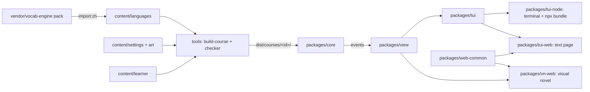

# E1: Visual Novel Front End Implementation Plan

> **For agentic workers:** REQUIRED SUB-SKILL: Use superpowers:subagent-driven-development (recommended) or superpowers:executing-plans to implement this plan task-by-task. Steps use checkbox (`- [ ]`) syntax for tracking.

**Goal:** A second browser front end, a 2D visual novel with flat SVG places and faceless silhouettes. It shares the core, the courses and the saves with the text game, and it is served at the site root with the text game at `/text/`.

**Architecture:**
- Presentation logic that has nothing to do with the terminal moves out of `packages/tui` into a new pure package, `packages/view`. The TUI keeps exactly its behaviour.
- Browser plumbing moves out of `packages/tui-web` into `packages/web-common`, so both pages share sessions, settings, audio and course fetching.
- A new Preact page, `packages/vn-web`, runs a small DOM-free controller (`vn.ts`). The controller turns core events into beats the player taps through.
- Art is per-setting content: `content/settings/<setting>/art/`. The course build checks it and copies it next to each course.

**Tech Stack:** TypeScript, Vitest, esbuild, Preact 10 (JSX via `jsxImportSource: "preact"`), Fluent (`@fluent/bundle`), hand-written SVG.

**Spec:** `docs/superpowers/specs/2026-09-26-e1-visual-novel-design.md`

## Global Constraints

- Always keep core free of I/O and rendering; front ends talk to it only through `send` and `state` (CLAUDE.md).
- The TUI's screens, keys and texts do not change. Every existing test in `packages/tui`, `packages/tui-node`, `packages/tui-web` and `tools` passes unchanged, except for import paths.
- `localStorage` key names stay exactly: `silver-tongue:<course>:session:<id>`, `silver-tongue:<course>:meta`, `silver-tongue:<course>:invalid-backup:…`, `silver-tongue:settings`.
- Every string the visual novel shows comes from the learner `ui.ftl` and is listed in `VN_UI_KEYS`. `place-<id>`, `npc-<id>`, `scene-<id>` and the existing `UI_KEYS` messages are reused, not copied.
- Art sizes and formats:
  - place SVG: `viewBox="0 0 1600 900"`;
  - NPC SVG: `viewBox="0 0 400 900"`, drawn in `currentColor`, feet on the bottom edge;
  - each SVG at most 40 KB (40 × 1024 bytes);
  - no `<script>`, no `on…=` attributes, no external `href`, no `<image>`, no `<foreignObject>`;
  - no text or hanzi in the art.
- Characters are faceless silhouettes. Reactions are motion and marks only: `speak` (bob), `puzzled` (tilt, **?**), `pleased` (hop, **!**), `listen` (still, dimmed).
- The stage is 16:9 and letterboxed. Phones play in landscape; portrait shows a dismissable "turn your phone" hint.
- `npm run build:course` after any change under `content/`, and never commit a course with checker errors.
- Commits end with `Co-Authored-By: Claude Opus 5.5 <noreply@anthropic.com>`.
- Release: version **0.14.0**. The `CHANGELOG.md` entry comes before the `release:` commit. Do not publish to npm or push without the owner's OK.

## Review Focus

1. **Double taps and early taps.** Tapping a choice twice, or pressing `1` while a beat is still showing, must send exactly one input. Pinned in Task 7 ("ignores choices while a beat is showing, and a second tap on the same choice").
2. **A save made mid-scene.** Reloading must put the NPC back on stage, show their line (not the scene's opening narration) and then offer the replies. Pinned in Task 7 ("resumes a scene saved half-way").
3. **Missing or unreachable art.** A course without art, a failed `art.json` fetch or one missing SVG must still play, with fallbacks. Pinned in Task 8 (`art.test.ts`).
4. **Blocked storage.** In a private window with storage blocked, the game must play on, show one toast, and not try to save again. Pinned in Task 7 ("says once that it can't save").
5. **Keys while an overlay is open or a name is being typed.** These must never reach the game; for example, `1` in the notebook must not start a scene. Pinned in Task 8 (`keys.test.ts`).

---

## File Structure

```
packages/view/                      NEW  pure presentation logic, no terminal/DOM/I-O
  package.json, src/index.ts
  src/text.ts                       MOVED from tui (+ VN_UI_KEYS)
  src/choose.ts, src/session-lines.ts, src/save-line.ts, src/audio.ts   MOVED from tui
  src/menu.ts                       placeMenu, waitingForMoney
  src/help.ts                       wordCard, sentenceCard
  src/narration.ts                  actionNarration, introLines
  src/hud.ts                        hudValues
  src/reply.ts                      rightReply, tileEcho
  src/notebook.ts                   notebookEntries
  src/settings.ts                   settingsRows
  src/testing.ts                    fixtureWithText, spacedWithText (for tests)
  test/*.test.ts
packages/tui/src/app.ts, notebook.ts, index.ts   MODIFIED to use view
packages/web-common/                NEW  browser plumbing shared by both pages
  package.json, tsconfig.json, src/index.ts
  src/web-storage.ts, src/web-audio.ts          MOVED from tui-web
  src/courses.ts                    metaContent, coursesBase, fetchJson
  copy-courses.mjs                  copies dist/courses + clips into a page's dist
  test/*.test.ts
packages/tui-web/                   MODIFIED to import web-common, st-courses/st-vn metas
packages/vn-web/                    NEW  the visual novel page
  package.json, tsconfig.json, build.mjs
  src/index.html, src/vn.css, src/main.tsx
  src/vn.ts                         controller (beats, phases, inputs)
  src/keys.ts                       keyAction
  src/art.ts                        loadArt + fallbacks
  src/art/title.svg
  src/ui/*.tsx                      App, Stage, Hud, Box, Line, Choices, Tiles, Card, Overlays, Title, Toasts, RotateHint
  test/vn.test.ts, test/keys.test.ts, test/art.test.ts
tools/src/art.ts                    NEW  svgProblems, artProblems
tools/src/build-course.ts           MODIFIED checks.art, artDir, writeCourses copies art
tools/src/site.ts                   NEW  assembles site/ (VN at /, text at /text/)
content/settings/china-city/art/    NEW  places/*.svg (12), npcs/*.svg (13), art.json
content/courses/zh-china.json       MODIFIED checks.art: true
content/learner/en/ui.ftl           MODIFIED vn-* messages
.github/workflows/pages.yml         MODIFIED builds the site
```

---

### Task 1: Create `packages/view` and move the non-terminal TUI modules into it

**Files:**
- Create: `packages/view/package.json`, `packages/view/src/index.ts`, `packages/view/src/testing.ts`
- Move (git mv): `packages/tui/src/{text,choose,session-lines,save-line,audio}.ts` → `packages/view/src/`
- Move (git mv): `packages/tui/test/{text,choose,save-line}.test.ts` → `packages/view/test/`
- Modify: `packages/tui/package.json`, `packages/tui/src/index.ts`, `packages/tui/src/app.ts`, `packages/tui/src/notebook.ts`, `packages/tui/test/fake-terminal.ts`, every `packages/tui/test/*.ts` that imports a moved module

**Interfaces:**
- Produces: package `@silver-tongue/view` exporting everything the moved files exported: `makeText`, `Text`, `UI_KEYS`, `uiTextProblems`, `narrationProblems`, `PlayerSettings`, `parseSettings`, `Start`, `learnerFor`, `chooseStart`, `courseLabels`, `SessionSummary`, `sessionLines`, `encodeSave`, `decodeSave`, `AudioOut`, `Speech`.
- Produces: `@silver-tongue/view/testing` exporting `NARRATION: string`, `fixtureWithText(): Course`, `spacedWithText(): Course`.
- `@silver-tongue/tui` keeps exporting all of the above (it re-exports `@silver-tongue/view`), so `tools`, `tui-node` and `tui-web` need no edits.

- [ ] **Step 1: Create the package**

`packages/view/package.json`:
```json
{
  "name": "@silver-tongue/view",
  "private": true,
  "type": "module",
  "exports": { ".": "./src/index.ts", "./testing": "./src/testing.ts" },
  "dependencies": { "@fluent/bundle": "^0.18.0", "@silver-tongue/core": "*" }
}
```

```bash
mkdir -p packages/view/src packages/view/test
git mv packages/tui/src/text.ts packages/tui/src/choose.ts packages/tui/src/session-lines.ts packages/tui/src/save-line.ts packages/tui/src/audio.ts packages/view/src/
git mv packages/tui/test/text.test.ts packages/tui/test/choose.test.ts packages/tui/test/save-line.test.ts packages/view/test/
```

`packages/view/src/index.ts`:
```ts
export * from "./text";
export * from "./choose";
export * from "./session-lines";
export * from "./save-line";
export type { AudioOut, Speech } from "./audio";
```

- [ ] **Step 2: Move the text fixtures into `view/testing`**

Create `packages/view/src/testing.ts` with the `NARRATION` string, `fixtureWithText` and `spacedWithText`, cut from `packages/tui/test/fake-terminal.ts`. The ui.ftl URL keeps the same depth:
```ts
import { readFileSync } from "node:fs";
import type { Course } from "@silver-tongue/core";
import { fixtureCourse, spacedCourse } from "@silver-tongue/core/testing";

/** Narration and names for the test course, as a learner-language file would give them. */
export const NARRATION = `
place-street = The street
place-street-desc = Bikes and steam.
place-noodle_shop = Noodle shop
place-noodle_shop-desc = Steam everywhere. The cook waves you over.
npc-cook = Cook
scene-intro = Say hello
scene-intro-start = The cook looks up from a steaming pot and wipes her hands on her apron.
scene-intro-end = She hands you an apron.
action-serve = You set down { $count } cups of { $item }.
asked-serve = They wanted { $count } cups of { $item }.
action-repeat = You repeat the word for { $item }.
note-hao-title = 好 means good
note-hao = On its own, 好 agrees.
intro-1 = You arrive with { $currency }{ $wallet } and no words.
intro-2 = An old man on a bench is watching you with open curiosity.
scene-shift = Serve drinks
`;

const ui = () => readFileSync(new URL("../../../content/learner/en/ui.ftl", import.meta.url), "utf8");

/** The fixture course with the real English UI text. */
export function fixtureWithText(): Course {
  return { ...fixtureCourse(), learnerFtl: ui() + NARRATION };
}

/** The spaced test course with the real English UI text. */
export function spacedWithText(): Course {
  return { ...spacedCourse(), learnerFtl: ui() + NARRATION };
}
```
In `packages/tui/test/fake-terminal.ts`, delete `NARRATION`, `fixtureWithText`, `spacedWithText` and the `readFileSync`, `fixtureCourse`, `spacedCourse` and `Course` imports that only they used. Add:
```ts
export { fixtureWithText, spacedWithText } from "@silver-tongue/view/testing";
```

- [ ] **Step 3: Point the TUI at the moved modules**

`packages/tui/package.json` dependencies become:
```json
"dependencies": { "@fluent/bundle": "^0.18.0", "@silver-tongue/core": "*", "@silver-tongue/view": "*" }
```
`packages/tui/src/index.ts` becomes:
```ts
export * from "./terminal";
export * from "./ansi";
export * from "./width";
export * from "./screen";
export * from "./notebook";
export { startApp, type App, type AppOptions } from "./app";
export * from "@silver-tongue/view";
```
Replace the relative imports of moved files in the TUI:
```bash
sed -i -E 's#from "\./(text|audio|choose|save-line|session-lines)"#from "@silver-tongue/view"#' packages/tui/src/*.ts
sed -i -E 's#from "\.\./src/(text|audio|choose|save-line|session-lines)"#from "@silver-tongue/view"#' packages/tui/test/*.ts packages/view/test/*.ts
sed -i -E 's#from "@silver-tongue/view"#from "../src/index"#' packages/view/test/*.ts
grep -rn 'tui/src/\(text\|audio\|choose\|save-line\|session-lines\)' packages tools --include=*.ts | grep -v node_modules
```
Expected: the grep prints nothing. `app.ts` ends up with two import lines from `@silver-tongue/view` (one for `AudioOut`/`Speech` types, one for `makeText`/`Text`), which is fine. Merge them if the linter-free code reads better.

- [ ] **Step 4: Link the workspace and run everything**

```bash
npm install
npm test && npm run typecheck
```
Expected: all tests pass (the same count as before the move), and typecheck is clean.

- [ ] **Step 5: Commit**

```bash
git add -A packages/view packages/tui package-lock.json
git commit -m "view: a package for presentation logic; text, settings, save lines and audio types move out of tui

Co-Authored-By: Claude Opus 5.5 <noreply@anthropic.com>"
```

---

### Task 2: Presentation helpers in `view`

**Files:**
- Create: `packages/view/src/{menu,help,narration,hud,reply,notebook,settings}.ts`
- Modify: `packages/view/src/index.ts`
- Test: `packages/view/test/{menu,help,narration,hud,reply,notebook,settings}.test.ts`

**Interfaces:**
- Consumes: `Text`/`makeText` (Task 1); from core: `availableSceneIds`, `mentorAvailable`, `moneyBlocked`, `sceneCost`, `rankFor`, `wordState`, `comboKey`, `joinTiles`, `tilePieces`, `personalize`, `PLAYER_MARK`.
- Produces (exact signatures):
```ts
// menu.ts
export const MAX_PLACE_ITEMS = 7;
export type MenuItem =
  | { kind: "talk"; label: string; input: Input; npc: string; scene: string }
  | { kind: "mentor"; label: string; input: Input; npc: string }
  | { kind: "go"; label: string; input: Input; place: string }
  | { kind: "sleep"; label: string; input: Input };
export function placeMenu(course: Course, state: GameState, t: Text): MenuItem[];
export function waitingForMoney(course: Course, state: GameState, t: Text): string[];
// help.ts
export interface WordCard { word: WordId; text: string; readings: string[]; gloss: string; clips: string[] }
export interface SentenceCard { text: string; reading: string; meaning: string; clips: string[] }
export function wordCard(course: Course, id: WordId): WordCard;
export function sentenceCard(course: Course, line: RenderedLine): SentenceCard | undefined;
// narration.ts
export type ActionPerformed = Extract<GameEvent, { type: "actionPerformed" }>;
export interface NarrationLine { text: string; tone: "plain" | "warn" }
export function actionNarration(course: Course, t: Text, e: Pick<ActionPerformed, "action" | "expected" | "matched" | "tilesWrong">): NarrationLine[];
export function introLines(course: Course, state: GameState, t: Text): string[];
// hud.ts
export interface HudValues { day: number; slot: number; slots: number; currency: string; wallet: number; rank: number; rankLabel: string; parcel: boolean; rentLate: boolean }
export function hudValues(course: Course, state: GameState, t: Text, now: number): HudValues;
// reply.ts
export function rightReply(course: Course, state: GameState): RenderedLine | undefined;
export function tileEcho(course: Course, state: GameState, tiles: string[], placed: number[]): { line: RenderedLine; right: boolean; clips: string[] };
// notebook.ts
export interface NotebookWord { id: WordId; text: string; readings: string[]; gloss: string; state: WordState; clips: string[]; first?: string }
export interface NotebookGroup { place: string | null; title: string; words: NotebookWord[] }
export interface Notebook { progress: string[]; empty: boolean; groups: NotebookGroup[]; notes: { title: string; text: string }[] }
export function notebookEntries(course: Course, state: GameState, t: Text, now: number): Notebook;
// settings.ts
export type SettingsScreen = "main" | "course" | "reading";
export type SettingsAction = { kind: "open"; screen: "course" | "reading" } | { kind: "back" } | { kind: "switch"; course: string; learner: string } | { kind: "sound" };
export interface SettingsRow { label: string; action: SettingsAction }
export interface SettingsContext { course: Course; catalog: CatalogEntry[]; state: GameState; t: Text; audioAvailable: boolean }
export function settingsRows(screen: SettingsScreen, c: SettingsContext): SettingsRow[];
```

- [ ] **Step 1: Write the failing tests**

`packages/view/test/menu.test.ts`:
```ts
import { describe, expect, it } from "vitest";
import { newGame } from "@silver-tongue/core";
import { fixtureWithText } from "../src/testing";
import { makeText, placeMenu, waitingForMoney } from "../src/index";

const setup = () => {
  const course = fixtureWithText();
  return { course, state: newGame(course), t: makeText(course.learnerFtl, "en") };
};

describe("place menu", () => {
  it("offers the exits, then sleep", () => {
    const { course, state, t } = setup();
    const menu = placeMenu(course, state, t);
    expect(menu.map((m) => m.kind)).toEqual(["go", "sleep"]);
    expect(menu[0]).toMatchObject({ label: "Go to Noodle shop", input: { type: "goTo", place: "noodle_shop" }, place: "noodle_shop" });
    expect(menu[1]).toMatchObject({ label: "Sleep (end the day)", input: { type: "sleep" } });
  });

  it("offers a scene here with who it is with and its slot cost", () => {
    const { course, state, t } = setup();
    state.place = "noodle_shop";
    expect(placeMenu(course, state, t)[0]).toEqual({
      kind: "talk", label: "Talk to Cook: Say hello · 1 slot", input: { type: "startScene", scene: "intro" }, npc: "cook", scene: "intro",
    });
  });

  it("offers the mentor only when a note is waiting", () => {
    const { course, state, t } = setup();
    course.world.mentor = { npc: "cook", after: "intro" };
    state.place = "noodle_shop";
    state.scenesDone.intro = 1;
    expect(placeMenu(course, state, t).some((m) => m.kind === "mentor")).toBe(false);
    state.notes.ready = ["hao"];
    expect(placeMenu(course, state, t).find((m) => m.kind === "mentor")).toMatchObject({ npc: "cook", input: { type: "visitMentor" } });
  });

  it("keeps at most seven items before sleep", () => {
    const { course, state, t } = setup();
    for (let i = 0; i < 9; i++) {
      course.world.places[`p${i}`] = { links: ["street"] };
      course.world.places.street.links.push(`p${i}`);
    }
    const menu = placeMenu(course, state, t);
    expect(menu).toHaveLength(8);
    expect(menu.at(-1)!.kind).toBe("sleep");
  });

  it("names the scenes here that wait only for money", () => {
    const { course, state, t } = setup();
    for (const v of Object.values(course.scenes[1].exchanges[0].variants)) v.cost = 100;
    state.place = "noodle_shop";
    state.scenesDone.intro = 1;
    state.trust.cook = 1;
    expect(waitingForMoney(course, state, t)).toEqual(["Cook: Serve drinks · needs ¥100"]);
  });
});
```

`packages/view/test/help.test.ts`:
```ts
import { describe, expect, it } from "vitest";
import { fixtureWithText } from "../src/testing";
import { sentenceCard, wordCard } from "../src/index";

describe("help cards", () => {
  const course = fixtureWithText();
  course.words.w_ni.audio = ["c-ni"];

  it("gives a word's text, readings, gloss and clips", () => {
    expect(wordCard(course, "w_ni")).toEqual({ word: "w_ni", text: "你", readings: ["nǐ"], gloss: "you", clips: ["c-ni"] });
    expect(wordCard(course, "w_cha").readings).toEqual([]);
  });

  it("gives a sentence's meaning and the last reading of each word, only when it has a meaning", () => {
    const line = course.scenes[0].exchanges[0].variants[""].npc;
    expect(sentenceCard(course, { ...line, audio: ["c-line"] })).toEqual({ text: "你好！", reading: "nǐ hǎo", meaning: "Hello!", clips: ["c-line"] });
    expect(sentenceCard(course, { ...line, meaning: undefined })).toBeUndefined();
  });
});
```

`packages/view/test/narration.test.ts`:
```ts
import { describe, expect, it } from "vitest";
import { newGame } from "@silver-tongue/core";
import { fixtureWithText } from "../src/testing";
import { actionNarration, introLines, makeText } from "../src/index";

const course = fixtureWithText();
const t = makeText(course.learnerFtl, "en");
const serve = (count: string, item: string) => ({ action: "serve", count, item });

describe("narration", () => {
  it("says what the reply did", () => {
    expect(actionNarration(course, t, { action: serve("three", "tea"), expected: serve("three", "tea"), matched: true, tilesWrong: false })).toEqual([
      { text: "You set down three cups of tea.", tone: "plain" },
    ]);
  });

  it("on a mix-up, also says what was asked", () => {
    expect(actionNarration(course, t, { action: serve("four", "tea"), expected: serve("three", "tea"), matched: false, tilesWrong: false })).toEqual([
      { text: "You set down four cups of tea.", tone: "plain" },
      { text: "They wanted three cups of tea.", tone: "warn" },
    ]);
  });

  it("wrong tiles did nothing recognisable: only what was asked", () => {
    expect(actionNarration(course, t, { action: serve("four", "tea"), expected: serve("three", "tea"), matched: false, tilesWrong: true })).toEqual([
      { text: "They wanted three cups of tea.", tone: "warn" },
    ]);
  });

  it("falls back to the generic mismatch line", () => {
    const greet = { action: "greet" };
    expect(actionNarration(course, t, { action: greet, expected: greet, matched: false, tilesWrong: false })).toEqual([
      { text: t("mismatch"), tone: "warn" },
    ]);
  });

  it("tells the story only for a game that hasn't started", () => {
    const state = newGame(course);
    expect(introLines(course, state, t)).toEqual([
      "You arrive with ¥20 and no words.",
      "An old man on a bench is watching you with open curiosity.",
    ]);
    state.scenesDone.intro = 1;
    expect(introLines(course, state, t)).toEqual([]);
  });
});
```

`packages/view/test/hud.test.ts`:
```ts
import { describe, expect, it } from "vitest";
import { newGame } from "@silver-tongue/core";
import { fixtureWithText } from "../src/testing";
import { hudValues, makeText } from "../src/index";

describe("hud values", () => {
  it("gives the day, slots, wallet, rank and flags", () => {
    const course = fixtureWithText();
    const state = newGame(course);
    state.errand = { to: "school" };
    state.rentLate = true;
    expect(hudValues(course, state, makeText(course.learnerFtl, "en"), 0)).toEqual({
      day: 1, slot: 0, slots: 4, currency: "¥", wallet: 20, rank: 0, rankLabel: "Pidgin", parcel: true, rentLate: true,
    });
  });
});
```

`packages/view/test/reply.test.ts`:
```ts
import { describe, expect, it } from "vitest";
import { comboKey, createCore, mulberry32, newGame } from "@silver-tongue/core";
import { fixtureWithText } from "../src/testing";
import { rightReply, tileEcho } from "../src/index";

const shaky = { right: 1, wrong: 1, streak: 0, helps: 0, lapsed: true, firstSeen: 0, lastSeen: 0 };

/** A game at the tiles exchange of the intro scene (greet answered right, the drink word shaky). */
function atTiles() {
  const course = fixtureWithText();
  const state = newGame(course);
  state.words.w_cha = { ...shaky };
  state.words.w_shui = { ...shaky };
  const core = createCore(course, state, { now: () => 0, rng: mulberry32(1) });
  core.send({ type: "goTo", place: "noodle_shop" });
  core.send({ type: "startScene", scene: "intro" });
  core.send({ type: "reply", choice: core.state.run!.options.indexOf(comboKey(core.state.run!.combo)) });
  return { course, core };
}

describe("replies", () => {
  it("finds the right reply for the exchange being played", () => {
    const { course, core } = atTiles();
    expect(rightReply(course, core.state)!.text).toMatch(/^(茶|水)？$/);
    expect(rightReply(course, newGame(course))).toBeUndefined();
  });

  it("echoes right tiles as the reply itself, wrong ones as placed", () => {
    const { course, core } = atTiles();
    const run = core.state.run!;
    expect(run.mode).toBe("tiles");
    const want = run.combo.item === "tea" ? "茶" : "水";
    const right = tileEcho(course, core.state, run.tiles, [run.tiles.indexOf(want)]);
    expect(right).toMatchObject({ right: true, line: { text: `${want}？` } });
    const wrongIndex = run.tiles.findIndex((x) => x !== want);
    const wrong = tileEcho(course, core.state, run.tiles, [wrongIndex]);
    expect(wrong).toMatchObject({ right: false, line: { text: run.tiles[wrongIndex], tokens: [] } });
  });
});
```

`packages/view/test/notebook.test.ts`:
```ts
import { describe, expect, it } from "vitest";
import { newGame, PLAYER_MARK, type WordRecord } from "@silver-tongue/core";
import { fixtureWithText } from "../src/testing";
import { makeText, notebookEntries } from "../src/index";

const T0 = 1_000_000;
const rec = (patch: Partial<WordRecord>): WordRecord => ({ right: 1, wrong: 0, streak: 1, helps: 0, lapsed: false, firstSeen: T0, lastSeen: T0, ...patch });

describe("notebook entries", () => {
  const course = fixtureWithText();
  const t = makeText(course.learnerFtl, "en");

  it("is empty for a new game", () => {
    const nb = notebookEntries(course, newGame(course), t, T0);
    expect(nb.empty).toBe(true);
    expect(nb.groups).toEqual([]);
    expect(nb.progress).toHaveLength(1);
  });

  it("groups words by where they were first heard, with the name in the first line", () => {
    const state = newGame(course);
    state.player = "Mei";
    course.words.w_ni.audio = ["c-ni"];
    state.words = { w_ni: rec({ streak: 3, right: 3, first: { line: `你好${PLAYER_MARK}！`, place: "noodle_shop" } }), w_cha: rec({}) };
    state.notes.read = ["hao"];
    const nb = notebookEntries(course, state, t, T0);
    expect(nb.groups.map((g) => [g.place, g.title])).toEqual([["noodle_shop", "Noodle shop"], [null, t("notebook-elsewhere")]]);
    expect(nb.groups[0].words[0]).toEqual({ id: "w_ni", text: "你", readings: ["nǐ"], gloss: "you", state: "known", clips: ["c-ni"], first: "你好Mei！" });
    expect(nb.groups[1].words[0].first).toBeUndefined();
    expect(nb.notes).toEqual([{ title: "好 means good", text: "On its own, 好 agrees." }]);
  });
});
```

`packages/view/test/settings.test.ts`:
```ts
import { describe, expect, it } from "vitest";
import { newGame, type CatalogEntry } from "@silver-tongue/core";
import { fixtureWithText } from "../src/testing";
import { makeText, settingsRows } from "../src/index";

const catalog: CatalogEntry[] = [
  { id: "test-course", language: "zh", setting: "s", learners: ["en", "bn"], learnerNames: { en: "English", bn: "বাংলা" } },
  { id: "ja-town", language: "ja", setting: "t", learners: ["bn"], learnerNames: { bn: "বাংলা" } },
];

describe("settings rows", () => {
  const course = fixtureWithText();
  const t = makeText(course.learnerFtl + "\nlanguage-ja = Japanese\n", "en");
  const ctx = { course, catalog, state: newGame(course), t, audioAvailable: true };

  it("main: learning, reading, sound", () => {
    const rows = settingsRows("main", ctx);
    expect(rows.map((r) => r.action)).toEqual([{ kind: "open", screen: "course" }, { kind: "open", screen: "reading" }, { kind: "sound" }]);
    expect(rows[0].label).toContain("Chinese");
    expect(rows[1].label).toContain("English");
  });

  it("course: the current one goes back; another switches, keeping the reading language if it can", () => {
    const rows = settingsRows("course", ctx);
    expect(rows[0].action).toEqual({ kind: "back" });
    expect(rows[1]).toMatchObject({ label: "Japanese", action: { kind: "switch", course: "ja-town", learner: "bn" } });
  });

  it("reading: each reading language of this course", () => {
    const rows = settingsRows("reading", ctx);
    expect(rows.map((r) => r.action)).toEqual([{ kind: "back" }, { kind: "switch", course: "test-course", learner: "bn" }]);
    expect(rows[1].label).toBe("বাংলা");
  });

  it("says when there is no sound", () => {
    expect(settingsRows("main", { ...ctx, audioAvailable: false })[2].label).toContain(t("settings-sound-none"));
  });
});
```

- [ ] **Step 2: Run the tests to verify they fail**

Run: `npx vitest run packages/view`
Expected: FAIL. `placeMenu`, `wordCard` and the other new helpers are not exported.

- [ ] **Step 3: Write the helpers**

`packages/view/src/menu.ts`:
```ts
import { availableSceneIds, mentorAvailable, moneyBlocked, sceneCost, type Course, type GameState, type Input } from "@silver-tongue/core";
import type { Text } from "./text";

/** Scenes, exits and the mentor's visit before sleep; the content checker keeps places within it. */
export const MAX_PLACE_ITEMS = 7;

export type MenuItem =
  | { kind: "talk"; label: string; input: Input; npc: string; scene: string }
  | { kind: "mentor"; label: string; input: Input; npc: string }
  | { kind: "go"; label: string; input: Input; place: string }
  | { kind: "sleep"; label: string; input: Input };

/** What the player can do here: talk, visit the mentor, go somewhere, sleep (always last). */
export function placeMenu(course: Course, state: GameState, t: Text): MenuItem[] {
  const npcName = (npc: string) => t(`npc-${npc}`);
  const items: MenuItem[] = [];
  for (const id of availableSceneIds(course, state)) {
    const scene = course.scenes.find((x) => x.id === id)!;
    if (scene.place !== state.place) continue;
    items.push({
      kind: "talk",
      label: t("menu-talk", { npc: npcName(scene.npc), scene: t(`scene-${id}`) }) + t("cost-slot"),
      input: { type: "startScene", scene: id },
      npc: scene.npc,
      scene: id,
    });
  }
  // Offered only when there is something to explain, so a slot is never spent on nothing.
  if (mentorAvailable(course, state) && state.notes.ready.length) {
    const npc = course.world.mentor!.npc;
    items.push({ kind: "mentor", label: t("menu-mentor", { npc: npcName(npc) }) + t("cost-slot"), input: { type: "visitMentor" }, npc });
  }
  for (const p of course.world.places[state.place].links) {
    items.push({ kind: "go", label: t("menu-go", { place: t(`place-${p}`) }), input: { type: "goTo", place: p }, place: p });
  }
  return [...items.slice(0, MAX_PLACE_ITEMS), { kind: "sleep", label: t("menu-sleep"), input: { type: "sleep" } }];
}

/** Scenes here that wait only for money: shown, not offered, so an empty shop says why. */
export function waitingForMoney(course: Course, state: GameState, t: Text): string[] {
  return course.scenes
    .filter((x) => x.place === state.place && moneyBlocked(x, state))
    .map((x) => t("menu-needs-money", { npc: t(`npc-${x.npc}`), scene: t(`scene-${x.id}`), currency: course.world.currency, cost: sceneCost(x) }));
}
```

`packages/view/src/help.ts`:
```ts
import type { Course, RenderedLine, WordId } from "@silver-tongue/core";

export interface WordCard {
  word: WordId;
  text: string;
  readings: string[];
  gloss: string;
  clips: string[];
}

export interface SentenceCard {
  text: string;
  /** each word's last (plainest) reading */
  reading: string;
  meaning: string;
  clips: string[];
}

/** What looking up a word shows. */
export function wordCard(course: Course, id: WordId): WordCard {
  const w = course.words[id];
  return { word: id, text: w.w, readings: w.readings ?? [], gloss: w.gloss, clips: w.audio ?? [] };
}

/** What asking about a whole line shows; undefined when the line has no meaning written. */
export function sentenceCard(course: Course, line: RenderedLine): SentenceCard | undefined {
  if (!line.meaning) return undefined;
  const reading = line.tokens.flatMap((tk) => course.words[tk.word]?.readings?.at(-1) ?? []).join(" ");
  return { text: line.text, reading, meaning: line.meaning, clips: line.audio ?? [] };
}
```

`packages/view/src/narration.ts`:
```ts
import type { Course, GameEvent, GameState } from "@silver-tongue/core";
import type { Text } from "./text";

export type ActionPerformed = Extract<GameEvent, { type: "actionPerformed" }>;
export interface NarrationLine {
  text: string;
  tone: "plain" | "warn";
}

/** An action's parameters as narration variables: concept values become learner-language names. */
const actionArgs = (course: Course, a: Record<string, string>) =>
  Object.fromEntries(Object.entries(a).map(([k, v]) => [k, course.conceptNames[v] ?? v]));

/**
 * What the reply did (action-<name>) and, on a mix-up, what was asked (asked-<name> of the asked
 * action), falling back to the generic mismatch line. Wrong tiles did nothing recognisable, so only
 * what was asked is narrated.
 */
export function actionNarration(course: Course, t: Text, e: Pick<ActionPerformed, "action" | "expected" | "matched" | "tilesWrong">): NarrationLine[] {
  const out: NarrationLine[] = [];
  if (!e.tilesWrong && t.has(`action-${e.action.action}`)) out.push({ text: t(`action-${e.action.action}`, actionArgs(course, e.action)), tone: "plain" });
  if (e.matched) return out;
  if (t.has(`asked-${e.expected.action}`)) out.push({ text: t(`asked-${e.expected.action}`, actionArgs(course, e.expected)), tone: "warn" });
  else out.push({ text: t("mismatch"), tone: "warn" });
  return out;
}

/** The opening story (intro-1, intro-2, …), for a game that hasn't started yet; otherwise none. */
export function introLines(course: Course, state: GameState, t: Text): string[] {
  const fresh =
    state.day === 1 && state.slot === 0 && !state.run && state.place === course.world.start && !Object.keys(state.scenesDone).length && !Object.keys(state.words).length;
  if (!fresh) return [];
  const args = { currency: course.world.currency, wallet: state.wallet, rent: course.world.rentPerWeek };
  const out: string[] = [];
  for (let i = 1; t.has(`intro-${i}`); i++) out.push(t(`intro-${i}`, args));
  return out;
}
```

`packages/view/src/hud.ts`:
```ts
import { rankFor, type Course, type GameState } from "@silver-tongue/core";
import type { Text } from "./text";

export interface HudValues {
  day: number;
  slot: number;
  slots: number;
  currency: string;
  wallet: number;
  rank: number;
  rankLabel: string;
  parcel: boolean;
  rentLate: boolean;
}

export function hudValues(course: Course, state: GameState, t: Text, now: number): HudValues {
  const rank = rankFor(state.words, Object.keys(course.words), now);
  return {
    day: state.day,
    slot: state.slot,
    slots: course.world.slotsPerDay,
    currency: course.world.currency,
    wallet: state.wallet,
    rank,
    rankLabel: t(`rank-${rank}`),
    parcel: !!state.errand,
    rentLate: state.rentLate,
  };
}
```

`packages/view/src/reply.ts`:
```ts
import { comboKey, joinTiles, personalize, PLAYER_MARK, tilePieces, type Course, type GameState, type RenderedLine } from "@silver-tongue/core";

/** The right reply for the exchange being played. */
export function rightReply(course: Course, state: GameState): RenderedLine | undefined {
  const run = state.run;
  const ex = run && course.scenes.find((x) => x.id === run.scene)?.exchanges[run.exchange];
  return run ? ex?.variants[comboKey(run.combo)]?.reply : undefined;
}

/**
 * What the player said with these tiles. Tiles that make the right reply are shown as the reply
 * itself, punctuation and all; others as placed, with no words to look up. `clips` is the right
 * reply's, said only when the tiles match.
 */
export function tileEcho(course: Course, state: GameState, tiles: string[], placed: number[]): { line: RenderedLine; right: boolean; clips: string[] } {
  const text = joinTiles(course, placed.map((i) => tiles[i]));
  const reply = rightReply(course, state);
  const name = state.player ?? "";
  const right = !!reply && joinTiles(course, tilePieces(reply).map((x) => (x === PLAYER_MARK ? name : x))) === text;
  return { line: right ? personalize(reply!, name) : { text, tokens: [] }, right, clips: reply?.audio ?? [] };
}
```

`packages/view/src/notebook.ts`:
```ts
import { PLAYER_MARK, wordState, type Course, type GameState, type WordId, type WordState } from "@silver-tongue/core";
import type { Text } from "./text";

export interface NotebookWord {
  id: WordId;
  text: string;
  readings: string[];
  gloss: string;
  state: WordState;
  clips: string[];
  /** the line it was first heard in, with the player's name */
  first?: string;
}
export interface NotebookGroup {
  /** null: heard before places were recorded */
  place: string | null;
  title: string;
  words: NotebookWord[];
}
export interface Notebook {
  progress: string[];
  empty: boolean;
  groups: NotebookGroup[];
  notes: { title: string; text: string }[];
}

/**
 * The notebook: progress on each stage's word list, the words heard so far grouped by the place
 * they were first heard (in world order), and the mentor notes already explained.
 */
export function notebookEntries(course: Course, state: GameState, t: Text, now: number): Notebook {
  const stages = [...new Set(course.scenes.map((s) => String(s.stage)))].sort();
  const progress = stages.map((stage) => {
    const list = course.stageWords[stage] ?? [];
    const states = list.map((w) => wordState(state.words[w], now));
    return t("notebook-progress", {
      stage,
      known: states.filter((s) => s === "known").length,
      total: list.length,
      heard: states.filter((s) => s !== "unseen").length,
    });
  });
  const heard = Object.keys(state.words).filter((w) => course.words[w]);
  const groups: NotebookGroup[] = [];
  for (const place of [...Object.keys(course.world.places), ""]) {
    const ids = heard.filter((w) => (state.words[w].first?.place ?? "") === place);
    if (!ids.length) continue;
    groups.push({
      place: place || null,
      title: place ? t(`place-${place}`) : t("notebook-elsewhere"),
      words: ids.map((id) => {
        const w = course.words[id];
        const rec = state.words[id];
        return {
          id,
          text: w.w,
          readings: w.readings ?? [],
          gloss: w.gloss,
          state: wordState(rec, now),
          clips: w.audio ?? [],
          // Saves from before 0.7.0 may hold the name's mark instead of the name.
          ...(rec.first ? { first: rec.first.line.split(PLAYER_MARK).join(state.player ?? "") } : {}),
        };
      }),
    });
  }
  return { progress, empty: !heard.length, groups, notes: state.notes.read.map((id) => ({ title: t(`note-${id}-title`), text: t(`note-${id}`) })) };
}
```

`packages/view/src/settings.ts`:
```ts
import type { CatalogEntry, Course, GameState } from "@silver-tongue/core";
import type { Text } from "./text";

export type SettingsScreen = "main" | "course" | "reading";
export type SettingsAction =
  | { kind: "open"; screen: "course" | "reading" }
  | { kind: "back" }
  | { kind: "switch"; course: string; learner: string }
  | { kind: "sound" };
export interface SettingsRow {
  label: string;
  action: SettingsAction;
}
export interface SettingsContext {
  course: Course;
  catalog: CatalogEntry[];
  state: GameState;
  t: Text;
  audioAvailable: boolean;
}

/** The rows a settings screen shows and what choosing each one does. */
export function settingsRows(screen: SettingsScreen, c: SettingsContext): SettingsRow[] {
  const { course, catalog, state, t } = c;
  const entry = catalog.find((e) => e.id === course.id);
  const languageName = (code: string) => (t.has(`language-${code}`) ? t(`language-${code}`) : code);
  const learnerName = (code: string) => entry?.learnerNames[code] ?? code;
  const current = (yes: boolean) => (yes ? ` ${t("settings-current")}` : "");
  if (screen === "course") {
    return catalog.map((e) => ({
      label: languageName(e.language) + current(e.id === course.id),
      action:
        e.id === course.id ? { kind: "back" } : { kind: "switch", course: e.id, learner: e.learners.includes(course.learner) ? course.learner : e.learners[0] },
    }));
  }
  if (screen === "reading") {
    return (entry?.learners ?? [course.learner]).map((code) => ({
      label: learnerName(code) + current(code === course.learner),
      action: code === course.learner ? { kind: "back" } : { kind: "switch", course: course.id, learner: code },
    }));
  }
  const sound = !c.audioAvailable ? t("settings-sound-none") : state.sound === false ? t("settings-sound-off") : t("settings-sound-on");
  return [
    { label: t("settings-learning", { language: languageName(course.language.code) }), action: { kind: "open", screen: "course" } },
    { label: t("settings-reading", { learner: learnerName(course.learner) }), action: { kind: "open", screen: "reading" } },
    { label: t("settings-sound", { sound }), action: { kind: "sound" } },
  ];
}
```

Append to `packages/view/src/index.ts`:
```ts
export * from "./menu";
export * from "./help";
export * from "./narration";
export * from "./hud";
export * from "./reply";
export * from "./notebook";
export * from "./settings";
```

- [ ] **Step 4: Run the tests to verify they pass**

Run: `npx vitest run packages/view && npm run typecheck`
Expected: PASS. If one expected label differs, check it against `content/learner/en/ui.ftl` and fix the test, not the helper, as long as the helper's logic is the code shown above.

- [ ] **Step 5: Commit**

```bash
git add packages/view
git commit -m "view: place menu, help cards, narration, hud values, tile echo, notebook entries, settings rows

Co-Authored-By: Claude Opus 5.5 <noreply@anthropic.com>"
```

---

### Task 3: The TUI uses the `view` helpers (no behaviour change)

**Files:**
- Modify: `packages/tui/src/app.ts`, `packages/tui/src/notebook.ts`
- Test: the existing `packages/tui/test/app.test.ts` and `notebook.test.ts`, unchanged

**Interfaces:**
- Consumes: everything Task 2 produces.
- Produces: nothing new. `startApp` and `notebookLines` keep their signatures.

- [ ] **Step 1: Run the TUI tests as the baseline**

Run: `npx vitest run packages/tui`
Expected: PASS. Note the count.

- [ ] **Step 2: Replace the duplicated logic in `app.ts`**

Imports: drop `availableSceneIds`, `comboKey`, `moneyBlocked`, `personalize`, `PLAYER_MARK`, `tilePieces`, `sceneCost`, `joinTiles` (keep it only if it is still used; it is, in `prompt`), `mentorAvailable` and `rankFor` from the core import where they are no longer used. Add:
```ts
import {
  actionNarration, hudValues, introLines, placeMenu, sentenceCard, settingsRows, tileEcho, waitingForMoney, wordCard,
  type SettingsScreen,
} from "@silver-tongue/view";
```
Make these replacements inside `startApp`:

1. `tellIntro()` body becomes:
```ts
    for (const line of introLines(course, core.state, t)) push([{ text: line }], []);
```
2. Delete `actionArgs`. `narrateAction` becomes:
```ts
  function narrateAction(action: Record<string, string>, expected: Record<string, string>, matched: boolean, tilesWrong: boolean) {
    for (const n of actionNarration(course, t, { action, expected, matched, tilesWrong }))
      push([n.tone === "warn" ? { text: n.text, color: "yellow" } : { text: n.text, dim: true }]);
  }
```
3. Delete `catalogEntry`, `languageName`, `learnerName`, `soundLabel` and `current`. Rename `settingsRows()` to `settingsChoices()` everywhere in the file (it is called in `prompt`, `render` and `press`), with this body:
```ts
  const settingsScreen = (): SettingsScreen => (mode === "settings-course" ? "course" : mode === "settings-reading" ? "reading" : "main");
  /** The rows the settings screen shows, and what choosing each one does. */
  function settingsChoices(): { label: string; choose: () => void }[] {
    const ctx = { course, catalog: opts.settings!.courses, state: core.state, t, audioAvailable: !!opts.audio?.available };
    return settingsRows(settingsScreen(), ctx).map((r) => ({
      label: r.label,
      choose: () => {
        const a = r.action;
        if (a.kind === "open") mode = a.screen === "course" ? "settings-course" : "settings-reading";
        else if (a.kind === "back") mode = "settings";
        else if (a.kind === "switch") switchTo(a.course, a.learner);
        else soundKey("m");
      },
    }));
  }
```
4. Delete the local `rightReply`. `menu()` becomes:
```ts
  function menu(): MenuItem[] {
    // Sleep and quit always keep their keys; the content checker keeps places within 7 other items.
    return [...placeMenu(course, core.state, t), { label: t("menu-quit"), quit: true }];
  }
```
5. In `prompt`, the `waiting` lines become:
```ts
      const waiting: StyledLine[] = waitingForMoney(course, core.state, t).map((text) => [{ text, dim: true }]);
```
6. In `render`, delete `wordIds` at the top of `startApp`. The `hud` becomes:
```ts
    const h = hudValues(course, s, t, opts.now());
    const hud = t("hud", {
      day: h.day, slot: h.slot, slots: h.slots, currency: h.currency, wallet: h.wallet,
      rank: h.rankLabel, parcel: h.parcel ? "yes" : "no", rentLate: h.rentLate ? "yes" : "no",
    });
```
7. In `press`, the help branch uses the cards:
```ts
      if (word) {
        const card = wordCard(course, word.word);
        lastHelp = card.clips;
        hear(lastHelp);
        send({ type: "helpWord", word: word.word });
        push([
          { text: card.text, bold: true },
          ...(card.readings.length ? [{ text: ` ${card.readings.join(" ")}`, color: "yellow" as const }] : []),
          { text: ` — ${card.gloss}` },
        ]);
      }
      ...
      const sentence = lastLine && sentenceCard(course, lastLine);
      if (key.name === "s" && sentence) {
        lastHelp = sentence.clips;
        hear(lastHelp, lastSlow);
        flush();
        // Reading the whole line is not logged as help on each word: the words still have to be
        // recognised in the reply.
        push([
          { text: sentence.text, bold: true },
          ...(sentence.reading ? [{ text: ` ${sentence.reading}`, color: "yellow" as const }] : []),
          { text: ` — ${sentence.meaning}` },
        ]);
      }
```
8. The tiles `return` branch becomes:
```ts
    } else if (key.name === "return" && tileInput.length) {
      const said = tileEcho(course, core.state, tiles, tileInput);
      echo(said.line.text);
      tileReply = said.clips;
      send({ type: "replyTiles", tiles: tileInput });
    }
```
`MenuItem` in `app.ts` stays the TUI's own `{ label; input?; quit? }` type. `placeMenu`'s items are assignable to it.

- [ ] **Step 3: `notebookLines` formats `notebookEntries`**

Replace the body of `packages/tui/src/notebook.ts`:
```ts
import type { Course, GameState, WordState } from "@silver-tongue/core";
import { notebookEntries, type Text } from "@silver-tongue/view";
import type { StyledLine } from "./terminal";

const MARK: Record<WordState, string> = { unseen: " ", met: "○", shaky: "◐", known: "●" };

/** The notebook as terminal lines (see notebookEntries for what it holds). */
export function notebookLines(course: Course, state: GameState, t: Text, now: number): StyledLine[] {
  const nb = notebookEntries(course, state, t, now);
  const out: StyledLine[] = nb.progress.map((text) => [{ text, bold: true }]);
  if (nb.empty) out.push([], [{ text: t("notebook-empty"), dim: true }]);
  for (const g of nb.groups) {
    out.push([], [{ text: g.title, color: "cyan", bold: true }]);
    for (const w of g.words) {
      out.push([
        { text: `${MARK[w.state]} ` },
        { text: w.text, bold: true },
        ...(w.readings.length ? [{ text: ` ${w.readings.join(" ")}`, color: "yellow" as const }] : []),
        { text: ` — ${w.gloss}` },
      ]);
      if (w.first !== undefined) out.push([{ text: `    ${w.first}`, dim: true }]);
    }
  }
  if (nb.notes.length) {
    out.push([], [{ text: t("notebook-notes"), color: "cyan", bold: true }]);
    for (const n of nb.notes) out.push([{ text: n.title, bold: true }], [{ text: n.text }], []);
  }
  return out;
}
```

- [ ] **Step 4: Run all tests**

Run: `npm test && npm run typecheck`
Expected: PASS with the same TUI test count as Step 1. A failing TUI test means behaviour changed. Fix `app.ts`, never the test.

- [ ] **Step 5: Commit**

```bash
git add packages/tui
git commit -m "tui: menus, narration, hud, help, tiles, settings and the notebook come from view

Co-Authored-By: Claude Opus 5.5 <noreply@anthropic.com>"
```

---

### Task 4: `packages/web-common`: browser plumbing both pages share

**Files:**
- Create: `packages/web-common/package.json`, `packages/web-common/tsconfig.json`, `packages/web-common/src/index.ts`, `packages/web-common/src/courses.ts`, `packages/web-common/copy-courses.mjs`
- Move (git mv): `packages/tui-web/src/{web-storage,web-audio}.ts` → `packages/web-common/src/`; `packages/tui-web/test/{web-storage,web-audio}.test.ts` → `packages/web-common/test/`
- Test: `packages/web-common/test/courses.test.ts`
- Modify: `packages/tui-web/package.json`, `packages/tui-web/src/main.ts`, `packages/tui-web/src/index.html`, `packages/tui-web/build.mjs`, root `tsconfig.json`, root `package.json`

**Interfaces:**
- Produces from `@silver-tongue/web-common`: `KeyValue`, `fromLocalStorage`, `Opened`, `StoredSession`, `WebSessions`, `SETTINGS_KEY`, `loadWebSettings`, `saveWebSettings`, `migrateWebAliases`, `AudioLike`, `WebAudioDeps`, `createWebAudio`, plus:
```ts
export interface MetaSource { querySelector(sel: string): { getAttribute(name: string): string | null } | null }
export function metaContent(doc: MetaSource, name: string): string;       // "" when absent
export function coursesBase(doc: MetaSource): string;                     // meta st-courses, else "courses/"
export function fetchJson<T>(path: string): Promise<T>;
```
- Produces `copy-courses.mjs`: `export function copyCourses(repo: string, out: string): number` returns the number of clips copied.

- [ ] **Step 1: Write the failing test**

`packages/web-common/test/courses.test.ts`:
```ts
import { describe, expect, it } from "vitest";
import { coursesBase, metaContent, type MetaSource } from "../src/courses";

const doc = (metas: Record<string, string>): MetaSource => ({
  querySelector: (sel) => {
    const name = /meta\[name="([^"]+)"\]/.exec(sel)?.[1];
    return name && name in metas ? { getAttribute: () => metas[name] } : null;
  },
});

describe("page metas", () => {
  it("reads a meta's content, empty when it is missing", () => {
    expect(metaContent(doc({ "st-vn": "../" }), "st-vn")).toBe("../");
    expect(metaContent(doc({}), "st-vn")).toBe("");
  });

  it("finds the courses next to the page unless a meta says where", () => {
    expect(coursesBase(doc({}))).toBe("courses/");
    expect(coursesBase(doc({ "st-courses": "../courses/" }))).toBe("../courses/");
  });
});
```

- [ ] **Step 2: Move the files and create the package**

```bash
mkdir -p packages/web-common/src packages/web-common/test
git mv packages/tui-web/src/web-storage.ts packages/tui-web/src/web-audio.ts packages/web-common/src/
git mv packages/tui-web/test/web-storage.test.ts packages/tui-web/test/web-audio.test.ts packages/web-common/test/
sed -i 's#from "@silver-tongue/tui"#from "@silver-tongue/view"#' packages/web-common/src/*.ts
```
`packages/web-common/package.json`:
```json
{
  "name": "@silver-tongue/web-common",
  "private": true,
  "type": "module",
  "exports": { ".": "./src/index.ts" },
  "dependencies": { "@silver-tongue/core": "*", "@silver-tongue/view": "*" }
}
```
`packages/web-common/tsconfig.json`:
```json
{
  "extends": "../../tsconfig.json",
  "compilerOptions": { "lib": ["ES2022", "DOM", "DOM.Iterable"] },
  "include": ["src", "test"],
  "exclude": []
}
```
Root `tsconfig.json` `exclude` becomes `["packages/tui-web", "packages/web-common", "packages/vn-web"]`. Root `package.json` `typecheck` becomes:
```json
"typecheck": "tsc && tsc -p packages/tui-web && tsc -p packages/web-common && tsc -p packages/vn-web",
```
Until Task 8 creates `packages/vn-web/tsconfig.json`, run `tsc && tsc -p packages/tui-web && tsc -p packages/web-common` by hand.

- [ ] **Step 3: Write `courses.ts`, `index.ts` and `copy-courses.mjs`**

`packages/web-common/src/courses.ts`:
```ts
/** The part of `document` the page metas need. */
export interface MetaSource {
  querySelector(sel: string): { getAttribute(name: string): string | null } | null;
}

/** A `<meta name=…>` value set by the page (or rewritten by the site build); "" when absent. */
export function metaContent(doc: MetaSource, name: string): string {
  return doc.querySelector(`meta[name="${name}"]`)?.getAttribute("content") ?? "";
}

/** Where the catalog, course files, art and clips are: next to the page unless the site says otherwise. */
export function coursesBase(doc: MetaSource): string {
  return metaContent(doc, "st-courses") || "courses/";
}

export async function fetchJson<T>(path: string): Promise<T> {
  const res = await fetch(path);
  if (!res.ok) throw new Error(`${path}: ${res.status}`);
  return (await res.json()) as T;
}
```
`packages/web-common/src/index.ts`:
```ts
export * from "./web-storage";
export * from "./web-audio";
export * from "./courses";
```
`packages/web-common/copy-courses.mjs`. This is the course-copying half of `packages/tui-web/build.mjs`, moved:
```js
// Copies the built courses (catalog, course files, art) and each course's finished clips into a
// page's dist, so the page can fetch them. Shared by the text page and the visual novel.
import { cpSync, existsSync, mkdirSync, readdirSync, readFileSync, rmSync } from "node:fs";
import { join } from "node:path";

/** Replaces `out` with dist/courses plus clips; returns how many clips were copied. */
export function copyCourses(repo, out) {
  rmSync(out, { recursive: true, force: true });
  cpSync(join(repo, "dist", "courses"), out, { recursive: true });
  let clips = 0;
  for (const entry of JSON.parse(readFileSync(join(out, "index.json"), "utf8"))) {
    const src = join(repo, "content", "audio", entry.language);
    if (!existsSync(src)) continue;
    const dest = join(out, entry.id, "audio");
    mkdirSync(dest, { recursive: true });
    // Only finished clips, as the npm bundle copies (bundle-courses.mjs).
    for (const f of readdirSync(src).filter((f) => f.endsWith(".mp3"))) {
      cpSync(join(src, f), join(dest, f));
      clips++;
    }
  }
  return clips;
}
```

- [ ] **Step 4: Point `tui-web` at web-common**

- `packages/tui-web/package.json` dependencies: add `"@silver-tongue/web-common": "*"`.
- In `packages/tui-web/build.mjs`, replace everything from `const coursesOut = …` to the end of the clips loop with:
```js
import { copyCourses } from "../web-common/copy-courses.mjs";
// (put the import with the other imports at the top)
rmSync(join(here, "dist", "audio"), { recursive: true, force: true }); // where 0.12 kept the clips
const clips = copyCourses(repo, join(here, "dist", "courses"));
```
  Drop the now-unused `cpSync`, `existsSync` and `readdirSync` imports.
- `packages/tui-web/src/index.html`: after the description meta add:
```html
    <meta name="st-courses" content="courses/" />
    <meta name="st-vn" content="" />
```
  In the header, before the GitHub link, add `<a id="vn-link" hidden></a>`.
- `packages/tui-web/src/main.ts`:
  - import from `@silver-tongue/web-common` instead of `./web-storage` and `./web-audio`, and add `coursesBase`, `fetchJson` and `metaContent`;
  - delete the local `fetchJson`;
  - add `const base = coursesBase(document);` near the top;
  - change `courses/${entry.id}/${learner}.json` → `${base}${entry.id}/${learner}.json`, `courses/${entry.id}/audio/` → `${base}${entry.id}/audio/`, and `"courses/index.json"` → `` `${base}index.json` ``.
  - In `use()`, after the controls are labelled, add the link to the visual novel:
```ts
  const vn = metaContent(document, "st-vn");
  const link = $<HTMLAnchorElement>("#vn-link");
  link.hidden = !vn;
  link.href = vn;
  link.textContent = tx("vn-play-visual");
```
  (`vn-play-visual` is added to `VN_UI_KEYS` and `ui.ftl` in Task 6. Until then it shows its id, which is harmless because the link is hidden without the meta.)
- `packages/tui-web/src/page.css`: add `#vn-link { color: var(--accent); font-size: 0.9rem; }`.

- [ ] **Step 5: Run everything**

```bash
npm install
npm test && tsc && tsc -p packages/tui-web && tsc -p packages/web-common
npm run build:course && npm run build:web
```
Expected: PASS. The moved storage and audio tests pass unchanged, and `build:web` prints the page size and the clip count as before.

- [ ] **Step 6: Commit**

```bash
git add -A packages/web-common packages/tui-web tsconfig.json package.json package-lock.json
git commit -m "web-common: sessions, settings, audio and course fetching shared by browser pages

Co-Authored-By: Claude Opus 5.5 <noreply@anthropic.com>"
```

---

### Task 5: Art as setting content: checker rules, build copy, placeholder art

**Files:**
- Create: `tools/src/art.ts`, `tools/test/art.test.ts`
- Create: `content/settings/china-city/art.json`, `content/settings/china-city/art/places/*.svg` (12), `content/settings/china-city/art/npcs/*.svg` (13), all placeholders for now
- Modify: `tools/src/build-course.ts`, `tools/src/check.ts` (the `checks` type), `content/courses/zh-china.json`
- Test: `tools/test/build-course.test.ts` (add cases)

**Interfaces:**
- Produces:
```ts
// tools/src/art.ts
export const PLACE_VIEWBOX = "0 0 1600 900";
export const NPC_VIEWBOX = "0 0 400 900";
export const MAX_ART_BYTES = 40 * 1024;
export interface PlaceArt { tint: string; rim: string; spots: Record<string, number> }
export interface ArtJson { places: Record<string, PlaceArt> }
export function svgProblems(name: string, svg: string, viewBox: string): string[];
export function artProblems(settingDir: string, world: World): string[];   // paths relative to the setting dir
```
- `BuildResult` gains `artDir: string | undefined`: the setting's `art/` folder when it exists. `CourseConfig.checks` gains `art?: boolean`. `writeCourses` copies `artDir` to `<out>/<course>/art/`, and `art.json` to `<out>/<course>/art/art.json`.
- The page (Task 8) fetches `courses/<id>/art/art.json`, `courses/<id>/art/places/<place>.svg` and `courses/<id>/art/npcs/<npc>.svg`.

- [ ] **Step 1: Write the failing tests**

`tools/test/art.test.ts`:
```ts
import { mkdirSync, mkdtempSync, rmSync, writeFileSync } from "node:fs";
import { tmpdir } from "node:os";
import { join } from "node:path";
import { afterAll, describe, expect, it } from "vitest";
import type { World } from "@silver-tongue/core";
import { artProblems, MAX_ART_BYTES, NPC_VIEWBOX, PLACE_VIEWBOX, svgProblems } from "../src/art";

const place = `<svg xmlns="http://www.w3.org/2000/svg" viewBox="${PLACE_VIEWBOX}"><rect width="1600" height="900" fill="#345"/></svg>`;
const npc = `<svg xmlns="http://www.w3.org/2000/svg" viewBox="${NPC_VIEWBOX}"><path fill="currentColor" d="M0 0h10v10z"/></svg>`;

describe("svg rules", () => {
  it("passes a plain drawing, with a local gradient reference", () => {
    const withGradient = place.replace("<rect", `<defs><linearGradient id="g"/></defs><use href="#g"/><rect`);
    expect(svgProblems("a.svg", withGradient, PLACE_VIEWBOX)).toEqual([]);
  });

  it("refuses a wrong viewBox, scripts, event attributes, outside links, images and oversize files", () => {
    expect(svgProblems("a.svg", place, NPC_VIEWBOX)).toEqual([`a.svg: viewBox must be "${NPC_VIEWBOX}"`]);
    expect(svgProblems("a.svg", place.replace("</svg>", "<script>x()</script></svg>"), PLACE_VIEWBOX)).toContain("a.svg: no <script>");
    expect(svgProblems("a.svg", place.replace("<rect", `<rect onclick="x()"`), PLACE_VIEWBOX)).toContain("a.svg: no event attributes (onclick)");
    expect(svgProblems("a.svg", place.replace("<rect", `<use href="http://x/y.svg#a"/><rect`), PLACE_VIEWBOX)).toContain("a.svg: no links outside the file");
    expect(svgProblems("a.svg", place.replace("<rect", `<image href="data:image/png;base64,AA"/><rect`), PLACE_VIEWBOX)).toContain("a.svg: no <image> or <foreignObject>");
    const big = place.replace("</svg>", `<!--${"x".repeat(MAX_ART_BYTES)}--></svg>`);
    expect(svgProblems("a.svg", big, PLACE_VIEWBOX)[0]).toMatch(/^a\.svg: \d+ KB, over 40 KB$/);
  });
});

describe("a setting's art", () => {
  const dirs: string[] = [];
  afterAll(() => dirs.forEach((d) => rmSync(d, { recursive: true, force: true })));
  const world = {
    places: { street: { links: [] }, shop: { links: [] } },
    npcs: { wang: { place: "street" } },
  } as unknown as World;

  function setting(files: Record<string, string>): string {
    const dir = mkdtempSync(join(tmpdir(), "st-art-"));
    dirs.push(dir);
    for (const [path, text] of Object.entries(files)) {
      mkdirSync(join(dir, path, ".."), { recursive: true });
      writeFileSync(join(dir, path), text);
    }
    return dir;
  }
  const good = {
    "art.json": JSON.stringify({ places: { street: { tint: "#1a1c24", rim: "#f0c070", spots: { wang: 0.3 } }, shop: { tint: "#222", rim: "#fff", spots: {} } } }),
    "art/places/street.svg": place,
    "art/places/shop.svg": place,
    "art/npcs/wang.svg": npc,
  };

  it("passes when every place and NPC is drawn and placed", () => {
    expect(artProblems(setting(good), world)).toEqual([]);
  });

  it("names what is missing", () => {
    const { ["art/places/shop.svg"]: _s, ["art/npcs/wang.svg"]: _w, ...rest } = good;
    expect(artProblems(setting(rest), world)).toEqual(["art/places/shop.svg: missing", "art/npcs/wang.svg: missing"]);
    expect(artProblems(setting({ ...good, "art.json": "{" }), world)[0]).toMatch(/^art\.json: /);
    const noSpot = JSON.stringify({ places: { street: { tint: "#111", rim: "#fff", spots: {} }, shop: { tint: "#222", rim: "#fff", spots: {} } } });
    expect(artProblems(setting({ ...good, "art.json": noSpot }), world)).toEqual(["art.json: street has no spot for wang (a number from 0 to 1)"]);
    const noShop = JSON.stringify({ places: { street: { tint: "#111", rim: "#fff", spots: { wang: 0.5 } } } });
    expect(artProblems(setting({ ...good, "art.json": noShop }), world)).toEqual(["art.json: no entry for place shop"]);
  });

  it("refuses colours that aren't hex, and drawings for places or NPCs that don't exist", () => {
    const bad = JSON.stringify({ places: { street: { tint: "red", rim: "#fff", spots: { wang: 0.5 } }, shop: { tint: "#222", rim: "#fff", spots: {} } } });
    expect(artProblems(setting({ ...good, "art.json": bad }), world)).toEqual(['art.json: street tint "red" must be a hex colour']);
    expect(artProblems(setting({ ...good, "art/npcs/ghost.svg": npc }), world)).toEqual(["art/npcs/ghost.svg: no such NPC"]);
  });
});
```

Add to `tools/test/build-course.test.ts`. Put `it("turns the art check on", …)` in the "real content" describe, next to "turns the audio check on":
```ts
  it("turns the art check on", () => {
    expect(JSON.parse(readFileSync(join(CONTENT, "courses/zh-china.json"), "utf8")).checks.art).toBe(true);
  });
```
In "broken content":
```ts
  it("with art on, fails on a missing drawing", () => {
    const { errors } = buildChanged((dir) => unlinkSync(join(dir, "settings/china-city/art/npcs/wang.svg")));
    expect(errors).toContain("settings/china-city/art/npcs/wang.svg: missing");
  });
```
In "courses and the catalog":
```ts
  it("copies the setting's art next to the course", () => {
    const out = mkdtempSync(join(tmpdir(), "st-out-"));
    temps.push(out);
    const built = buildAll(CONTENT, "zh-china");
    writeCourses(out, built.builds, built.catalog, "zh-china");
    expect(existsSync(join(out, "zh-china/art/art.json"))).toBe(true);
    expect(existsSync(join(out, "zh-china/art/places/street.svg"))).toBe(true);
    expect(existsSync(join(out, "zh-china/art/npcs/wang.svg"))).toBe(true);
  });
```

- [ ] **Step 2: Run the tests to verify they fail**

Run: `npx vitest run tools/test/art.test.ts tools/test/build-course.test.ts`
Expected: FAIL. `../src/art` does not exist, `checks.art` is undefined and no art is copied.

- [ ] **Step 3: Write `tools/src/art.ts`**

```ts
import { existsSync, readdirSync, readFileSync, statSync } from "node:fs";
import { join } from "node:path";
import type { World } from "@silver-tongue/core";

/** A setting's drawings: places are 16:9 backdrops, NPCs faceless silhouettes in currentColor. */
export const PLACE_VIEWBOX = "0 0 1600 900";
export const NPC_VIEWBOX = "0 0 400 900";
export const MAX_ART_BYTES = 40 * 1024;

/** Per place: the silhouettes' tint and rim light for its light, and where each NPC stands (0-1 across). */
export interface PlaceArt {
  tint: string;
  rim: string;
  spots: Record<string, number>;
}
export interface ArtJson {
  places: Record<string, PlaceArt>;
}

const HEX = /^#[0-9a-fA-F]{3,8}$/;

/** What makes an SVG unsafe or unfit to inline in the page. */
export function svgProblems(name: string, svg: string, viewBox: string): string[] {
  const out: string[] = [];
  const bytes = Buffer.byteLength(svg);
  if (bytes > MAX_ART_BYTES) out.push(`${name}: ${Math.ceil(bytes / 1024)} KB, over 40 KB`);
  const root = /<svg\b[^>]*>/.exec(svg)?.[0] ?? "";
  if (/\bviewBox="([^"]*)"/.exec(root)?.[1] !== viewBox) out.push(`${name}: viewBox must be "${viewBox}"`);
  if (/<script\b/i.test(svg)) out.push(`${name}: no <script>`);
  const on = /\s(on[a-z]+)\s*=/i.exec(svg);
  if (on) out.push(`${name}: no event attributes (${on[1]})`);
  if (/\b(?:xlink:)?href\s*=\s*["'](?!#)/i.test(svg)) out.push(`${name}: no links outside the file`);
  if (/<(image|foreignObject)\b/i.test(svg)) out.push(`${name}: no <image> or <foreignObject>`);
  return out;
}

/** Every problem with a setting's art: missing or unfit drawings, and art.json entries. */
export function artProblems(settingDir: string, world: World): string[] {
  const out: string[] = [];
  let json: ArtJson | undefined;
  try {
    json = JSON.parse(readFileSync(join(settingDir, "art.json"), "utf8")) as ArtJson;
  } catch (e) {
    out.push(`art.json: ${(e as Error).message}`);
  }
  const check = (kind: "places" | "npcs", ids: string[], viewBox: string) => {
    for (const id of ids) {
      const rel = `art/${kind}/${id}.svg`;
      const path = join(settingDir, rel);
      if (!existsSync(path)) out.push(`${rel}: missing`);
      else out.push(...svgProblems(rel, readFileSync(path, "utf8"), viewBox));
    }
    const dir = join(settingDir, "art", kind);
    const extra = existsSync(dir) && statSync(dir).isDirectory() ? readdirSync(dir).filter((f) => f.endsWith(".svg") && !ids.includes(f.slice(0, -4))) : [];
    for (const f of extra) out.push(`art/${kind}/${f}: no such ${kind === "places" ? "place" : "NPC"}`);
  };
  check("places", Object.keys(world.places), PLACE_VIEWBOX);
  check("npcs", Object.keys(world.npcs), NPC_VIEWBOX);
  if (!json) return out;
  for (const place of Object.keys(world.places)) {
    const p = json.places?.[place];
    if (!p) {
      out.push(`art.json: no entry for place ${place}`);
      continue;
    }
    for (const key of ["tint", "rim"] as const) if (!HEX.test(p[key] ?? "")) out.push(`art.json: ${place} ${key} "${p[key]}" must be a hex colour`);
    for (const [npc, at] of Object.entries(world.npcs)) {
      if (at.place !== place) continue;
      const x = p.spots?.[npc];
      if (typeof x !== "number" || x < 0 || x > 1) out.push(`art.json: ${place} has no spot for ${npc} (a number from 0 to 1)`);
    }
  }
  return out;
}
```

- [ ] **Step 4: Wire it into the build**

In `tools/src/check.ts`, change `checks: { coverage: boolean; audio: boolean };` in `CheckInput` to `checks: { coverage: boolean; audio: boolean; art?: boolean };`.

In `tools/src/build-course.ts`:
- `import { artProblems } from "./art";`
- `CourseConfig.checks`: `{ coverage: boolean; audio: boolean; art?: boolean }`.
- `BuildResult`: add
```ts
  /** the setting's drawings (content/settings/<setting>/art), when it has any */
  artDir: string | undefined;
```
- `stop()` returns `{ course: undefined, errors, clips: [], audioDir: undefined, artDir: undefined }`.
- After `errors.push(...narrationProblems(…));` add:
```ts
  if (cfg.checks.art) errors.push(...artProblems(settingDir, world).map((e) => `settings/${cfg.setting}/${e}`));
  const artDir = existsSync(join(settingDir, "art")) ? settingDir : undefined;
```
  Change the final return to `return { course, errors, clips, audioDir, artDir };`. Note: `artDir` is the *setting* folder, since `art.json` sits beside `art/`. Name it that way in the doc comment: "the setting folder holding art.json and art/, when it has art".
- `writeCourses`: after writing each course file add:
```ts
    if (result.artDir) {
      cpSync(join(result.artDir, "art"), join(out, course, "art"), { recursive: true });
      cpSync(join(result.artDir, "art.json"), join(out, course, "art", "art.json"));
    }
```
  and add `cpSync` to the `node:fs` import.

`content/courses/zh-china.json` `checks` becomes `{ "coverage": true, "audio": true, "art": true }`.

- [ ] **Step 5: Placeholder art so the check passes**

Run this one-off script (not committed) to write flat placeholders and an `art.json` with evenly spread spots:
```bash
node -e '
const fs = require("fs"), p = require("path");
const dir = "content/settings/china-city";
const world = JSON.parse(fs.readFileSync(p.join(dir, "world.json"), "utf8"));
fs.mkdirSync(p.join(dir, "art/places"), { recursive: true });
fs.mkdirSync(p.join(dir, "art/npcs"), { recursive: true });
const places = {};
for (const id of Object.keys(world.places)) {
  fs.writeFileSync(p.join(dir, "art/places", id + ".svg"), `<svg xmlns="http://www.w3.org/2000/svg" viewBox="0 0 1600 900"><rect width="1600" height="900" fill="#39414f"/><rect y="640" width="1600" height="260" fill="#2a2f39"/></svg>\n`);
  const here = Object.entries(world.npcs).filter(([, n]) => n.place === id).map(([n]) => n);
  places[id] = { tint: "#15171d", rim: "#e8d9b0", spots: Object.fromEntries(here.map((n, i) => [n, Math.round(((i + 1) / (here.length + 1)) * 100) / 100])) };
}
for (const id of Object.keys(world.npcs))
  fs.writeFileSync(p.join(dir, "art/npcs", id + ".svg"), `<svg xmlns="http://www.w3.org/2000/svg" viewBox="0 0 400 900"><path fill="currentColor" d="M200 60a70 70 0 1 1 0 140a70 70 0 1 1 0-140zM120 230h160l50 670H70z"/></svg>\n`);
fs.writeFileSync(p.join(dir, "art.json"), JSON.stringify({ places }, null, 2) + "\n");
'
```

- [ ] **Step 6: Run the tests and the build**

Run: `npx vitest run tools && npm run build:course && ls dist/courses/zh-china/art`
Expected: PASS. The build writes zh-china with no errors, and `art.json`, `npcs` and `places` are listed.

- [ ] **Step 7: Commit**

```bash
git add tools content/settings/china-city/art content/settings/china-city/art.json content/courses/zh-china.json
git commit -m "tools: a setting's art is checked and copied next to each course; placeholder drawings for china-city

Co-Authored-By: Claude Opus 5.5 <noreply@anthropic.com>"
```

---

### Task 6: Visual novel text: `VN_UI_KEYS` and the English messages

**Files:**
- Modify: `packages/view/src/text.ts`, `content/learner/en/ui.ftl`
- Test: `packages/view/test/text.test.ts`

**Interfaces:**
- Produces: `export const VN_UI_KEYS: Record<string, string[]>`. `uiTextProblems` checks `UI_KEYS` and `VN_UI_KEYS`, so the course build fails a learner language missing any VN string.

The keys and their variables (exact):
```ts
export const VN_UI_KEYS: Record<string, string[]> = {
  "vn-tagline": [],
  "vn-continue": [],
  "vn-new-game": [],
  "vn-tap": [],
  "vn-notebook": [],
  "vn-backlog": [],
  "vn-settings": [],
  "vn-games": [],
  "vn-menu": [],
  "vn-play-text": [],
  "vn-play-visual": [],
  "vn-replay": [],
  "vn-slow": [],
  "vn-meaning": [],
  "vn-undo": [],
  "vn-send": [],
  "vn-name-go": [],
  "vn-sound": [],
  "vn-day": ["day"],
  "vn-parcel": [],
  "vn-rent-late": [],
  "vn-turn-phone": [],
  "vn-dismiss": [],
  "vn-play-word": [],
};
```

- [ ] **Step 1: Write the failing test**

Add to `packages/view/test/text.test.ts`:
```ts
  it("the English UI file has every visual novel message too", () => {
    const en = readFileSync(new URL("../../../content/learner/en/ui.ftl", import.meta.url), "utf8");
    expect(uiTextProblems(en, "en")).toEqual([]);
    const withoutVn = en.split("\n").filter((l) => !l.startsWith("vn-")).join("\n");
    expect(uiTextProblems(withoutVn, "en")).toContain('learner text: missing "vn-continue"');
  });
```
Also add `VN_UI_KEYS` to that file's import.

- [ ] **Step 2: Run the test to verify it fails**

Run: `npx vitest run packages/view/test/text.test.ts`
Expected: FAIL. `VN_UI_KEYS` is not exported.

- [ ] **Step 3: Add the keys and the messages**

In `packages/view/src/text.ts`, add `VN_UI_KEYS` (above) after `UI_KEYS`, with the doc comment `/** Message ids the visual novel uses, with their variables; checked like UI_KEYS. */`. In `uiTextProblems`, change the loop to iterate over `Object.entries({ ...UI_KEYS, ...VN_UI_KEYS })`.

Append to `content/learner/en/ui.ftl`:
```
# Visual novel
vn-tagline = You arrive speaking pidgin; you leave with a silver tongue.
vn-continue = Continue
vn-new-game = New game
vn-tap = Tap to continue
vn-notebook = Notebook
vn-backlog = What was said
vn-settings = Settings
vn-games = Games
vn-menu = Menu
vn-play-text = Play as text
vn-play-visual = Visual novel
vn-replay = Say it again
vn-slow = Say it slowly
vn-meaning = What does it mean?
vn-undo = Take back a tile
vn-send = Say it
vn-name-go = That's me
vn-sound = Sound
vn-day = Day { $day }
vn-parcel = Carrying a parcel
vn-rent-late = Rent is late
vn-turn-phone = Turn your phone sideways for a bigger view.
vn-dismiss = Got it
vn-play-word = Hear it
```

- [ ] **Step 4: Run the tests and the build**

Run: `npm test && npm run build:course`
Expected: PASS. The build has no errors.

- [ ] **Step 5: Commit**

```bash
git add packages/view content/learner/en/ui.ftl
git commit -m "view: visual novel text, checked with the rest of the UI text

Co-Authored-By: Claude Opus 5.5 <noreply@anthropic.com>"
```

---

### Task 7: The visual novel controller (`vn.ts`)

**Files:**
- Create: `packages/vn-web/package.json`, `packages/vn-web/src/vn.ts`
- Test: `packages/vn-web/test/vn.test.ts`

**Interfaces:**
- Consumes: from view: `makeText`, `Text`, `placeMenu`, `MenuItem`, `waitingForMoney`, `actionNarration`, `introLines`, `wordCard`, `WordCard`, `sentenceCard`, `SentenceCard`, `tileEcho`, `AudioOut`, `Speech`. From core: `describeRun`, `joinTiles`, `Core`, `Course`, `GameEvent`, `GameState`, `Input`, `RenderedLine`, `WordId`.
- Produces (used by Task 9 and Task 10):
```ts
export type Cue = "speak" | "puzzled" | "pleased" | "listen";
export interface Beat {
  /** an NPC id, "player" for the player's own reply, absent for narration */
  speaker?: string;
  /** a line in the language being learned */
  line?: RenderedLine;
  /** narration or a mentor note, in the reading language */
  text?: string;
  /** a mentor note's title */
  title?: string;
  tone?: "plain" | "warn" | "good";
  /** words heard for the first time in this line */
  fresh?: WordId[];
  speech?: Speech;
  cue?: Cue;
  /** a new day starts: the page shows "Day N" over black while this beat is up */
  day?: number;
}
export type Phase =
  | { kind: "name" }
  | { kind: "beat"; beat: Beat }
  | { kind: "pick"; options: RenderedLine[] }
  | { kind: "tiles"; tiles: string[]; placed: number[]; answer: string }
  | { kind: "explore"; menu: MenuItem[]; waiting: string[] };
export interface Toast { id: number; text: string; tone: "good" | "bad" | "info" }
export interface VnView {
  place: string;
  /** who stands centre stage (in a scene or a mentor visit) */
  npc?: string;
  cue: Cue;
  phase: Phase;
  /** the NPC line replies answer, for word help and the meaning card */
  lastLine?: RenderedLine;
  backlog: Beat[];
  toasts: Toast[];
  /** wallet changes, newest last; each id rises once */
  floats: { id: number; delta: number }[];
}
export interface VnOptions {
  course: Course;
  core: Core;
  now: () => number;
  /** saves after each accepted input; false if it couldn't. Leave out to play without saving. */
  save?: (state: GameState) => boolean;
  audio?: AudioOut;
  /** a message id shown once at start, e.g. "notice-bad-save" */
  notice?: string;
}
export interface Vn {
  readonly t: Text;
  readonly course: Course;
  readonly core: Core;
  view(): VnView;
  subscribe(fn: () => void): () => void;
  advance(): void;
  choose(n: number): void;
  talkTo(npc: string): void;
  placeTile(i: number): void;
  undoTile(): void;
  sendTiles(): void;
  lookUp(word: WordId): WordCard;
  sentence(): SentenceCard | undefined;
  replay(slow?: boolean): void;
  play(clips: string[]): void;
  setName(name: string): boolean;
  toggleSound(): void;
  dismissToast(id: number): void;
}
export const BACKLOG_LIMIT = 200;
export function createVn(opts: VnOptions): Vn;
```

- [ ] **Step 1: Create the package**

`packages/vn-web/package.json`:
```json
{
  "name": "@silver-tongue/vn-web",
  "private": true,
  "type": "module",
  "scripts": { "build": "node build.mjs" },
  "dependencies": {
    "@silver-tongue/core": "*",
    "@silver-tongue/view": "*",
    "@silver-tongue/web-common": "*",
    "preact": "^10.26.0"
  },
  "devDependencies": { "esbuild": "^0.28.2" }
}
```
Run: `npm install`

- [ ] **Step 2: Write the failing tests**

`packages/vn-web/test/vn.test.ts`:
```ts
import { describe, expect, it } from "vitest";
import { comboKey, createCore, mulberry32, newGame, type Course, type GameState } from "@silver-tongue/core";
import { fixtureWithText } from "@silver-tongue/view/testing";
import type { AudioOut, Speech } from "@silver-tongue/view";
import { createVn, type VnOptions } from "../src/vn";

const T0 = 1_000_000;
const shaky = { right: 1, wrong: 1, streak: 0, helps: 0, lapsed: true, firstSeen: 0, lastSeen: 0 };

function setup(patch: (s: GameState) => void = () => {}, change: (c: Course) => void = () => {}, extra: Partial<VnOptions> = {}) {
  const course = fixtureWithText();
  change(course);
  const state = newGame(course);
  patch(state);
  const core = createCore(course, state, { now: () => T0, rng: mulberry32(1) });
  const saves: GameState[] = [];
  const vn = createVn({ course, core, now: () => T0, save: (s) => saves.push(s) > 0, ...extra });
  return { course, core, vn, saves };
}
/** Taps through every beat. */
const skip = (vn: ReturnType<typeof setup>["vn"]) => {
  while (vn.view().phase.kind === "beat") vn.advance();
};
const rightIndex = (core: ReturnType<typeof setup>["core"]) => core.state.run!.options.indexOf(comboKey(core.state.run!.combo));
/** From a new game: to the noodle shop, into the intro scene, through its opening beats. */
const intoScene = (s: ReturnType<typeof setup>) => {
  skip(s.vn);
  s.vn.choose(0); // go to the noodle shop
  s.vn.choose(0); // talk to the cook
  skip(s.vn);
};

describe("visual novel controller", () => {
  it("tells the story one beat at a time, then offers the place's menu", () => {
    const { vn } = setup();
    expect(vn.view().phase).toMatchObject({ kind: "beat", beat: { text: "You arrive with ¥20 and no words." } });
    vn.advance();
    expect(vn.view().phase).toMatchObject({ kind: "beat", beat: { text: "An old man on a bench is watching you with open curiosity." } });
    vn.advance();
    const p = vn.view().phase;
    expect(p.kind).toBe("explore");
    if (p.kind === "explore") expect(p.menu.map((m) => m.kind)).toEqual(["go", "sleep"]);
    expect(vn.view().place).toBe("street");
  });

  it("starts a scene: the NPC steps on stage, the opening narration, their line, then the replies", () => {
    const { vn } = setup();
    skip(vn);
    vn.choose(0);
    expect(vn.view().place).toBe("noodle_shop");
    vn.choose(0);
    expect(vn.view().npc).toBe("cook");
    expect(vn.view().phase).toMatchObject({ kind: "beat", beat: { text: "The cook looks up from a steaming pot and wipes her hands on her apron." } });
    vn.advance();
    expect(vn.view().phase).toMatchObject({ kind: "beat", beat: { speaker: "cook", line: { text: "你好！" }, cue: "speak" } });
    expect(vn.view().cue).toBe("speak");
    vn.advance();
    expect(vn.view().phase.kind).toBe("pick");
    expect(vn.view().cue).toBe("listen");
    expect(vn.view().lastLine?.text).toBe("你好！");
  });

  it("marks the words heard for the first time", () => {
    const { vn } = setup();
    skip(vn);
    vn.choose(0);
    vn.choose(0);
    vn.advance();
    expect(vn.view().phase).toMatchObject({ kind: "beat", beat: { fresh: ["w_ni", "w_hao"] } });
  });

  it("ignores choices while a beat is showing, and a second tap on the same choice", () => {
    const s = setup();
    skip(s.vn);
    s.vn.choose(0);
    s.vn.choose(0);
    const logged = s.core.state.log.length;
    s.vn.choose(0); // the opening narration is showing
    expect(s.core.state.log.length).toBe(logged);
    skip(s.vn);
    s.vn.choose(rightIndex(s.core));
    s.vn.choose(0); // the player's own line is showing now
    expect(s.core.state.log.length).toBe(logged + 1);
  });

  it("says the player's reply as a beat, then goes on", () => {
    const s = setup();
    intoScene(s);
    s.vn.choose(rightIndex(s.core));
    expect(s.vn.view().phase).toMatchObject({ kind: "beat", beat: { speaker: "player", line: { text: "你好！" } } });
    expect(s.core.state.run!.exchange).toBe(1);
  });

  it("a wrong reply gets a puzzled NPC", () => {
    const s = setup();
    intoScene(s);
    s.vn.choose(rightIndex(s.core) === 0 ? 1 : 0);
    const cues: string[] = [];
    while (s.vn.view().phase.kind === "beat") {
      cues.push(s.vn.view().cue);
      s.vn.advance();
    }
    expect(cues).toContain("puzzled");
  });

  it("builds a tiles reply: place, undo, send", () => {
    const s = setup((st) => {
      st.words.w_cha = { ...shaky };
      st.words.w_shui = { ...shaky };
    });
    intoScene(s);
    s.vn.choose(rightIndex(s.core));
    skip(s.vn);
    const p = s.vn.view().phase;
    expect(p.kind).toBe("tiles");
    if (p.kind !== "tiles") return;
    const want = s.core.state.run!.combo.item === "tea" ? "茶" : "水";
    const wrong = p.tiles.findIndex((x) => x !== want);
    s.vn.placeTile(wrong);
    s.vn.placeTile(wrong); // a tile is placed once
    expect(s.vn.view().phase).toMatchObject({ kind: "tiles", placed: [wrong], answer: p.tiles[wrong] });
    s.vn.undoTile();
    s.vn.placeTile(p.tiles.indexOf(want));
    s.vn.sendTiles();
    expect(s.vn.view().phase).toMatchObject({ kind: "beat", beat: { speaker: "player", line: { text: `${want}？` } } });
  });

  it("looking up a word counts as help and gives its card", () => {
    const s = setup();
    intoScene(s);
    const card = s.vn.lookUp("w_ni");
    expect(card).toMatchObject({ text: "你", gloss: "you" });
    expect(s.core.state.words.w_ni.helps).toBe(1);
    expect(s.vn.view().phase.kind).toBe("pick");
  });

  it("gives the meaning of the line being answered", () => {
    const s = setup();
    intoScene(s);
    expect(s.vn.sentence()).toMatchObject({ text: "你好！", meaning: "Hello!" });
  });

  it("saves after each accepted input, and says once that it can't save", () => {
    const ok = setup();
    skip(ok.vn);
    ok.vn.choose(0);
    expect(ok.saves).toHaveLength(1);
    let tries = 0;
    const blocked = setup(undefined, undefined, { save: () => (tries++, false) });
    skip(blocked.vn);
    blocked.vn.choose(0);
    blocked.vn.choose(0);
    expect(tries).toBe(1);
    expect(blocked.vn.view().toasts.map((x) => x.text)).toEqual([blocked.vn.t("notice-read-only")]);
  });

  it("resumes a scene saved half-way: the NPC's line, not the opening, then the replies", () => {
    const first = setup();
    intoScene(first);
    const saved = first.core.state;
    const again = setup((st) => Object.assign(st, structuredClone(saved)));
    expect(again.vn.view().npc).toBe("cook");
    expect(again.vn.view().phase).toMatchObject({ kind: "beat", beat: { speaker: "cook", line: { text: "你好！" } } });
    again.vn.advance();
    expect(again.vn.view().phase.kind).toBe("pick");
  });

  it("at the end of a scene the NPC leaves after the last beat, and the backlog keeps what was said", () => {
    const s = setup();
    intoScene(s);
    while (s.core.state.run) {
      if (s.vn.view().phase.kind === "pick") s.vn.choose(rightIndex(s.core));
      else s.vn.advance();
    }
    expect(s.vn.view().npc).toBe("cook");
    skip(s.vn);
    expect(s.vn.view().npc).toBeUndefined();
    expect(s.vn.view().phase.kind).toBe("explore");
    expect(s.vn.view().backlog.some((b) => b.text === "She hands you an apron.")).toBe(true);
    expect(s.vn.view().toasts.some((x) => x.tone === "good")).toBe(true); // trust went up
  });

  it("sleeping shows the new day", () => {
    const s = setup();
    skip(s.vn);
    const p = s.vn.view().phase;
    if (p.kind === "explore") s.vn.choose(p.menu.findIndex((m) => m.kind === "sleep"));
    expect(s.vn.view().phase).toMatchObject({ kind: "beat", beat: { day: 2 } });
  });

  it("asks for a name first when the course needs one, and refuses a bad one", () => {
    const s = setup(undefined, (c) => (c.needsName = true));
    expect(s.vn.view().phase.kind).toBe("name");
    expect(s.vn.setName("  ")).toBe(false);
    expect(s.vn.view().toasts.at(-1)!.tone).toBe("bad");
    expect(s.vn.setName("Mei")).toBe(true);
    expect(s.core.state.player).toBe("Mei");
    expect(s.vn.view().phase.kind).toBe("beat");
  });

  it("talking to a silhouette starts that NPC's scene", () => {
    const s = setup((st) => (st.place = "noodle_shop"));
    skip(s.vn);
    s.vn.talkTo("cook");
    expect(s.core.state.run?.scene).toBe("intro");
  });

  it("plays each beat's clips as it is shown, and not with sound off", () => {
    const played: Speech[][] = [];
    const audio: AudioOut = { available: true, play: (l) => played.push(l), stop: () => {} };
    const s = setup(undefined, (c) => (c.scenes[0].exchanges[0].variants[""].npc.audio = ["c-hello"]), { audio });
    skip(s.vn);
    s.vn.choose(0);
    s.vn.choose(0);
    s.vn.advance();
    expect(played.at(-1)).toEqual([{ clips: ["c-hello"] }]);
    s.vn.toggleSound();
    expect(s.core.state.sound).toBe(false);
    s.vn.replay();
    expect(played).toHaveLength(1);
  });
});
```

- [ ] **Step 3: Run the tests to verify they fail**

Run: `npx vitest run packages/vn-web`
Expected: FAIL. `../src/vn` does not exist.

- [ ] **Step 4: Write the controller**

`packages/vn-web/src/vn.ts`:
```ts
import { describeRun, joinTiles, type Core, type Course, type GameEvent, type GameState, type Input, type RenderedLine, type WordId } from "@silver-tongue/core";
import {
  actionNarration, introLines, makeText, placeMenu, sentenceCard, tileEcho, waitingForMoney, wordCard,
  type AudioOut, type MenuItem, type SentenceCard, type Speech, type Text, type WordCard,
} from "@silver-tongue/view";

// Types exactly as in the plan's Interfaces block for Task 7: Cue, Beat, Phase, Toast, VnView, VnOptions, Vn.
// (Copy them here verbatim.)

export const BACKLOG_LIMIT = 200;
const TOAST_LIMIT = 4;

/**
 * The visual novel's side of play: turns core events into beats the player taps through, and taps
 * into inputs. It keeps only what is on screen; the game itself is core.state.
 */
export function createVn(opts: VnOptions): Vn {
  const { course, core } = opts;
  const t = makeText(course.learnerFtl, course.learner);
  const npcName = (npc: string) => t(`npc-${npc}`);

  let place = core.state.place;
  let npc: string | undefined;
  let cue: Cue = "listen";
  let queue: Beat[] = [];
  let current: Beat | undefined;
  let reply: { mode: "pick"; options: RenderedLine[] } | { mode: "tiles"; tiles: string[] } | undefined;
  let placed: number[] = [];
  let lastLine: RenderedLine | undefined;
  let backlog: Beat[] = [];
  let toasts: Toast[] = [];
  let floats: { id: number; delta: number }[] = [];
  let naming = course.needsName && !core.state.player;
  let leaving = false; // the scene or visit is over: the NPC leaves once its last beat is read
  let resuming = false;
  let nextId = 1;
  let save = opts.save;
  const listeners = new Set<() => void>();

  const changed = () => listeners.forEach((f) => f());
  const soundOn = () => !!opts.audio?.available && core.state.sound !== false;
  const say = (speech?: Speech) => {
    if (speech?.clips.length && soundOn()) opts.audio!.play([speech]);
  };
  const speech = (clips: string[] | undefined, slow = false): Speech | undefined =>
    clips?.length ? (slow ? { clips, slow } : { clips }) : undefined;
  const toast = (text: string, tone: Toast["tone"]) => {
    toasts = [...toasts, { id: nextId++, text, tone }].slice(-TOAST_LIMIT);
  };
  const log = (b: Beat) => {
    backlog = [...backlog, b].slice(-BACKLOG_LIMIT);
  };

  /** Shows the next beat, or, when there is none, lets the NPC leave or listen. */
  function show() {
    current = queue.shift();
    if (current) {
      log(current);
      if (current.cue) cue = current.cue;
      say(current.speech);
      return;
    }
    if (leaving) {
      npc = undefined;
      leaving = false;
    }
    if (reply) cue = "listen";
  }

  function apply(events: GameEvent[]) {
    const fresh = new Set(events.flatMap((e) => (e.type === "wordStateChanged" && e.from === "unseen" ? [e.word] : [])));
    const freshIn = (l: RenderedLine) => l.tokens.map((tk) => tk.word).filter((w) => fresh.has(w));
    let hinted = false;
    for (const e of events) {
      switch (e.type) {
        case "placeEntered":
          place = e.place;
          npc = undefined;
          break;
        case "sceneStarted":
          npc = e.npc;
          leaving = false;
          reply = undefined;
          if (!resuming && t.has(`scene-${e.scene}-start`)) queue.push({ text: t(`scene-${e.scene}-start`), cue: "listen" });
          break;
        case "lineSpoken":
          lastLine = e.line;
          queue.push({ speaker: e.npc, line: e.line, fresh: freshIn(e.line), speech: speech(e.line.audio), cue: "speak" });
          break;
        case "lineRephrased":
          lastLine = e.line;
          queue.push({ speaker: e.npc, line: e.line, fresh: freshIn(e.line), speech: speech(e.line.audio, e.slow), cue: "speak" });
          break;
        case "replyOptions":
          reply = e.mode === "pick" ? { mode: "pick", options: e.options } : { mode: "tiles", tiles: e.tiles };
          placed = [];
          break;
        case "actionPerformed":
          for (const n of actionNarration(course, t, e)) queue.push({ text: n.text, tone: n.tone, cue: e.matched ? "pleased" : "puzzled" });
          break;
        case "npcReacted":
          // Word help keeps offering the request the player got wrong, not the reaction.
          queue.push({ speaker: e.npc, line: e.line, fresh: freshIn(e.line), speech: speech(course.reactionAudio?.[e.reaction]?.[e.npc]), cue: "puzzled" });
          break;
        case "walletChanged":
          floats = [...floats, { id: nextId++, delta: e.delta }].slice(-TOAST_LIMIT);
          log({
            text: t("wallet-change", { sign: e.delta > 0 ? "+" : "-", amount: Math.abs(e.delta), currency: course.world.currency, reason: t(`reason-${e.reason}`) }),
            tone: e.delta > 0 ? "good" : "warn",
          });
          break;
        case "trustChanged":
          toast(t("trust-up", { npc: npcName(e.npc), trust: e.trust }), "good");
          break;
        case "sceneEnded":
          leaving = true;
          reply = undefined;
          lastLine = undefined;
          if (t.has(`scene-${e.scene}-end`)) queue.push({ text: t(`scene-${e.scene}-end`), cue: "pleased" });
          queue.push({ text: t("scene-done", { currency: course.world.currency, earned: e.earned }), tone: "good", cue: "pleased" });
          break;
        case "unlocked":
          toast(t("unlocked", { scene: t(`scene-${e.scene}`) }), "good");
          break;
        case "errandStarted":
          toast(t("errand-started"), "info");
          break;
        case "errandEnded":
          toast(t("errand-ended"), "info");
          break;
        case "rankChanged":
          toast(t("rank-up", { rank: t(`rank-${e.rank}`) }), "good");
          break;
        case "dayEnded":
          // core.state already holds the new day when events are applied
          queue.push({ text: t("day-ended", { day: e.day }), day: core.state.day });
          break;
        case "inputRejected":
          toast(t(`reject-${e.reason}`), "bad");
          break;
        case "noteReady":
          // One hint however many notes became ready at once.
          if (course.world.mentor && !hinted) toast(t("note-hint", { npc: npcName(course.world.mentor.npc) }), "info");
          hinted = true;
          break;
        case "mentorVisited":
          npc = e.npc;
          leaving = true;
          if (!e.notes.length) queue.push({ speaker: e.npc, text: t("mentor-nothing", { npc: npcName(e.npc) }), cue: "listen" });
          for (const id of e.notes) queue.push({ speaker: e.npc, title: t(`note-${id}-title`), text: t(`note-${id}`), cue: "speak" });
          break;
        case "wordStateChanged":
        case "playerNamed":
        case "soundSet":
          break;
      }
    }
  }

  function persist() {
    if (save && !save(core.state)) {
      save = undefined; // stop trying; say so once
      toast(t("notice-read-only"), "bad");
    }
  }

  /** Sends an input; the player's own line (echo) is shown first, and only if the input was taken. */
  function send(input: Input, echo?: Beat): boolean {
    const events = core.send(input);
    const taken = !events.some((e) => e.type === "inputRejected");
    if (echo && taken) queue.push(echo);
    apply(events);
    if (taken) persist();
    if (!current) show();
    changed();
    return taken;
  }

  function phase(): Phase {
    if (naming) return { kind: "name" };
    if (current) return { kind: "beat", beat: current };
    if (reply?.mode === "pick") return { kind: "pick", options: reply.options };
    if (reply?.mode === "tiles") return { kind: "tiles", tiles: reply.tiles, placed, answer: joinTiles(course, placed.map((i) => (reply as { tiles: string[] }).tiles[i])) };
    return { kind: "explore", menu: placeMenu(course, core.state, t), waiting: waitingForMoney(course, core.state, t) };
  }

  if (opts.notice) toast(t(opts.notice), "bad");
  for (const text of introLines(course, core.state, t)) queue.push({ text });
  resuming = true;
  apply(describeRun(course, core.state)); // a save made mid-scene resumes in the scene
  resuming = false;
  show();

  return {
    t,
    course,
    core,
    view: () => ({ place, npc, cue, phase: phase(), lastLine, backlog, toasts, floats }),
    subscribe(fn) {
      listeners.add(fn);
      return () => listeners.delete(fn);
    },
    advance() {
      if (!current || naming) return;
      show();
      changed();
    },
    choose(n) {
      const p = phase();
      if (p.kind === "explore") {
        const item = p.menu[n];
        if (item) send(item.input);
      } else if (p.kind === "pick") {
        const o = p.options[n];
        if (o) send({ type: "reply", choice: n }, { speaker: "player", line: o, speech: speech(o.audio), cue: "listen" });
      }
    },
    talkTo(who) {
      const p = phase();
      if (p.kind !== "explore") return;
      const item = p.menu.find((m) => (m.kind === "talk" || m.kind === "mentor") && m.npc === who);
      if (item) send(item.input);
    },
    placeTile(i) {
      if (reply?.mode !== "tiles" || current || i < 0 || i >= reply.tiles.length || placed.includes(i)) return;
      placed = [...placed, i];
      changed();
    },
    undoTile() {
      if (reply?.mode !== "tiles" || current || !placed.length) return;
      placed = placed.slice(0, -1);
      changed();
    },
    sendTiles() {
      if (reply?.mode !== "tiles" || current || !placed.length) return;
      const said = tileEcho(course, core.state, reply.tiles, placed);
      send({ type: "replyTiles", tiles: placed }, { speaker: "player", line: said.line, speech: said.right ? speech(said.clips) : undefined, cue: "listen" });
    },
    lookUp(word) {
      const card = wordCard(course, word);
      say(speech(card.clips));
      send({ type: "helpWord", word });
      return card;
    },
    sentence() {
      // Reading the whole line is not logged as help: the words still have to be recognised.
      const card = lastLine && sentenceCard(course, lastLine);
      if (card) say(speech(card.clips));
      return card;
    },
    replay(slow = false) {
      const s = current?.speech ?? speech(lastLine?.audio);
      if (s) say({ ...s, slow: slow || s.slow });
    },
    play(clips) {
      say(speech(clips));
    },
    setName(name) {
      const events = core.send({ type: "setName", name });
      if (events.some((e) => e.type === "inputRejected")) {
        toast(t("reject-bad-name"), "bad");
        changed();
        return false;
      }
      persist();
      naming = false;
      if (!current) show();
      changed();
      return true;
    },
    toggleSound() {
      if (!opts.audio?.available) return;
      const on = core.state.sound === false;
      if (!on) opts.audio.stop();
      send({ type: "setSound", on });
    },
    dismissToast(id) {
      toasts = toasts.filter((x) => x.id !== id);
      changed();
    },
  };
}
```
Copy the `Cue`, `Beat`, `Phase`, `Toast`, `VnView`, `VnOptions` and `Vn` declarations from this task's Interfaces block into the top of the file, after the imports, with their doc comments.

Two things to know when writing this:
- `replay` spreads `slow: false` onto a speech. Pass `slow` only when it is true (`slow || s.slow ? { ...s, slow: true } : s`). The audio test compares `[{ clips }]` exactly.
- `send` for `setSound` goes through `persist()`. That matches the TUI, which saves the sound setting too.

- [ ] **Step 5: Run the tests to verify they pass**

Run: `npx vitest run packages/vn-web`
Expected: PASS. If "sleeping shows the new day" fails because the start place is not home, check `course.world.home`. The fixture has none, so sleep works anywhere.

- [ ] **Step 6: Commit**

```bash
git add packages/vn-web package-lock.json
git commit -m "vn-web: the visual novel controller turns events into beats and taps into inputs

Co-Authored-By: Claude Opus 5.5 <noreply@anthropic.com>"
```

---

### Task 8: Page groundwork: keys, art loading, the build

**Files:**
- Create: `packages/vn-web/tsconfig.json`, `packages/vn-web/build.mjs`, `packages/vn-web/src/keys.ts`, `packages/vn-web/src/art.ts`, `packages/vn-web/src/index.html`, `packages/vn-web/src/art/title.svg`
- Test: `packages/vn-web/test/keys.test.ts`, `packages/vn-web/test/art.test.ts`
- Modify: root `package.json` (script `build:vn`)

**Interfaces:**
- Consumes: `Phase` (Task 7), `coursesBase` (Task 4), and the art layout from Task 5.
- Produces:
```ts
// keys.ts
export type VnAction =
  | { kind: "advance" } | { kind: "choose"; n: number } | { kind: "undo" } | { kind: "send" }
  | { kind: "open"; overlay: "notebook" | "backlog" | "settings" } | { kind: "sound" } | { kind: "replay" } | { kind: "close" };
export interface KeyContext { overlay: boolean; phase: Phase["kind"]; typing: boolean; modifier: boolean }
export function keyAction(key: string, ctx: KeyContext): VnAction | null;
// art.ts
export interface PlaceArt { tint: string; rim: string; spots: Record<string, number> }
export interface Art {
  place(id: string, name: string): { svg: string } & PlaceArt;
  npc(id: string): string;
  /** where an NPC stands at a place, 0-1 across */
  spot(place: string, npc: string, others: string[]): number;
}
export type GetText = (url: string) => Promise<string | null>;
export async function loadArt(base: string, course: { world: { places: Record<string, unknown>; npcs: Record<string, unknown> } }, get: GetText): Promise<Art>;
export function fallbackPlace(name: string): string;
export const FALLBACK_NPC: string;
```

- [ ] **Step 1: Write the failing tests**

`packages/vn-web/test/keys.test.ts`:
```ts
import { describe, expect, it } from "vitest";
import { keyAction, type KeyContext } from "../src/keys";

const ctx = (patch: Partial<KeyContext> = {}): KeyContext => ({ overlay: false, phase: "explore", typing: false, modifier: false, ...patch });

describe("visual novel keys", () => {
  it("space and enter move a beat on", () => {
    expect(keyAction(" ", ctx({ phase: "beat" }))).toEqual({ kind: "advance" });
    expect(keyAction("Enter", ctx({ phase: "beat" }))).toEqual({ kind: "advance" });
  });

  it("digits choose, full-width ones too", () => {
    expect(keyAction("3", ctx())).toEqual({ kind: "choose", n: 2 });
    expect(keyAction("２", ctx({ phase: "pick" }))).toEqual({ kind: "choose", n: 1 });
    expect(keyAction("1", ctx({ phase: "tiles" }))).toEqual({ kind: "choose", n: 0 });
    expect(keyAction("0", ctx())).toBeNull();
  });

  it("tiles: backspace takes one back, enter says it", () => {
    expect(keyAction("Backspace", ctx({ phase: "tiles" }))).toEqual({ kind: "undo" });
    expect(keyAction("Enter", ctx({ phase: "tiles" }))).toEqual({ kind: "send" });
  });

  it("letters open the notebook, backlog and settings, and toggle sound", () => {
    expect(keyAction("n", ctx())).toEqual({ kind: "open", overlay: "notebook" });
    expect(keyAction("l", ctx())).toEqual({ kind: "open", overlay: "backlog" });
    expect(keyAction("o", ctx())).toEqual({ kind: "open", overlay: "settings" });
    expect(keyAction("m", ctx())).toEqual({ kind: "sound" });
    expect(keyAction("r", ctx({ phase: "pick" }))).toEqual({ kind: "replay" });
  });

  it("with an overlay open only Escape does anything", () => {
    expect(keyAction("1", ctx({ overlay: true }))).toBeNull();
    expect(keyAction("n", ctx({ overlay: true }))).toBeNull();
    expect(keyAction("Escape", ctx({ overlay: true }))).toEqual({ kind: "close" });
  });

  it("typing a name and browser shortcuts never reach the game", () => {
    expect(keyAction("1", ctx({ typing: true }))).toBeNull();
    expect(keyAction("n", ctx({ phase: "name" }))).toBeNull();
    expect(keyAction("n", ctx({ modifier: true }))).toBeNull();
  });
});
```

`packages/vn-web/test/art.test.ts`:
```ts
import { describe, expect, it } from "vitest";
import { FALLBACK_NPC, fallbackPlace, loadArt, type GetText } from "../src/art";

const course = { world: { places: { street: {}, shop: {} }, npcs: { wang: {}, cook: {} } } };
const files = (map: Record<string, string>): GetText => async (url) => map[url] ?? null;
const json = JSON.stringify({ places: { street: { tint: "#111111", rim: "#eeeeee", spots: { wang: 0.25 } } } });

describe("art", () => {
  it("uses the course's drawings and art.json", async () => {
    const art = await loadArt("c/", course, files({ "c/art/art.json": json, "c/art/places/street.svg": "<svg>street</svg>", "c/art/npcs/wang.svg": "<svg>wang</svg>" }));
    expect(art.place("street", "Street")).toEqual({ svg: "<svg>street</svg>", tint: "#111111", rim: "#eeeeee", spots: { wang: 0.25 } });
    expect(art.npc("wang")).toBe("<svg>wang</svg>");
    expect(art.spot("street", "wang", ["wang"])).toBe(0.25);
  });

  it("falls back for anything missing, so a course without art still plays", async () => {
    const art = await loadArt("c/", course, files({}));
    expect(art.place("shop", "Shop").svg).toBe(fallbackPlace("Shop"));
    expect(art.npc("cook")).toBe(FALLBACK_NPC);
    expect(art.spot("shop", "cook", ["wang", "cook"])).toBeCloseTo(2 / 3);
  });

  it("a fetch that throws is a missing file", async () => {
    const art = await loadArt("c/", course, async () => {
      throw new Error("offline");
    });
    expect(art.npc("wang")).toBe(FALLBACK_NPC);
  });

  it("escapes the place name in the fallback", () => {
    expect(fallbackPlace("<b>&")).toContain("&lt;b&gt;&amp;");
    expect(fallbackPlace("<b>&")).not.toContain("<b>");
  });
});
```

- [ ] **Step 2: Run the tests to verify they fail**

Run: `npx vitest run packages/vn-web/test/keys.test.ts packages/vn-web/test/art.test.ts`
Expected: FAIL. The modules do not exist.

- [ ] **Step 3: Write `keys.ts` and `art.ts`**

`packages/vn-web/src/keys.ts`:
```ts
import type { Phase } from "./vn";

export type VnAction =
  | { kind: "advance" }
  | { kind: "choose"; n: number }
  | { kind: "undo" }
  | { kind: "send" }
  | { kind: "open"; overlay: "notebook" | "backlog" | "settings" }
  | { kind: "sound" }
  | { kind: "replay" }
  | { kind: "close" };

export interface KeyContext {
  /** a notebook, backlog, settings, games or word card is open */
  overlay: boolean;
  phase: Phase["kind"];
  /** focus is in a text field */
  typing: boolean;
  /** ctrl, alt or meta is held: the key is the browser's */
  modifier: boolean;
}

const OPEN: Record<string, "notebook" | "backlog" | "settings"> = { n: "notebook", l: "backlog", o: "settings" };

/** What a key (KeyboardEvent.key) does here, or null to leave it to the browser. */
export function keyAction(key: string, ctx: KeyContext): VnAction | null {
  if (ctx.modifier || ctx.typing || ctx.phase === "name") return null;
  if (ctx.overlay) return key === "Escape" ? { kind: "close" } : null;
  const k = key.normalize("NFKC"); // full-width digits from an input method count as digits
  if (/^[1-9]$/.test(k)) return ctx.phase === "beat" ? null : { kind: "choose", n: Number(k) - 1 };
  if (ctx.phase === "tiles" && k === "Backspace") return { kind: "undo" };
  if (ctx.phase === "tiles" && k === "Enter") return { kind: "send" };
  if (ctx.phase === "beat" && (k === " " || k === "Enter")) return { kind: "advance" };
  if (OPEN[k]) return { kind: "open", overlay: OPEN[k] };
  if (k === "m") return { kind: "sound" };
  if (k === "r") return { kind: "replay" };
  return null;
}
```

`packages/vn-web/src/art.ts`:
```ts
/** Per place: the silhouettes' tint and rim light, and where each NPC stands (0-1 across). */
export interface PlaceArt {
  tint: string;
  rim: string;
  spots: Record<string, number>;
}
export interface Art {
  place(id: string, name: string): { svg: string } & PlaceArt;
  npc(id: string): string;
  /** where an NPC stands at a place, 0-1 across; evenly spread among `others` when art.json doesn't say */
  spot(place: string, npc: string, others: string[]): number;
}
/** Fetches a text file; null when it isn't there. */
export type GetText = (url: string) => Promise<string | null>;

const DEFAULT: PlaceArt = { tint: "#16181f", rim: "#e8dcc0", spots: {} };

const escape = (s: string) => s.replace(/&/g, "&amp;").replace(/</g, "&lt;").replace(/>/g, "&gt;").replace(/"/g, "&quot;");

/** A plain backdrop with the place's name, for a course that has no drawing of it. */
export function fallbackPlace(name: string): string {
  return `<svg xmlns="http://www.w3.org/2000/svg" viewBox="0 0 1600 900"><defs><linearGradient id="fb" x1="0" y1="0" x2="0" y2="1"><stop offset="0" stop-color="#3b4557"/><stop offset="1" stop-color="#1c2029"/></linearGradient></defs><rect width="1600" height="900" fill="url(#fb)"/><text x="800" y="200" text-anchor="middle" font-family="system-ui, sans-serif" font-size="64" fill="#ffffff55">${escape(name)}</text></svg>`;
}

/** Someone, for a course that has no drawing of them. */
export const FALLBACK_NPC = `<svg xmlns="http://www.w3.org/2000/svg" viewBox="0 0 400 900"><path fill="currentColor" d="M200 60a70 70 0 1 1 0 140a70 70 0 1 1 0-140zM120 230h160l50 670H70z"/></svg>`;

/** Fetches a course's art (under `<base>art/`) up front; anything missing falls back. */
export async function loadArt(base: string, course: { world: { places: Record<string, unknown>; npcs: Record<string, unknown> } }, get: GetText): Promise<Art> {
  const safe = async (url: string) => {
    try {
      return await get(url);
    } catch {
      return null;
    }
  };
  let places: Record<string, PlaceArt> = {};
  try {
    places = (JSON.parse((await safe(`${base}art/art.json`)) ?? "{}") as { places?: Record<string, PlaceArt> }).places ?? {};
  } catch {
    // unreadable art.json: defaults everywhere
  }
  const [placeSvgs, npcSvgs] = await Promise.all(
    (["places", "npcs"] as const).map(async (kind) => {
      const ids = Object.keys(course.world[kind]);
      const svgs = await Promise.all(ids.map((id) => safe(`${base}art/${kind}/${id}.svg`)));
      return Object.fromEntries(ids.map((id, i) => [id, svgs[i]]));
    }),
  );
  return {
    place: (id, name) => ({ ...DEFAULT, ...places[id], svg: placeSvgs[id] ?? fallbackPlace(name) }),
    npc: (id) => npcSvgs[id] ?? FALLBACK_NPC,
    spot: (place, npc, others) => places[place]?.spots?.[npc] ?? (others.indexOf(npc) + 1) / (others.length + 1),
  };
}
```

- [ ] **Step 4: Run the tests to verify they pass**

Run: `npx vitest run packages/vn-web`
Expected: PASS.

- [ ] **Step 5: tsconfig, page template, title art and build**

`packages/vn-web/tsconfig.json`:
```json
{
  "extends": "../../tsconfig.json",
  "compilerOptions": { "lib": ["ES2022", "DOM", "DOM.Iterable"], "jsx": "react-jsx", "jsxImportSource": "preact" },
  "include": ["src", "test"],
  "exclude": []
}
```

`packages/vn-web/src/index.html`:
```html
<!doctype html>
<html>
  <head>
    <meta charset="utf-8" />
    <meta name="viewport" content="width=device-width, initial-scale=1, viewport-fit=cover" />
    <meta name="description" content="Learn a language by living in it: a visual novel." />
    <meta name="st-courses" content="courses/" />
    <meta name="st-text" content="" />
    <meta name="theme-color" content="#0e1016" />
    <title>Silver Tongue</title>
    <link rel="icon" href="data:image/svg+xml,%3Csvg xmlns='http://www.w3.org/2000/svg' viewBox='0 0 32 32'%3E%3Crect width='32' height='32' rx='6' fill='%2314171c'/%3E%3Ctext x='16' y='23' font-size='20' text-anchor='middle' fill='%237fc8d8' font-family='sans-serif'%3E%E8%AF%9D%3C/text%3E%3C/svg%3E" />
    <style>
/*CSS*/
    </style>
  </head>
  <body>
    <div id="app"></div>
    <script type="module">
/*JS*/
    </script>
  </body>
</html>
```

`packages/vn-web/src/art/title.svg` is the title backdrop, 1600×900. It shows a dusk city skyline in layered flat shapes (a deep blue to amber sky, three receding rows of building blocks, lit windows as small warm rectangles, strings of round lanterns across the foreground), with no text. The title words are drawn by the page. Write it under the same SVG rules as the setting art (Global Constraints), at most 40 KB.

`packages/vn-web/build.mjs`:
```js
// Builds dist/index.html (the app, Preact and the CSS in one file) and dist/courses/ (catalog, course
// files, art, clips), which the page fetches, so it needs a web server like the text page.
import { build } from "esbuild";
import { mkdirSync, readFileSync, writeFileSync } from "node:fs";
import { dirname, join } from "node:path";
import { fileURLToPath } from "node:url";
import { copyCourses } from "../web-common/copy-courses.mjs";

const here = dirname(fileURLToPath(import.meta.url));
const repo = join(here, "..", "..");

const result = await build({
  entryPoints: [join(here, "src", "main.tsx")],
  bundle: true,
  format: "esm",
  target: "es2022",
  minify: true,
  write: false,
  jsx: "automatic",
  jsxImportSource: "preact",
  loader: { ".svg": "text" },
  define: {
    __VERSION__: JSON.stringify(JSON.parse(readFileSync(join(repo, "packages", "tui-node", "package.json"), "utf8")).version),
  },
  legalComments: "none",
});
// "</script" inside the inlined code would end the script element early.
const js = result.outputFiles[0].text.replace(/<\/script/gi, "<\\/script");
const css = readFileSync(join(here, "src", "vn.css"), "utf8");
const html = readFileSync(join(here, "src", "index.html"), "utf8")
  .replace("/*CSS*/", () => css)
  .replace("/*JS*/", () => js);
mkdirSync(join(here, "dist"), { recursive: true });
writeFileSync(join(here, "dist", "index.html"), html);
const clips = copyCourses(repo, join(here, "dist", "courses"));
console.log(`built packages/vn-web/dist/index.html (${Math.round(html.length / 1024)} KB) and dist/courses/ with ${clips} clips`);
```
Add `src/svg.d.ts` so TypeScript accepts the import:
```ts
declare module "*.svg" {
  const text: string;
  export default text;
}
```
Root `package.json` scripts: add `"build:vn": "npm run build -w @silver-tongue/vn-web",`.

The build itself runs in Task 10, once `main.tsx` exists.

- [ ] **Step 6: Commit**

```bash
git add packages/vn-web package.json
git commit -m "vn-web: keys, art loading with fallbacks, the page template and build

Co-Authored-By: Claude Opus 5.5 <noreply@anthropic.com>"
```

---

### Task 9: The stage, dialogue box, choices, tiles and word cards

**Files:**
- Create: `packages/vn-web/src/vn.css`, `packages/vn-web/src/ui/{use-vn.ts,Line.tsx,Stage.tsx,Hud.tsx,Box.tsx,Choices.tsx,Tiles.tsx,Card.tsx,Toasts.tsx}`

**Interfaces:**
- Consumes: `Vn`, `VnView`, `Beat`, `Phase`, `Cue` (Task 7); `Art` (Task 8); `hudValues`, `MenuItem`, `WordCard`, `SentenceCard` (view).
- Produces the components (props exact):
```ts
export function useVn(vn: Vn): VnView;                                       // use-vn.ts
export function Line(p: { line: RenderedLine; fresh?: WordId[]; onWord?: (w: WordId) => void }): JSX.Element;
export function Stage(p: { vn: Vn; view: VnView; art: Art }): JSX.Element;
export function Hud(p: { vn: Vn; view: VnView; onOpen: (o: "notebook" | "backlog" | "menu") => void }): JSX.Element;
export function Box(p: { vn: Vn; view: VnView; onWord: (w: WordId) => void; onMeaning: () => void }): JSX.Element;
export function Choices(p: { vn: Vn; view: VnView; onWord: (w: WordId) => void }): JSX.Element | null;
export function Tiles(p: { vn: Vn; view: VnView }): JSX.Element | null;
export type CardData = { kind: "word"; card: WordCard } | { kind: "sentence"; card: SentenceCard };
export function Card(p: { vn: Vn; data: CardData; onClose: () => void }): JSX.Element;
export function Toasts(p: { vn: Vn; view: VnView }): JSX.Element;
```

These components have no unit tests. The controller holds the logic, and Task 10's smoke test checks them in a real browser. Keep them presentational. Any rule you find yourself writing belongs in `vn.ts` or `view`.

- [ ] **Step 1: `use-vn.ts` and `Line.tsx`**

```ts
// use-vn.ts
import { useEffect, useState } from "preact/hooks";
import type { Vn, VnView } from "../vn";

/** The controller's view, re-read whenever it changes. */
export function useVn(vn: Vn): VnView {
  const [view, setView] = useState(() => vn.view());
  useEffect(() => {
    setView(vn.view());
    return vn.subscribe(() => setView(vn.view()));
  }, [vn]);
  return view;
}
```
```tsx
// Line.tsx
import type { RenderedLine, WordId } from "@silver-tongue/core";

/** A line in the language being learned: each word a button to look it up, new words underlined. */
export function Line({ line, fresh = [], onWord }: { line: RenderedLine; fresh?: WordId[]; onWord?: (w: WordId) => void }) {
  const parts = [];
  let at = 0;
  line.tokens.forEach((tk, i) => {
    if (tk.start > at) parts.push(<span key={`g${i}`}>{line.text.slice(at, tk.start)}</span>);
    const text = line.text.slice(tk.start, tk.end);
    const cls = `word${fresh.includes(tk.word) ? " fresh" : ""}`;
    parts.push(
      onWord ? (
        <button key={i} type="button" class={cls} onClick={(e) => (e.stopPropagation(), onWord(tk.word))}>
          {text}
        </button>
      ) : (
        <span key={i} class={cls}>{text}</span>
      ),
    );
    at = tk.end;
  });
  if (at < line.text.length) parts.push(<span key="end">{line.text.slice(at)}</span>);
  return <span class="line">{parts}</span>;
}
```

- [ ] **Step 2: `Stage.tsx`**

```tsx
import type { Art } from "../art";
import type { Cue, Vn, VnView } from "../vn";

const MARK: Partial<Record<Cue, string>> = { puzzled: "?", pleased: "!" };

function Silhouette({ vn, svg, cue, x, tint, rim, small, name, onTalk }: {
  vn: Vn; svg: string; cue: Cue; x: number; tint: string; rim: string; small?: boolean; name: string; onTalk?: () => void;
}) {
  const style = { left: `${x * 100}%`, color: tint, "--rim": rim } as Record<string, string>;
  const body = (
    <>
      <span class="sil-body" dangerouslySetInnerHTML={{ __html: svg }} />
      {MARK[cue] && <span class="sil-mark" aria-hidden="true">{MARK[cue]}</span>}
    </>
  );
  return onTalk ? (
    <button type="button" class={`sil small cue-${cue}`} style={style} aria-label={name} title={name} onClick={onTalk}>{body}</button>
  ) : (
    <div class={`sil${small ? " small" : ""} cue-${cue}`} style={style} aria-label={name} role="img">{body}</div>
  );
}

/** The backdrop and the people on it: one centred in a scene, or everyone free to talk while exploring. */
export function Stage({ vn, view, art }: { vn: Vn; view: VnView; art: Art }) {
  const place = art.place(view.place, vn.t(`place-${view.place}`));
  const present =
    view.phase.kind === "explore"
      ? [...new Set(view.phase.menu.flatMap((m) => (m.kind === "talk" || m.kind === "mentor" ? [m.npc] : [])))]
      : [];
  return (
    <div class="scene">
      <div class="bg" key={view.place} dangerouslySetInnerHTML={{ __html: place.svg }} />
      {view.npc ? (
        <Silhouette vn={vn} svg={art.npc(view.npc)} cue={view.cue} x={0.5} tint={place.tint} rim={place.rim} name={vn.t(`npc-${view.npc}`)} />
      ) : (
        present.map((npc) => (
          <Silhouette
            key={npc} vn={vn} svg={art.npc(npc)} cue="listen" small x={art.spot(view.place, npc, present)}
            tint={place.tint} rim={place.rim} name={vn.t(`npc-${npc}`)} onTalk={() => vn.talkTo(npc)}
          />
        ))
      )}
    </div>
  );
}
```
(The `vn` prop on `Silhouette` is unused. Drop it if the typecheck's `noUnusedParameters` is off; it is off in this repo.)

- [ ] **Step 3: `Hud.tsx`**

```tsx
import { hudValues } from "@silver-tongue/view";
import type { Vn, VnView } from "../vn";

export function Hud({ vn, view, onOpen }: { vn: Vn; view: VnView; onOpen: (o: "notebook" | "backlog" | "menu") => void }) {
  const h = hudValues(vn.course, vn.core.state, vn.t, Date.now());
  const soundOff = vn.core.state.sound === false;
  return (
    <div class="hud">
      <span class="hud-day">{vn.t("vn-day", { day: h.day })}</span>
      <span class="pips" aria-label={`${h.slot}/${h.slots}`}>
        {Array.from({ length: h.slots }, (_, i) => <i key={i} class={i < h.slot ? "used" : ""} />)}
      </span>
      <span class="hud-wallet">
        {h.currency}{h.wallet}
        {view.floats.map((f) => (
          <span key={f.id} class={`float ${f.delta > 0 ? "up" : "down"}`}>{f.delta > 0 ? "+" : "−"}{h.currency}{Math.abs(f.delta)}</span>
        ))}
      </span>
      <span class="hud-rank">{h.rankLabel}</span>
      {h.parcel && <span class="badge" title={vn.t("vn-parcel")}>📦</span>}
      {h.rentLate && <span class="badge warn">{vn.t("vn-rent-late")}</span>}
      <span class="hud-buttons">
        <button type="button" aria-label={vn.t("vn-sound")} title={vn.t("vn-sound")} onClick={() => vn.toggleSound()}>{soundOff ? "♪̸" : "♪"}</button>
        <button type="button" aria-label={vn.t("vn-notebook")} title={vn.t("vn-notebook")} onClick={() => onOpen("notebook")}>✎</button>
        <button type="button" aria-label={vn.t("vn-backlog")} title={vn.t("vn-backlog")} onClick={() => onOpen("backlog")}>☰̲</button>
        <button type="button" aria-label={vn.t("vn-menu")} title={vn.t("vn-menu")} onClick={() => onOpen("menu")}>☰</button>
      </span>
    </div>
  );
}
```

- [ ] **Step 4: `Box.tsx`, `Choices.tsx`, `Tiles.tsx`**

```tsx
// Box.tsx
import { useState } from "preact/hooks";
import type { WordId } from "@silver-tongue/core";
import type { Vn, VnView } from "../vn";
import { Line } from "./Line";

/** The dialogue box: whoever speaks, what is said, and the tools to hear or understand it. */
export function Box({ vn, view, onWord, onMeaning }: { vn: Vn; view: VnView; onWord: (w: WordId) => void; onMeaning: () => void }) {
  const [name, setName] = useState("");
  const p = view.phase;
  const who = (speaker?: string) => (speaker === "player" ? vn.core.state.player ?? vn.t("you") : speaker ? vn.t(`npc-${speaker}`) : undefined);
  const tools = (line?: { audio?: string[]; meaning?: string }) => (
    <span class="box-tools">
      {line?.audio?.length ? <button type="button" title={vn.t("vn-replay")} aria-label={vn.t("vn-replay")} onClick={(e) => (e.stopPropagation(), vn.replay())}>▶</button> : null}
      {line?.audio?.length ? <button type="button" title={vn.t("vn-slow")} aria-label={vn.t("vn-slow")} onClick={(e) => (e.stopPropagation(), vn.replay(true))}>🐢</button> : null}
      {view.lastLine?.meaning ? <button type="button" title={vn.t("vn-meaning")} aria-label={vn.t("vn-meaning")} onClick={(e) => (e.stopPropagation(), onMeaning())}>?</button> : null}
    </span>
  );

  if (p.kind === "name") {
    return (
      <form class="box" onSubmit={(e) => (e.preventDefault(), vn.setName(name))}>
        <div class="nameplate">{vn.t("name-prompt")}</div>
        <input class="name-input" autoFocus maxLength={20} value={name} onInput={(e) => setName((e.target as HTMLInputElement).value)} />
        <button type="submit" class="primary">{vn.t("vn-name-go")}</button>
      </form>
    );
  }
  if (p.kind === "beat") {
    const b = p.beat;
    return (
      <div class={`box tone-${b.tone ?? "plain"}${b.speaker ? "" : " narration"}`} onClick={() => vn.advance()} role="button" aria-label={vn.t("vn-tap")}>
        {(b.title || who(b.speaker)) && <div class="nameplate">{b.title ?? who(b.speaker)}</div>}
        <div class="box-text">{b.line ? <Line line={b.line} fresh={b.fresh} onWord={b.speaker === "player" ? undefined : onWord} /> : b.text}</div>
        {tools(b.line)}
        <span class="next" aria-hidden="true">▼</span>
      </div>
    );
  }
  if (p.kind === "explore") {
    return (
      <div class="box narration">
        <div class="nameplate">{vn.t(`place-${view.place}`)}</div>
        <div class="box-text">{vn.t(`place-${view.place}-desc`)}</div>
      </div>
    );
  }
  // pick or tiles: the line being answered stays up, words and all
  const answer = p.kind === "tiles" ? p.answer : "";
  return (
    <div class="box">
      {view.npc && <div class="nameplate">{who(view.npc)}</div>}
      <div class="box-text">{view.lastLine && <Line line={view.lastLine} onWord={onWord} />}</div>
      {p.kind === "tiles" && <div class="answer">{vn.t("tiles-answer")} <b>{answer}</b></div>}
      {tools(view.lastLine)}
    </div>
  );
}
```
```tsx
// Choices.tsx
import type { WordId } from "@silver-tongue/core";
import type { Vn, VnView } from "../vn";
import { Line } from "./Line";

/** Choice buttons mid-stage: the place's menu while exploring, the replies while picking. */
export function Choices({ vn, view, onWord }: { vn: Vn; view: VnView; onWord: (w: WordId) => void }) {
  const p = view.phase;
  if (p.kind === "explore") {
    return (
      <div class="choices">
        {p.waiting.map((w) => <div key={w} class="choice waiting" aria-disabled="true">{w}</div>)}
        {p.menu.map((m, i) => (
          <button key={i} type="button" class={`choice kind-${m.kind}`} onClick={() => vn.choose(i)}>
            <span class="key">{i + 1}</span>{m.kind === "go" ? "→ " : ""}{m.label}
          </button>
        ))}
      </div>
    );
  }
  if (p.kind !== "pick") return null;
  return (
    <div class="choices">
      {p.options.map((o, i) => (
        <div key={i} class="choice reply" role="button" tabIndex={0} onClick={() => vn.choose(i)} onKeyDown={(e) => e.key === "Enter" && vn.choose(i)}>
          <span class="key">{i + 1}</span><Line line={o} onWord={onWord} />
        </div>
      ))}
    </div>
  );
}
```
A reply is a `div role="button"`, not a `<button>`, because its words are buttons too, and buttons can't nest.
```tsx
// Tiles.tsx
import type { Vn, VnView } from "../vn";

export function Tiles({ vn, view }: { vn: Vn; view: VnView }) {
  const p = view.phase;
  if (p.kind !== "tiles") return null;
  return (
    <div class="tiles">
      {p.tiles.map((x, i) => (
        <button key={i} type="button" class="tile" disabled={p.placed.includes(i)} onClick={() => vn.placeTile(i)}>
          <span class="key">{i + 1}</span>{x}
        </button>
      ))}
      <button type="button" class="tile tool" aria-label={vn.t("vn-undo")} title={vn.t("vn-undo")} disabled={!p.placed.length} onClick={() => vn.undoTile()}>⌫</button>
      <button type="button" class="tile tool primary" aria-label={vn.t("vn-send")} title={vn.t("vn-send")} disabled={!p.placed.length} onClick={() => vn.sendTiles()}>✓</button>
    </div>
  );
}
```

- [ ] **Step 5: `Card.tsx` and `Toasts.tsx`**

```tsx
// Card.tsx
import type { SentenceCard, WordCard } from "@silver-tongue/view";
import type { Vn } from "../vn";

export type CardData = { kind: "word"; card: WordCard } | { kind: "sentence"; card: SentenceCard };

/** What a word or a line means, with a button to hear it. */
export function Card({ vn, data, onClose }: { vn: Vn; data: CardData; onClose: () => void }) {
  const c = data.card;
  const reading = data.kind === "word" ? data.card.readings.join(" ") : data.card.reading;
  const meaning = data.kind === "word" ? data.card.gloss : data.card.meaning;
  return (
    <div class="card-back" onClick={onClose}>
      <div class="card" role="dialog" onClick={(e) => e.stopPropagation()}>
        <div class="card-text">{c.text}</div>
        {reading && <div class="card-reading">{reading}</div>}
        <div class="card-meaning">{meaning}</div>
        <div class="card-buttons">
          {c.clips.length > 0 && <button type="button" onClick={() => vn.play(c.clips)}>▶ {vn.t("vn-play-word")}</button>}
          <button type="button" onClick={onClose}>{vn.t("web-close")}</button>
        </div>
      </div>
    </div>
  );
}
```
```tsx
// Toasts.tsx
import { useEffect } from "preact/hooks";
import type { Toast } from "../vn";
import type { Vn, VnView } from "../vn";

function Item({ vn, toast }: { vn: Vn; toast: Toast }) {
  useEffect(() => {
    const h = setTimeout(() => vn.dismissToast(toast.id), 4000);
    return () => clearTimeout(h);
  }, [toast.id]);
  return <div class={`toast ${toast.tone}`} role="status" onClick={() => vn.dismissToast(toast.id)}>{toast.text}</div>;
}

export function Toasts({ vn, view }: { vn: Vn; view: VnView }) {
  return <div class="toasts">{view.toasts.map((x) => <Item key={x.id} vn={vn} toast={x} />)}</div>;
}
```

- [ ] **Step 6: `vn.css`**

Write `packages/vn-web/src/vn.css` with these rules. The values below are the design; keep the selectors.
```css
:root { --bg: #0e1016; --panel: #171a22ee; --line: #2c323c; --text: #eef0f4; --muted: #9aa3b2; --accent: #7fc8d8; --good: #8fd694; --bad: #f08a7e; --warn: #f2c46d; }
* { box-sizing: border-box; }
html, body { height: 100%; margin: 0; background: var(--bg); color: var(--text); font: 16px/1.45 system-ui, sans-serif; }
button { font: inherit; color: inherit; background: none; border: 0; cursor: pointer; }
button:focus-visible, [role="button"]:focus-visible { outline: 2px solid var(--accent); outline-offset: 2px; }
#app { height: 100dvh; display: grid; place-items: center; padding: env(safe-area-inset-top) env(safe-area-inset-right) env(safe-area-inset-bottom) env(safe-area-inset-left); }
/* The 16:9 stage fits the screen; everything inside sizes with it (container query units). */
.stage { position: relative; width: min(100vw, calc(100dvh * 16 / 9)); aspect-ratio: 16 / 9; overflow: hidden; container-type: size; background: #000; font-size: 2.1cqh; }
.scene, .bg, .bg svg { position: absolute; inset: 0; width: 100%; height: 100%; }
.bg { animation: fade-in 0.6s ease; }
.sil { position: absolute; bottom: 0; height: 88%; aspect-ratio: 400 / 900; translate: -50% 0; filter: drop-shadow(0 0 0.4cqh var(--rim)); transform-origin: 50% 100%; padding: 0; }
.sil.small { height: 48%; bottom: 22%; }
.sil button, button.sil { cursor: pointer; }
button.sil:hover { filter: drop-shadow(0 0 0.8cqh var(--rim)) brightness(1.3); }
.sil-body, .sil-body svg { display: block; width: 100%; height: 100%; }
.sil-mark { position: absolute; top: -4%; left: 62%; font: 700 7cqh/1 system-ui; color: var(--rim); animation: pop 0.3s ease; }
.cue-speak { animation: bob 0.9s ease-in-out infinite; }
.cue-puzzled { rotate: -4deg; transition: rotate 0.2s; }
.cue-pleased { animation: hop 0.45s ease 1; }
.cue-listen:not(.small) { filter: drop-shadow(0 0 0.4cqh var(--rim)) brightness(0.85); }
@keyframes bob { 50% { translate: -50% -0.8%; } }
@keyframes hop { 40% { translate: -50% -4%; } }
@keyframes pop { from { scale: 0.3; opacity: 0; } }
@keyframes fade-in { from { opacity: 0; } }
@keyframes rise { to { translate: 0 -3cqh; opacity: 0; } }
.hud { position: absolute; top: 0; left: 0; right: 0; display: flex; align-items: center; gap: 1.5cqw; padding: 1.2cqh 1.5cqw; background: linear-gradient(#000a, #0000); font-size: 2.4cqh; }
.pips { display: flex; gap: 0.5cqw; } .pips i { width: 1.4cqh; height: 1.4cqh; border-radius: 50%; border: 0.25cqh solid var(--text); } .pips i.used { background: var(--text); }
.hud-wallet { position: relative; font-weight: 600; }
.float { position: absolute; left: 100%; top: 0; margin-left: 0.5cqw; animation: rise 1.6s ease forwards; } .float.up { color: var(--good); } .float.down { color: var(--bad); }
.badge.warn { color: var(--warn); }
.hud-buttons { margin-left: auto; display: flex; gap: 0.6cqw; } .hud-buttons button { width: 5cqh; height: 5cqh; border-radius: 50%; background: #0008; }
.box { position: absolute; left: 3%; right: 3%; bottom: 3%; min-height: 24%; padding: 3.2cqh 2.5cqw 2cqh; background: var(--panel); border: 0.2cqh solid #ffffff22; border-radius: 1.6cqh; font-size: 3.4cqh; cursor: default; }
.box[role="button"] { cursor: pointer; }
.box.narration .box-text { font-style: italic; color: #d8dce4; }
.box.tone-warn .box-text { color: var(--warn); } .box.tone-good .box-text { color: var(--good); }
.nameplate { position: absolute; top: -2.2cqh; left: 2cqw; padding: 0.4cqh 1.4cqw; border-radius: 1cqh; background: var(--accent); color: #0b1d22; font-weight: 700; font-size: 2.6cqh; }
.box-tools { position: absolute; right: 1.5cqw; top: 1cqh; display: flex; gap: 0.6cqw; font-size: 2.6cqh; } .box-tools button { width: 4.4cqh; height: 4.4cqh; border-radius: 50%; background: #ffffff14; }
.next { position: absolute; right: 2cqw; bottom: 1.2cqh; font-size: 2cqh; animation: bob 1s infinite; }
.word { padding: 0 0.1em; border-radius: 0.3em; } button.word:hover { background: #ffffff22; } .word.fresh { text-decoration: underline 0.15em var(--accent); text-underline-offset: 0.25em; }
.answer { margin-top: 1cqh; color: var(--muted); font-size: 2.8cqh; } .answer b { color: var(--text); }
.choices { position: absolute; left: 50%; top: 12%; translate: -50% 0; width: min(60%, 90cqh); max-height: 58%; overflow: auto; display: flex; flex-direction: column; gap: 1.2cqh; }
.choice { display: flex; align-items: center; gap: 1.2cqw; padding: 1.3cqh 1.6cqw; border-radius: 1.2cqh; background: #10131bdd; border: 0.2cqh solid #ffffff2a; text-align: left; font-size: 2.9cqh; cursor: pointer; }
.choice:hover { border-color: var(--accent); } .choice.reply { font-size: 3.4cqh; } .choice.waiting { opacity: 0.55; cursor: default; }
.key { flex: none; display: inline-grid; place-items: center; width: 3.4cqh; height: 3.4cqh; border-radius: 0.6cqh; background: #ffffff1c; font-size: 2.2cqh; color: var(--muted); }
.tiles { position: absolute; left: 3%; right: 3%; bottom: 29%; display: flex; flex-wrap: wrap; justify-content: center; gap: 1cqh; }
.tile { display: flex; align-items: center; gap: 0.6cqw; padding: 1cqh 1.4cqw; border-radius: 1cqh; background: #f4ecd8; color: #1b1b1b; font-size: 3.6cqh; box-shadow: 0 0.5cqh 0 #b9ab8a; }
.tile:disabled { opacity: 0.3; box-shadow: none; } .tile .key { background: #0001; color: #555; } .tile.tool { background: #2a2f3a; color: var(--text); box-shadow: 0 0.5cqh 0 #151820; } .tile.primary { background: var(--accent); color: #0b1d22; }
.card-back, .overlay-back { position: absolute; inset: 0; background: #000a; display: grid; place-items: center; animation: fade-in 0.15s; }
.card { min-width: 40%; max-width: 70%; padding: 3cqh 3cqw; border-radius: 1.6cqh; background: #f6f1e6; color: #1e1e1e; text-align: center; }
.card-text { font-size: 7cqh; } .card-reading { font-size: 3.4cqh; color: #8a5a00; } .card-meaning { margin: 1.4cqh 0; font-size: 3cqh; }
.card-buttons { display: flex; gap: 1cqw; justify-content: center; } .card-buttons button { padding: 0.8cqh 1.6cqw; border-radius: 1cqh; background: #0000000f; font-size: 2.6cqh; }
.toasts { position: absolute; top: 9%; right: 2%; display: flex; flex-direction: column; gap: 0.8cqh; max-width: 40%; }
.toast { padding: 1cqh 1.4cqw; border-radius: 1cqh; background: var(--panel); border-left: 0.6cqh solid var(--accent); font-size: 2.4cqh; animation: fade-in 0.2s; } .toast.good { border-color: var(--good); } .toast.bad { border-color: var(--bad); }
.primary { background: var(--accent); color: #0b1d22; }
.name-input { width: 60%; margin-right: 1cqw; padding: 1cqh 1cqw; border-radius: 1cqh; border: 0.2cqh solid var(--line); background: #0d0f14; color: var(--text); font: inherit; }
form.box button { padding: 1cqh 2cqw; border-radius: 1cqh; }
```
Task 10 adds the overlay, title, day-fade and rotate-hint rules.

- [ ] **Step 7: Typecheck**

Run: `tsc -p packages/vn-web`
Expected: no errors. The build runs in Task 10.

- [ ] **Step 8: Commit**

```bash
git add packages/vn-web
git commit -m "vn-web: stage with silhouettes, hud, dialogue box, choices, tiles, word cards, toasts

Co-Authored-By: Claude Opus 5.5 <noreply@anthropic.com>"
```

---

### Task 10: Overlays, title screen, the page, and a smoke test

**Files:**
- Create: `packages/vn-web/src/ui/{Overlays.tsx,Title.tsx,RotateHint.tsx,DayFade.tsx,App.tsx}`, `packages/vn-web/src/main.tsx`
- Modify: `packages/vn-web/src/vn.css` (append)

**Interfaces:**
- Consumes: everything from Tasks 7 to 9; `settingsRows`, `notebookEntries`, `sessionLines`, `chooseStart`, `learnerFor`, `courseLabels`, `encodeSave`, `decodeSave`, `makeText` from view; from web-common `WebSessions`, `Opened`, `fromLocalStorage`, `loadWebSettings`, `saveWebSettings`, `migrateWebAliases`, `createWebAudio`, `coursesBase`, `metaContent`, `fetchJson`, `KeyValue`.
- Produces:
```ts
// App.tsx
export interface Page {
  catalog: CatalogEntry[];
  /** another course or reading language; the page reloads the game */
  switchTo(course: string, learner: string): void;
  games: {
    list(): { id: string; label: string }[];
    open(id: string): void;
    startNew(): void;
    exportLine(): Promise<string>;
    /** adds a pasted line as a new game and plays it; an error text, or null when it worked */
    importLine(line: string): Promise<string | null>;
  };
  /** the text game's address, "" when there is none */
  textUrl: string;
}
export function App(p: { vn: Vn; art: Art; page: Page }): JSX.Element;
// Title.tsx
export function Title(p: { t: Text; version: string; courses?: { label: string; pick: () => void }[]; hasSave: boolean; onContinue: () => void; onNew: () => void; error?: string }): JSX.Element;
```

- [ ] **Step 1: `Overlays.tsx`**

```tsx
import { useState } from "preact/hooks";
import type { CatalogEntry } from "@silver-tongue/core";
import { notebookEntries, settingsRows, type SettingsScreen } from "@silver-tongue/view";
import type { Vn, VnView } from "../vn";
import type { Page } from "./App";
import { Line } from "./Line";

const MARK = { unseen: " ", met: "○", shaky: "◐", known: "●" } as const;

function Overlay({ title, onClose, children, close }: { title: string; onClose: () => void; children: preact.ComponentChildren; close: string }) {
  return (
    <div class="overlay-back" onClick={onClose}>
      <div class="overlay" role="dialog" aria-label={title} onClick={(e) => e.stopPropagation()}>
        <header><h2>{title}</h2><button type="button" aria-label={close} onClick={onClose}>✕</button></header>
        <div class="overlay-body">{children}</div>
      </div>
    </div>
  );
}

export function Notebook({ vn, onClose }: { vn: Vn; onClose: () => void }) {
  const nb = notebookEntries(vn.course, vn.core.state, vn.t, Date.now());
  return (
    <Overlay title={vn.t("vn-notebook")} onClose={onClose} close={vn.t("web-close")}>
      <div class="paper">
        {nb.progress.map((p) => <p key={p} class="progress">{p}</p>)}
        {nb.empty && <p class="muted">{vn.t("notebook-empty")}</p>}
        {nb.groups.map((g) => (
          <section key={g.title}>
            <h3>{g.title}</h3>
            {g.words.map((w) => (
              <div key={w.id} class="nb-word">
                <span class="nb-mark">{MARK[w.state]}</span>
                <b>{w.text}</b> <span class="nb-reading">{w.readings.join(" ")}</span> — {w.gloss}
                {w.clips.length > 0 && <button type="button" aria-label={vn.t("vn-play-word")} onClick={() => vn.play(w.clips)}>▶</button>}
                {w.first && <div class="nb-first">{w.first}</div>}
              </div>
            ))}
          </section>
        ))}
        {nb.notes.length > 0 && (
          <section>
            <h3>{vn.t("notebook-notes")}</h3>
            {nb.notes.map((n) => <div key={n.title} class="nb-note"><b>{n.title}</b><p>{n.text}</p></div>)}
          </section>
        )}
      </div>
    </Overlay>
  );
}

export function Backlog({ vn, view, onClose }: { vn: Vn; view: VnView; onClose: () => void }) {
  const who = (s?: string) => (s === "player" ? vn.core.state.player ?? vn.t("you") : s ? vn.t(`npc-${s}`) : "");
  return (
    <Overlay title={vn.t("vn-backlog")} onClose={onClose} close={vn.t("web-close")}>
      {view.backlog.map((b, i) => (
        <p key={i} class={`bl tone-${b.tone ?? "plain"}${b.speaker ? "" : " narration"}`}>
          {b.speaker && <b>{who(b.speaker)}: </b>}
          {b.title && <b>{b.title} </b>}
          {b.line ? <Line line={b.line} /> : b.text}
        </p>
      ))}
    </Overlay>
  );
}

export function Menu({ vn, page, onClose, onGames }: { vn: Vn; page: Page; onClose: () => void; onGames: () => void }) {
  const [screen, setScreen] = useState<SettingsScreen>("main");
  const rows = settingsRows(screen, { course: vn.course, catalog: page.catalog as CatalogEntry[], state: vn.core.state, t: vn.t, audioAvailable: true });
  const title = screen === "main" ? vn.t("vn-settings") : screen === "course" ? vn.t("settings-pick-course") : vn.t("settings-pick-reading");
  return (
    <Overlay title={title} onClose={onClose} close={vn.t("web-close")}>
      {rows.map((r) => (
        <button key={r.label} type="button" class="row" onClick={() => {
          const a = r.action;
          if (a.kind === "open") setScreen(a.screen);
          else if (a.kind === "back") setScreen("main");
          else if (a.kind === "switch") page.switchTo(a.course, a.learner);
          else vn.toggleSound();
        }}>{r.label}</button>
      ))}
      {screen === "main" && <button type="button" class="row" onClick={onGames}>{vn.t("vn-games")}</button>}
      {screen === "main" && page.textUrl && <a class="row" href={page.textUrl}>{vn.t("vn-play-text")}</a>}
    </Overlay>
  );
}

export function Games({ vn, page, onClose }: { vn: Vn; page: Page; onClose: () => void }) {
  const [panel, setPanel] = useState<"list" | "export" | "import">("list");
  const [line, setLine] = useState("");
  const [note, setNote] = useState("");
  const games = page.games.list();
  return (
    <Overlay title={vn.t("vn-games")} onClose={onClose} close={vn.t("web-close")}>
      <nav class="tabs">
        <button type="button" onClick={() => setPanel("list")}>{vn.t("resume-title")}</button>
        <button type="button" onClick={() => page.games.startNew()}>{vn.t("web-new")}</button>
        <button type="button" onClick={async () => (setLine(await page.games.exportLine()), setPanel("export"))}>{vn.t("web-export")}</button>
        <button type="button" onClick={() => (setLine(""), setNote(""), setPanel("import"))}>{vn.t("web-import")}</button>
      </nav>
      {panel === "list" && (games.length ? games.map((g) => <button key={g.id} type="button" class="row" onClick={() => page.games.open(g.id)}>{g.label}</button>) : <p class="muted">{vn.t("web-games-none")}</p>)}
      {panel === "export" && (
        <>
          <p class="muted">{vn.t("web-export-hint")}</p>
          <textarea readOnly rows={5} value={line} onFocus={(e) => (e.target as HTMLTextAreaElement).select()} />
          <button type="button" class="primary" onClick={async () => { try { await navigator.clipboard.writeText(line); setNote(vn.t("web-copied")); } catch { /* select and copy by hand */ } }}>{vn.t("web-copy")}</button>
          <p class="muted">{note}</p>
        </>
      )}
      {panel === "import" && (
        <>
          <p class="muted">{vn.t("web-import-hint")}</p>
          <textarea rows={5} placeholder="st1:…" value={line} onInput={(e) => setLine((e.target as HTMLTextAreaElement).value)} />
          <button type="button" class="primary" onClick={async () => setNote((await page.games.importLine(line)) ?? "")}>{vn.t("web-import-go")}</button>
          <p class="muted">{note}</p>
        </>
      )}
    </Overlay>
  );
}
```

- [ ] **Step 2: `DayFade.tsx`, `RotateHint.tsx`, `Title.tsx`**

```tsx
// DayFade.tsx
import type { Vn, VnView } from "../vn";

/** A new day: black, "Day N" and the night's narration, over the stage until tapped. */
export function DayFade({ vn, view }: { vn: Vn; view: VnView }) {
  const p = view.phase;
  if (p.kind !== "beat" || p.beat.day === undefined) return null;
  return (
    <div class="day-fade" onClick={() => vn.advance()} role="button" aria-label={vn.t("vn-tap")}>
      <div class="day-title">{vn.t("vn-day", { day: p.beat.day })}</div>
      <p>{p.beat.text}</p>
    </div>
  );
}
```
```tsx
// RotateHint.tsx
import { useEffect, useState } from "preact/hooks";
import type { Text } from "@silver-tongue/view";

const QUERY = "(orientation: portrait) and (pointer: coarse)";

/** On a phone held upright: a hint to turn it, which the player can dismiss for this visit. */
export function RotateHint({ t }: { t: Text }) {
  const [portrait, setPortrait] = useState(() => matchMedia(QUERY).matches);
  const [dismissed, setDismissed] = useState(false);
  useEffect(() => {
    const m = matchMedia(QUERY);
    const on = () => setPortrait(m.matches);
    m.addEventListener("change", on);
    return () => m.removeEventListener("change", on);
  }, []);
  if (!portrait || dismissed) return null;
  return (
    <div class="rotate-hint" role="status">
      <span class="rotate-icon" aria-hidden="true">⟳</span>
      <p>{t("vn-turn-phone")}</p>
      <button type="button" onClick={() => setDismissed(true)}>{t("vn-dismiss")}</button>
    </div>
  );
}
```
```tsx
// Title.tsx
import type { Text } from "@silver-tongue/view";
import title from "../art/title.svg";

export function Title({ t, version, courses, hasSave, onContinue, onNew, error }: {
  t: Text; version: string; courses?: { label: string; pick: () => void }[]; hasSave: boolean; onContinue: () => void; onNew: () => void; error?: string;
}) {
  return (
    <div class="stage title-screen">
      <div class="bg" dangerouslySetInnerHTML={{ __html: title }} />
      <div class="title-card">
        <h1>Silver Tongue</h1>
        <p class="tagline">{error ? "" : t("vn-tagline")}</p>
        {error && <p class="error">{error}</p>}
        {courses ? (
          <>
            <p class="muted">{t("start-title")}</p>
            {courses.map((c) => <button key={c.label} type="button" class="title-button" onClick={c.pick}>{c.label}</button>)}
          </>
        ) : !error && (
          <>
            {hasSave && <button type="button" class="title-button primary" onClick={onContinue}>{t("vn-continue")}</button>}
            <button type="button" class={`title-button${hasSave ? "" : " primary"}`} onClick={onNew}>{t("vn-new-game")}</button>
          </>
        )}
      </div>
      <span class="version">v{version}</span>
    </div>
  );
}
```

- [ ] **Step 3: `App.tsx`**

```tsx
import { useEffect, useState } from "preact/hooks";
import type { CatalogEntry, WordId } from "@silver-tongue/core";
import type { Art } from "../art";
import { keyAction } from "../keys";
import type { Vn } from "../vn";
import { Box } from "./Box";
import { Card, type CardData } from "./Card";
import { Choices } from "./Choices";
import { DayFade } from "./DayFade";
import { Hud } from "./Hud";
import { Backlog, Games, Menu, Notebook } from "./Overlays";
import { RotateHint } from "./RotateHint";
import { Stage } from "./Stage";
import { Tiles } from "./Tiles";
import { Toasts } from "./Toasts";
import { useVn } from "./use-vn";

export interface Page {
  catalog: CatalogEntry[];
  switchTo(course: string, learner: string): void;
  games: {
    list(): { id: string; label: string }[];
    open(id: string): void;
    startNew(): void;
    exportLine(): Promise<string>;
    importLine(line: string): Promise<string | null>;
  };
  textUrl: string;
}

type Overlay = "notebook" | "backlog" | "menu" | "games" | null;

export function App({ vn, art, page }: { vn: Vn; art: Art; page: Page }) {
  const view = useVn(vn);
  const [overlay, setOverlay] = useState<Overlay>(null);
  const [card, setCard] = useState<CardData | null>(null);
  const onWord = (w: WordId) => setCard({ kind: "word", card: vn.lookUp(w) });
  const onMeaning = () => {
    const c = vn.sentence();
    if (c) setCard({ kind: "sentence", card: c });
  };

  useEffect(() => {
    const onKey = (e: KeyboardEvent) => {
      const target = e.target as HTMLElement | null;
      const typing = !!target && (target.tagName === "INPUT" || target.tagName === "TEXTAREA");
      const a = keyAction(e.key, { overlay: !!overlay || !!card, phase: vn.view().phase.kind, typing, modifier: e.ctrlKey || e.altKey || e.metaKey });
      if (!a) return;
      e.preventDefault();
      const p = vn.view().phase;
      if (a.kind === "close") (card ? setCard(null) : setOverlay(null));
      else if (a.kind === "advance") vn.advance();
      else if (a.kind === "choose") (p.kind === "tiles" ? vn.placeTile(a.n) : vn.choose(a.n));
      else if (a.kind === "undo") vn.undoTile();
      else if (a.kind === "send") vn.sendTiles();
      else if (a.kind === "open") setOverlay(a.overlay === "settings" ? "menu" : a.overlay);
      else if (a.kind === "sound") vn.toggleSound();
      else if (a.kind === "replay") vn.replay();
    };
    addEventListener("keydown", onKey);
    return () => removeEventListener("keydown", onKey);
  }, [vn, overlay, card]);

  return (
    <div class="stage">
      <Stage vn={vn} view={view} art={art} />
      <Hud vn={vn} view={view} onOpen={setOverlay} />
      <Choices vn={vn} view={view} onWord={onWord} />
      <Tiles vn={vn} view={view} />
      <Box vn={vn} view={view} onWord={onWord} onMeaning={onMeaning} />
      <Toasts vn={vn} view={view} />
      <DayFade vn={vn} view={view} />
      {overlay === "notebook" && <Notebook vn={vn} onClose={() => setOverlay(null)} />}
      {overlay === "backlog" && <Backlog vn={vn} view={view} onClose={() => setOverlay(null)} />}
      {overlay === "menu" && <Menu vn={vn} page={page} onClose={() => setOverlay(null)} onGames={() => setOverlay("games")} />}
      {overlay === "games" && <Games vn={vn} page={page} onClose={() => setOverlay(null)} />}
      {card && <Card vn={vn} data={card} onClose={() => setCard(null)} />}
      <RotateHint t={vn.t} />
    </div>
  );
}
```
`Menu` gets `audioAvailable: true` in Step 1. Replace that with a real value: add `audioAvailable: boolean` to `Page`, set it in `main.tsx` from `audio.available`, and pass `page.audioAvailable`.

- [ ] **Step 4: `main.tsx`**

```tsx
import { render } from "preact";
import { createCore, mulberry32, type CatalogEntry, type Course, type GameState } from "@silver-tongue/core";
import { chooseStart, courseLabels, decodeSave, encodeSave, learnerFor, makeText, sessionLines, type Text } from "@silver-tongue/view";
import {
  coursesBase, createWebAudio, fetchJson, fromLocalStorage, loadWebSettings, metaContent, migrateWebAliases, saveWebSettings, WebSessions,
  type KeyValue, type Opened,
} from "@silver-tongue/web-common";
import { loadArt, type Art } from "./art";
import { App, type Page } from "./ui/App";
import { Title } from "./ui/Title";
import { createVn } from "./vn";

/** The game's version (packages/tui-node/package.json), put in by the build. */
declare const __VERSION__: string;
const root = document.getElementById("app")!;
const base = coursesBase(document);
const textUrl = metaContent(document, "st-text");

// Private windows and blocked site data make localStorage throw: play on without saving.
const noStorage: KeyValue = {
  getItem: () => { throw new Error("no storage"); },
  setItem: () => { throw new Error("no storage"); },
  removeItem: () => {},
  keys: () => [],
};
let kv = noStorage;
try {
  kv = fromLocalStorage(window.localStorage);
} catch {
  // stays noStorage
}

interface Loaded { course: Course; t: Text; sessions: WebSessions; audio: ReturnType<typeof createWebAudio>; art: Art }
let catalog: CatalogEntry[] = [];
let loaded: Loaded | undefined;
let current: { id: string; readOnly: boolean; state: () => GameState } | undefined;

async function getText(url: string): Promise<string | null> {
  const res = await fetch(url);
  return res.ok ? res.text() : null;
}

/** Fetches a course file, its art and its sound, and moves its old games. */
async function load(entry: CatalogEntry, learner: string): Promise<Loaded> {
  const course = await fetchJson<Course>(`${base}${entry.id}/${learner}.json`);
  migrateWebAliases(kv, course);
  return {
    course,
    t: makeText(course.learnerFtl, course.learner),
    sessions: new WebSessions(kv, course, Date.now),
    audio: createWebAudio({
      base: `${base}${entry.id}/audio/`,
      audio: typeof Audio === "undefined" ? undefined : new Audio(),
      wait: (ms, cb) => {
        const h = setTimeout(cb, ms);
        return { cancel: () => clearTimeout(h) };
      },
    }),
    art: await loadArt(`${base}${entry.id}/`, course, getText),
  };
}

function use(l: Loaded, remember: boolean) {
  loaded?.audio.stop();
  loaded = l;
  document.documentElement.lang = l.course.learner;
  if (remember) saveWebSettings(kv, { course: l.course.id, learner: l.course.learner });
}

function play(opened: Opened) {
  const l = loaded!;
  l.audio.stop();
  const core = createCore(l.course, opened.state, { now: Date.now, rng: mulberry32(Date.now() >>> 0) });
  const store = l.sessions; // this game's own store: a course loaded later must not take its saves
  const vn = createVn({
    course: l.course, core, now: Date.now, audio: l.audio, notice: opened.notice,
    save: opened.readOnly ? undefined : (s) => store.save(opened.id, s),
  });
  current = { id: opened.id, readOnly: opened.readOnly, state: () => core.state };
  const page: Page = {
    catalog,
    audioAvailable: l.audio.available,
    switchTo: (id, learner) => void switchTo(id, learner),
    textUrl,
    games: {
      list: () => {
        const list = store.list();
        const lines = sessionLines(list, l.course, l.t, (ms) => new Date(ms).toLocaleString());
        return list.map((s, i) => ({ id: s.id, label: lines[i].replace(/^\d+\) /, "") }));
      },
      open: (id) => play(store.open(id)),
      startNew: () => play(store.startNew()),
      exportLine: () => encodeSave(core.state),
      importLine: async (line) => {
        const decoded = await decodeSave(line, l.course);
        if (!decoded.ok) return l.t("import-bad", { reason: decoded.reason });
        const id = store.add(decoded.state);
        if (!id) return l.t("notice-read-only");
        play(store.open(id));
        return null;
      },
    },
  };
  render(<App key={`${l.course.id}/${l.course.learner}/${opened.id}`} vn={vn} art={l.art} page={page} />, root);
}

/** Another course or reading language, chosen in settings. */
async function switchTo(id: string, learner: string) {
  const entry = catalog.find((e) => e.id === id);
  const was = current!;
  const carried: Opened = { id: was.id, state: was.state(), readOnly: was.readOnly };
  const sameCourse = id === loaded!.course.id;
  try {
    if (!entry) throw new Error(`no course ${id}`);
    use(await load(entry, learner), true);
  } catch {
    return play(carried); // the file didn't come: go on with the game being played
  }
  // Another reading language goes on with the game as played, saved or not.
  play(sameCourse ? carried : loaded!.sessions.continueLast());
}

function title(courses?: { label: string; pick: () => void }[], error?: string) {
  const l = loaded;
  const t = l?.t ?? Object.assign((id: string) => id, { has: () => false });
  render(
    <Title
      t={t} version={__VERSION__} courses={courses} error={error} hasSave={!!l && l.sessions.list().length > 0}
      onContinue={() => play(l!.sessions.continueLast())} onNew={() => play(l!.sessions.startNew())}
    />,
    root,
  );
}

async function boot() {
  const settings = loadWebSettings(kv);
  try {
    catalog = await fetchJson<CatalogEntry[]>(`${base}index.json`);
    const picked = chooseStart(catalog, settings);
    if ("error" in picked) throw new Error(picked.error);
    if (!picked.ask) {
      use(await load(picked.course, picked.learner), true);
      return title();
    }
    // Several courses and none chosen yet: list them, named in the first course's reading language.
    use(await load(catalog[0], learnerFor(catalog[0], settings.learner)), false);
  } catch {
    // No course text has loaded, so there is no reading language to say this in.
    return title(undefined, "The game could not load. Serve this page from a web server and reload.");
  }
  const labels = courseLabels(catalog, loaded!.t);
  title(
    catalog.map((entry, i) => ({
      label: labels[i].replace(/^\d+\) /, ""),
      pick: async () => {
        try {
          use(await load(entry, learnerFor(entry, settings.learner)), true);
          title();
        } catch {
          title(undefined, loaded!.t("web-load-failed"));
        }
      },
    })),
  );
}
void boot();
```
Add `audioAvailable: boolean;` to the `Page` interface in `App.tsx`, and use `page.audioAvailable` in `Menu`.

- [ ] **Step 5: Append the overlay, title, fade and hint CSS**

Append to `vn.css`:
```css
.overlay { width: min(80%, 140cqh); max-height: 86%; display: flex; flex-direction: column; border-radius: 1.6cqh; background: #1a1d25; border: 0.2cqh solid var(--line); font-size: 2.6cqh; }
.overlay header { display: flex; align-items: center; justify-content: space-between; padding: 1.4cqh 2cqw; border-bottom: 0.2cqh solid var(--line); }
.overlay h2 { margin: 0; font-size: 3cqh; } .overlay-body { overflow: auto; padding: 1.4cqh 2cqw; display: flex; flex-direction: column; gap: 1cqh; }
.row { display: block; text-align: left; padding: 1.2cqh 1.4cqw; border-radius: 1cqh; background: #ffffff0c; color: var(--text); text-decoration: none; } .row:hover { background: #ffffff18; }
.tabs { display: flex; gap: 0.8cqw; } .tabs button { padding: 0.8cqh 1.2cqw; border-radius: 1cqh; background: #ffffff10; }
.overlay textarea { width: 100%; background: #0d0f14; color: var(--text); border: 0.2cqh solid var(--line); border-radius: 1cqh; padding: 1cqh; font: 2.2cqh ui-monospace, monospace; word-break: break-all; }
.overlay .primary { align-self: flex-start; padding: 1cqh 2cqw; border-radius: 1cqh; }
.muted { color: var(--muted); } .error { color: var(--bad); }
.paper { background: #f4efe3; color: #242424; border-radius: 1cqh; padding: 2cqh 2cqw; } .paper h3 { margin: 2cqh 0 0.6cqh; color: #3b6f7d; }
.nb-word { padding: 0.4cqh 0; } .nb-mark { display: inline-block; width: 2.4cqh; } .nb-reading { color: #8a5a00; } .nb-first { margin-left: 2.4cqh; color: #777; font-size: 2.2cqh; }
.nb-word button { margin-left: 0.6cqw; color: #3b6f7d; }
.bl { margin: 0; } .bl.narration { font-style: italic; color: var(--muted); } .bl.tone-warn { color: var(--warn); } .bl.tone-good { color: var(--good); }
.day-fade { position: absolute; inset: 0; display: grid; place-content: center; text-align: center; background: #000; animation: fade-in 0.8s; cursor: pointer; }
.day-title { font-size: 8cqh; letter-spacing: 0.05em; } .day-fade p { color: var(--muted); font-size: 3cqh; }
.rotate-hint { position: absolute; inset: 0; display: grid; place-content: center; gap: 2cqh; text-align: center; padding: 4cqw; background: #000d; font-size: 4cqh; }
.rotate-icon { font-size: 12cqh; animation: bob 1.5s infinite; } .rotate-hint button { justify-self: center; padding: 1cqh 3cqw; border-radius: 1cqh; background: var(--accent); color: #0b1d22; }
.title-screen .title-card { position: absolute; left: 50%; top: 50%; translate: -50% -50%; display: flex; flex-direction: column; align-items: center; gap: 1.6cqh; text-align: center; }
.title-screen h1 { margin: 0; font: 600 11cqh/1 Georgia, "Times New Roman", serif; letter-spacing: 0.04em; color: #f4ead2; text-shadow: 0 0.6cqh 2cqh #000c; }
.tagline { margin: 0 0 2cqh; font-size: 3cqh; color: #e7dcc4; text-shadow: 0 0.3cqh 1cqh #000; }
.title-button { min-width: 36cqh; padding: 1.4cqh 3cqw; border-radius: 1.4cqh; background: #10131bcc; border: 0.2cqh solid #ffffff33; font-size: 3.2cqh; } .title-button.primary { background: var(--accent); color: #0b1d22; }
.version { position: absolute; right: 1.5cqw; bottom: 1cqh; font-size: 2cqh; color: #ffffff88; }
```

- [ ] **Step 6: Typecheck, test, build**

```bash
npm run typecheck && npm test
npm run build:course && npm run build:vn
```
Expected: all pass. `build:vn` prints `built packages/vn-web/dist/index.html (… KB) …`.

- [ ] **Step 7: Smoke test in a real browser (by hand, not in CI)**

Load the `playwright-cli` skill. Serve and drive the page:
```bash
npx serve packages/vn-web/dist -l 5174   # in the background
```
At a desktop size (1280×720) and a phone landscape size (844×390, touch):
1. Open `http://localhost:5174/`. The title shows **Continue** or **New game**. Choose **New game**.
2. Tap through the two intro beats. The street backdrop shows and the menu offers "Go to …". Choose the noodle shop, then talk to the cook.
3. The cook's silhouette is centred and bobbing, and her line shows in the box. Tap a word: the card shows its reading and gloss. Close it. Pick a reply.
4. Press `n`: the notebook opens, and `1` does nothing while it is open. Press Escape.
5. Reload. **Continue** resumes in the scene with the cook's line and the replies.
6. Take a screenshot at each size and look at them: nothing overflows the stage and the text is readable on the phone.
At a phone portrait size (390×844, touch), the "turn your phone" hint shows and **Got it** dismisses it.

Fix anything broken before committing. Keep each fix in the component or CSS, not by special-casing in the controller.

- [ ] **Step 8: Commit**

```bash
git add packages/vn-web
git commit -m "vn-web: notebook, backlog, settings, games, title screen, day fade, rotate hint; the page plays

Co-Authored-By: Claude Opus 5.5 <noreply@anthropic.com>"
```

---

### Task 11: The real backgrounds (12 places)

**Files:**
- Replace: `content/settings/china-city/art/places/{street,noodle_shop,market,room,warehouse,station_road,school,hospital,station,shop,tea_house,stairs}.svg`
- Modify: `content/settings/china-city/art.json` (tints, rims, spots to match each drawing)

**Interfaces:**
- Consumes: the SVG rules (Global Constraints); `art.json` shape (Task 5).
- Produces: the finished backdrops. `npm run build:course` passes the art check.

**Style for every backdrop:**
- flat vector shapes, no strokes heavier than 4px, and at most 6 colours plus darker/lighter shades of them;
- three depth layers: back (sky or far wall), middle (buildings, counters, furniture), front (a floor band and one or two foreground props at the edges);
- the lower-middle third stays clear enough for silhouettes to stand in front;
- a horizon or floor line at y≈640 to 700, which is where the silhouettes' feet go;
- no text, no hanzi, no logos: signs are blank boards or simple icons (a bowl, a cup, a cross);
- gradients are allowed (`<linearGradient>` in `<defs>`, referenced as `url(#id)`), each at most 40 KB.

Read each place's description in `content/learner/en/narration-china-city.ftl` (`place-<id>-desc`) first, and draw what it says.

| Place | Brief | Light (tint / rim) |
|---|---|---|
| street | Main street by day: road with bikes, a bench on the left, a glowing noodle shop front across the road, the street opening to a market at the right | warm day: `#1d1a1f` / `#ffd9a0` |
| noodle_shop | Inside: steam, a long counter, a big pot on a stove, bowls stacked, stools, warm hanging lamp | warm: `#231612` / `#ffb070` |
| market | Market street: striped awnings, crates of fruit and greens, hanging lamps, doorways (room, warehouse, shop) | late day: `#1b1a21` / `#ffe0a8` |
| room | A small rented room: bed, a table with a chair, a window with city lights, a door | dim evening: `#121521` / `#9fb6ff` |
| warehouse | High shelves of boxes, a roller door, pallets, a single strip light | cold: `#141a1f` / `#b8e0ff` |
| station_road | A wide road with a bus stop shelter, a hospital cross on a far building, a school gate, the station in the distance | overcast: `#1a1c22` / `#e0e6f0` |
| school | A classroom: blackboard (blank), desks in rows, a window, a clock | bright: `#1a1d24` / `#fff4d0` |
| hospital | A waiting area: a reception desk with a cross icon, chairs, pale walls | clinical: `#172026` / `#d8f4ff` |
| station | A station hall: a departure board of blank tiles, pillars, a taxi rank outside the glass | cool: `#161a22` / `#c8dcff` |
| shop | A corner shop: shelves of goods (apples, cups, books as shapes), a counter with a till | warm: `#1e1a16` / `#ffe6b0` |
| tea_house | A tea house: a low table, a teapot and cups, paper lanterns, a TV on a shelf, rain on the window | lantern: `#221512` / `#ffc080` |
| stairs | A stairwell: steps going up to the left, a landing with doors, a potted plant, a sleeping cat shape | dim: `#15161d` / `#d0c8ff` |

For each place, in the order of the table:

- [ ] **Step 1: Draw `street.svg`** as the style reference. Start from this skeleton and fill it out:
```svg
<svg xmlns="http://www.w3.org/2000/svg" viewBox="0 0 1600 900">
  <defs>
    <linearGradient id="sky" x1="0" y1="0" x2="0" y2="1"><stop offset="0" stop-color="#9cc9e8"/><stop offset="1" stop-color="#f4dcb4"/></linearGradient>
  </defs>
  <rect width="1600" height="900" fill="url(#sky)"/>
  <!-- back: far buildings -->
  <path fill="#b9b0c8" d="M0 380h140v-90h120v60h160v-120h140v150h180v-70h200v100h160v-140h180v110h220v520H0z"/>
  <!-- middle: noodle shop front (right of centre), market opening (far right) -->
  <rect x="980" y="330" width="360" height="330" fill="#7a4a3a"/>
  <rect x="1010" y="420" width="300" height="200" fill="#ffcf7a"/>
  <rect x="1000" y="340" width="320" height="60" fill="#b23a2e"/>
  <!-- front: road, pavement, bench (left) -->
  <rect y="660" width="1600" height="240" fill="#5b5f6b"/>
  <rect y="640" width="1600" height="28" fill="#8d8f98"/>
  <rect x="90" y="600" width="260" height="22" rx="6" fill="#4a3528"/>
  <rect x="110" y="622" width="14" height="46" fill="#3a2a20"/><rect x="316" y="622" width="14" height="46" fill="#3a2a20"/>
</svg>
```
Add windows, a bike, lamp posts and steam from the shop until it matches the brief, keeping it flat and under 40 KB.

- [ ] **Step 2: Draw the other 11 places** following the table. Update each place's `tint`, `rim` and `spots` in `art.json` to fit the drawing: a spot is where that NPC stands, clear of foreground props. The mentor, Old Wang, sits by the bench on the street, so his spot is ≈0.18.

- [ ] **Step 3: Check and look**

```bash
npm run build:course && npm run build:vn && npx serve packages/vn-web/dist -l 5174
```
Expected: the build has no errors. Use the `playwright-cli` skill to screenshot every place at 1280×720: visit each place with `goTo` through the menu, or import a save with `place` set. Look at every screenshot and check that:
- the backdrop reads clearly;
- silhouettes stand on the floor line, not floating;
- the dialogue box doesn't hide anything essential;
- no text appears in the art.
Redraw any place that fails.

- [ ] **Step 4: Commit**

```bash
git add content/settings/china-city/art content/settings/china-city/art.json
git commit -m "art: twelve china-city backdrops

Co-Authored-By: Claude Opus 5.5 <noreply@anthropic.com>"
```

---

### Task 12: The real silhouettes (13 NPCs)

**Files:**
- Replace: `content/settings/china-city/art/npcs/{wang,cook,landlord,foreman,dispatcher,doctor,teacher,traveller,shopkeeper,teaboss,neighbour,classmate,driver}.svg`

**Interfaces:**
- Consumes: the SVG rules, and the tints from Task 11.
- Produces: 13 faceless silhouettes.

**Style for every silhouette:**
- a single `fill="currentColor"` shape, or a group all in `currentColor`: no other colours, no facial features, no eyes;
- a full body standing, feet on y=900 and head near y=60 to 120, filling the 400px width naturally (props may reach the edges);
- recognisable from outline alone: posture and props carry the character;
- the head must have a clean, separate outline so the **?** mark reads beside it, and the head sits in the top 20%.

| NPC | Outline and props |
|---|---|
| wang | Old man, slightly stooped, cane in the right hand, flat cap, loose jacket |
| cook | Tall chef's hat, apron, a ladle raised in one hand |
| landlord | Middle-aged man, cardigan, a ring of keys hanging from one hand, reading glasses pushed up on the head |
| foreman | Broad-shouldered, hard hat, clipboard under an arm, boots |
| dispatcher | Young woman, ponytail, a phone headset, a parcel held against the hip |
| doctor | Long coat, stethoscope loop around the neck, hands in pockets |
| teacher | Neat bun, holds a book open in front, straight posture |
| traveller | Backpack, wheeled suitcase at the side, a sun hat |
| shopkeeper | Rounded figure, apron, one hand resting on an unseen counter (arm forward) |
| teaboss | Elegant long dress or robe, holding a teapot, hair up with a pin |
| neighbour | Older woman, shopping bag, short curly hair, cardigan |
| classmate | Student, backpack on one shoulder, a hand raised mid-wave |
| driver | Flat driver's cap, short jacket, a car key held out |

- [ ] **Step 1: Draw `wang.svg`** as the style reference, starting from:
```svg
<svg xmlns="http://www.w3.org/2000/svg" viewBox="0 0 400 900">
  <g fill="currentColor">
    <!-- cap and head -->
    <path d="M150 118q2-40 52-44q52 2 58 40l14 6q-2 10-18 8q-6 44-54 46q-48-4-52-48z"/>
    <!-- stooped body in a loose jacket -->
    <path d="M140 190q60-22 120 6q30 80 26 230l-12 150h-140l-18-160q-4-140 24-226z"/>
    <!-- legs -->
    <path d="M150 570h52l-6 318h-48zM214 570h50l6 318h-50z"/>
    <!-- cane, in the right hand -->
    <path d="M288 400l12 2 -16 490h-12z"/>
    <path d="M262 390q20-14 36 2l-6 30q-20 0-30-12z"/>
  </g>
</svg>
```
Refine it until the outline alone reads as the character in the brief.

- [ ] **Step 2: Draw the other 12** following the table.

- [ ] **Step 3: Check and look**

```bash
npm run build:course && npm run build:vn
```
Expected: no errors. Screenshot every NPC in their scene at 1280×720 and at 844×390, using the `playwright-cli` skill. Check that:
- each character reads from outline alone;
- none has a face;
- the tint and rim light against their place look right;
- the tilt, hop and bob motions look natural.
Redraw any that fail.

- [ ] **Step 4: Commit**

```bash
git add content/settings/china-city/art/npcs
git commit -m "art: thirteen china-city silhouettes

Co-Authored-By: Claude Opus 5.5 <noreply@anthropic.com>"
```

---

### Task 13: One site: the visual novel at `/`, the text game at `/text/`

**Files:**
- Create: `tools/src/site.ts`, `tools/test/site.test.ts`
- Modify: root `package.json` (`build:site`), `.gitignore` (`site/`), `.github/workflows/pages.yml`

**Interfaces:**
- Consumes: `packages/vn-web/dist/{index.html,courses/}` and `packages/tui-web/dist/index.html`; the metas `st-courses`, `st-vn` and `st-text` (Tasks 4 and 8).
- Produces:
```ts
export function sitePages(vnHtml: string, textHtml: string): { vn: string; text: string };
export function buildSite(repo: string): void; // writes site/index.html, site/text/index.html, site/courses/
```

- [ ] **Step 1: Write the failing test**

`tools/test/site.test.ts`:
```ts
import { describe, expect, it } from "vitest";
import { sitePages } from "../src/site";

const vn = `<meta name="st-courses" content="courses/" /><meta name="st-text" content="" />`;
const text = `<meta name="st-courses" content="courses/" /><meta name="st-vn" content="" />`;

describe("site pages", () => {
  it("links the pages to each other and points the text page at the shared courses", () => {
    const out = sitePages(vn, text);
    expect(out.vn).toBe(`<meta name="st-courses" content="courses/" /><meta name="st-text" content="text/" />`);
    expect(out.text).toBe(`<meta name="st-courses" content="../courses/" /><meta name="st-vn" content="../" />`);
  });

  it("fails loudly when a page lacks its metas", () => {
    expect(() => sitePages("<html>", text)).toThrow(/st-text/);
    expect(() => sitePages(vn, "<html>")).toThrow(/st-courses/);
  });
});
```

- [ ] **Step 2: Run the test to verify it fails**

Run: `npx vitest run tools/test/site.test.ts`
Expected: FAIL. The module does not exist.

- [ ] **Step 3: Write `tools/src/site.ts`**

```ts
import { cpSync, mkdirSync, readFileSync, rmSync, writeFileSync } from "node:fs";
import { join, resolve } from "node:path";
import { fileURLToPath } from "node:url";

/** Replaces one meta's content; throws when the page doesn't have it, so a broken site never ships. */
function setMeta(html: string, name: string, from: string, to: string): string {
  const tag = `name="${name}" content="${from}"`;
  if (!html.includes(tag)) throw new Error(`page has no <meta ${tag}>`);
  return html.replace(tag, `name="${name}" content="${to}"`);
}

/** The two pages as the site serves them: the visual novel at /, the text game at /text/. */
export function sitePages(vnHtml: string, textHtml: string): { vn: string; text: string } {
  return {
    vn: setMeta(vnHtml, "st-text", "", "text/"),
    text: setMeta(setMeta(textHtml, "st-courses", "courses/", "../courses/"), "st-vn", "", "../"),
  };
}

/** site/: both pages and one shared courses folder, ready for GitHub Pages. */
export function buildSite(repo: string): void {
  const out = join(repo, "site");
  const vnDist = join(repo, "packages", "vn-web", "dist");
  const pages = sitePages(readFileSync(join(vnDist, "index.html"), "utf8"), readFileSync(join(repo, "packages", "tui-web", "dist", "index.html"), "utf8"));
  rmSync(out, { recursive: true, force: true });
  mkdirSync(join(out, "text"), { recursive: true });
  writeFileSync(join(out, "index.html"), pages.vn);
  writeFileSync(join(out, "text", "index.html"), pages.text);
  cpSync(join(vnDist, "courses"), join(out, "courses"), { recursive: true });
  console.log(`site/: the visual novel at /, the text game at /text/, courses at /courses/`);
}

if (process.argv[1] === fileURLToPath(import.meta.url)) buildSite(resolve(fileURLToPath(new URL("../..", import.meta.url))));
```
Root `package.json` scripts: `"build:site": "npm run build:web && npm run build:vn && tsx tools/src/site.ts",`. Add `site/` to `.gitignore`.

- [ ] **Step 4: Pages workflow**

In `.github/workflows/pages.yml`, replace the `run: npm run build:web` step with `- run: npm run build:site`, and the upload `path: packages/tui-web/dist` with `path: site`. Update the top comment to: `# Builds the site (the visual novel at /, the text game at /text/) and deploys it to GitHub Pages on every push to main.`

- [ ] **Step 5: Run and check**

```bash
npx vitest run tools/test/site.test.ts
npm run build:course && npm run build:site
npx serve site -l 5175
```
Expected: the test passes. With the `playwright-cli` skill:
1. Open `http://localhost:5175/` and start a game. Play one reply.
2. Open `http://localhost:5175/text/`. The same game is there, on the same day and at the same place, because the saves are shared.
3. The text page's header shows the "Visual novel" link, which goes back to `/`. The VN's ☰ menu shows "Play as text", which goes to `/text/`.
4. Clips play in both pages: both pages read from `/courses/`.

- [ ] **Step 6: Commit**

```bash
git add tools/src/site.ts tools/test/site.test.ts package.json .gitignore .github/workflows/pages.yml
git commit -m "site: the visual novel at the root, the text game at /text/, one shared courses folder

Co-Authored-By: Claude Opus 5.5 <noreply@anthropic.com>"
```

---

### Task 14: Docs and release 0.14.0

**Files:**
- Modify: `CLAUDE.md`, `CHANGELOG.md`, `packages/tui-node/package.json` (version), `packages/tui-node/README.md` (only if it names the web address as the text game)

- [ ] **Step 1: `CLAUDE.md`**

- Architecture diagram: add `view`, `web-common` and `vn-web`:

- Bullets: add
  - `packages/view`: presentation logic both front ends share (menus, narration, help cards, notebook, settings, text). Pure: no terminal, no DOM, no I/O.
  - `packages/web-common`: browser sessions, settings, audio and course fetching, shared by both web pages.
  - `packages/vn-web`: the visual novel page (Preact). `vn.ts` turns core events into beats; components only draw.
- Commands: add `npm run build:vn` (the visual novel page) and `npm run build:site` (both pages into `site/`, as GitHub Pages serves them).
- Rules: add
  - "A new place or NPC needs its drawing (`content/settings/<setting>/art/places|npcs/<id>.svg`) and its `art.json` entry. Characters are faceless silhouettes in `currentColor`; no text in art."
  - "Every UI string the visual novel uses must be listed in `packages/view/src/text.ts` `VN_UI_KEYS`."
  - Change the `UI_KEYS` rule's path to `packages/view/src/text.ts`.

- [ ] **Step 2: `CHANGELOG.md` entry, at the top**

```markdown
## 0.14.0 (2026-09-26)

- A new way to play in the browser: a visual novel. Each place is drawn, the people you talk to stand in front of you as silhouettes, and their lines appear one at a time. Tap any word to look it up.
- The game's web address now opens the visual novel. The text version is at /text/, and your games are the same in both, so you can switch at any point.
- Play it on a phone held sideways.
```

- [ ] **Step 3: Version**

In `packages/tui-node/package.json`, set `"version": "0.14.0"`. Check that `packages/tui-node/README.md` doesn't describe the web address as the text game. If it does, add `/text/` to that link.

- [ ] **Step 4: Full verification**

```bash
npm test && npm run typecheck && npm run build:course && npm run build:site && npm run bundle -w silver-tongue
```
Expected: every step succeeds with no errors.

- [ ] **Step 5: Commit and release commit**

```bash
git add CLAUDE.md CHANGELOG.md packages/tui-node/package.json packages/tui-node/README.md
git commit -m "docs: the visual novel, shared view and web packages, art rules

Co-Authored-By: Claude Opus 5.5 <noreply@anthropic.com>"
git commit --allow-empty -m "release: 0.14.0

Co-Authored-By: Claude Opus 5.5 <noreply@anthropic.com>"
```
Stop here. Merging to `main`, pushing (which deploys Pages) and publishing to npm are outward-facing, so ask the owner first. After an npm release, update the progress artifact (see memory).
